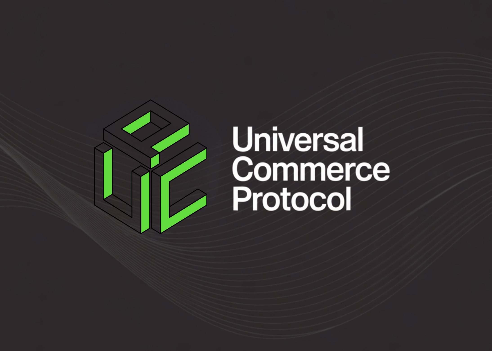

# Google AI Releases Universal Commerce Protocol (UCP): An Open-Source Standard Designed to Power the Next Generation of Agentic Commerce

> Can AI shopping agents move beyond sending product links and actually complete trusted purchases end to end inside a chat? Universal Commerce Protocol, or UCP, is Google’s new open standard for agentic commerce. It gives AI agents and merchant systems a shared language so that a shopping query can move from product discovery to an […]

Can AI shopping agents move beyond sending product links and actually complete trusted purchases end to end inside a chat? Universal Commerce Protocol, or UCP, is Google’s new open standard for agentic commerce. It gives AI agents and merchant systems a shared language so that a shopping query can move from product discovery to an authenticated order without custom integrations for every retailer and every surface.

*https://developers.googleblog.com/under-the-hood-universal-commerce-protocol-ucp/*

### What problem is UCP solving?

Today, most AI shopping experiences stop at recommendation. The agent aggregates links, you handle stock checks, coupon codes, and checkout flows on separate sites. Google’s engineering team describes this as an N by N integration bottleneck. Each new conversational surface requires separate work from every merchant and payment provider.

UCP collapses that to one abstraction. Platforms such as Gemini or AI Mode in Search integrate once with the protocol. Businesses expose their commerce behavior once behind UCP. Payment Service Providers and Credential Providers integrate at the payment layer. The same protocol can support many verticals such as shopping, travel, or services.

### Roles and core building blocks

**The UCP core concepts document defines four primary actors:**

- Platform, which is the agent or application that orchestrates the user journey. Examples include AI shopping assistants and search surfaces.

- Business, which is the merchant or service provider and the Merchant of Record.

- Credential Provider, which manages payment instruments and personal data such as addresses.

- Payment Service Provider, which processes authorizations, captures, and settlements.

**On top of these roles, UCP introduces three fundamental constructs:**

- Capabilities, such as Checkout, Identity Linking, and Order.

- Extensions, such as Discounts, Fulfillment, or AP2 Mandates, which extend a capability via an `extends` field.

- Services, which bind capabilities to transports such as REST API, Model Context Protocol, and Agent2Agent.

**The GitHub repo lists four initial key capabilities for shopping:**

- Checkout manages checkout sessions, cart contents, totals, and tax.

- Identity Linking uses OAuth 2.0 so agents can act on behalf of users.

- Order emits lifecycle events for shipment, returns, and refunds.

- Payment Token Exchange coordinates token and credential exchange between Payment Service Providers and Credential Providers.

### Commerce lifecycle for an AI agent

The [Google reference implementation](https://developers.googleblog.com/under-the-hood-universal-commerce-protocol-ucp/) and the samples repository use a simple store to illustrate the UCP flow.

**A typical agentic checkout looks like this:**

- The agent fetches the business profile from `/.well-known/ucp`, discovers that `dev.ucp.shopping.checkout` and associated extensions are available, and resolves schemas for those capabilities.

- If the user has linked an account, the agent performs Identity Linking with OAuth 2.0 scopes that permit checkout and order read operations for that merchant.

- The agent calls the Checkout capability using the REST or MCP binding, passing line items, buyer region, and any required context. The server returns a checkout object with line items, totals, and candidate fulfillment options.

- The agent applies discounts or loyalty benefits by invoking extensions that modify the composed checkout schema, then asks the user to confirm the final order.

- Payment is routed through a payment handler that understands a specific payment instrument schema, such as a tokenized card. Once the Payment Service Provider authorizes the transaction, the business creates an order.

- The Order capability emits webhook events for shipment and post purchase adjustments, which the agent can present in the conversation.

From the user perspective, this keeps the entire flow in a single conversation with clear consent steps.

### Transports, payments, and security

The specification defines a transport layer with bindings for REST, Model Context Protocol, Agent2Agent, and an Embedded Protocol that allows deeply customized merchant checkout experiences while still using UCP data structures.

For payments, UCP integrates with Agent Payments Protocol. The payment architecture separates payment instruments from payment handlers, and uses mandates scoped to a specific checkout hash. This design supports binding proof and reduces token replay risk, which is important when agents execute payments without the user directly in the browser.

Credential Providers issue tokens and hold sensitive card data or addresses. Payment Service Providers consume those tokens and talk to card networks. UCP keeps these roles explicit and uses verifiable credentials and signatures so that both agents and businesses have cryptographic evidence of what was authorized.

### Key Takeaways

- UCP is an open standard and open source specification from Google that defines a common commerce language for AI agents, businesses, payment providers, and credential providers across the full shopping journey.

- The protocol is co developed with partners such as Shopify, Etsy, Wayfair, Target, and Walmart, and is already endorsed by more than 20 ecosystem players including Visa, Mastercard, Stripe, PayPal, Best Buy, The Home Depot, Macy’s, and Zalando.

- UCP models commerce through discoverable capabilities like Checkout, Identity Linking, and Order, plus extensible modules for discounts, fulfillment, and subscriptions, with merchants and agents negotiating a shared capability set dynamically via profiles hosted at `.well-known/ucp`.

- The protocol is transport agnostic, it supports REST, JSON RPC, Model Context Protocol, and Agent2Agent so the same capability schemas can be reused across backend services, MCP tool calls into LLM agents, and agent to agent networks without rewriting business logic.

- Payments in UCP integrate with Agent Payments Protocol and a modular payment handler design, which separates payment instruments from handlers and uses cryptographically provable mandates, so agents can execute checkout flows autonomously while preserving clear proof of user consent.

---

Check out the **[GitHub Repo](https://github.com/Universal-Commerce-Protocol/ucp?tab=readme-ov-file) **and** [Technical details](https://developers.googleblog.com/under-the-hood-universal-commerce-protocol-ucp/)**. Also, feel free to follow us on **[Twitter](https://x.com/intent/follow?screen_name=marktechpost)** and don’t forget to join our **[100k+ ML SubReddit](https://www.reddit.com/r/machinelearningnews/)** and Subscribe to **[our Newsletter](https://www.aidevsignals.com/)**. Wait! are you on telegram? **[now you can join us on telegram as well.](https://t.me/machinelearningresearchnews)**

Check out our latest release of [**ai2025.dev**](https://ai2025.dev/), a 2025-focused analytics platform that turns model launches, benchmarks, and ecosystem activity into a structured dataset you can filter, compare, and export.
