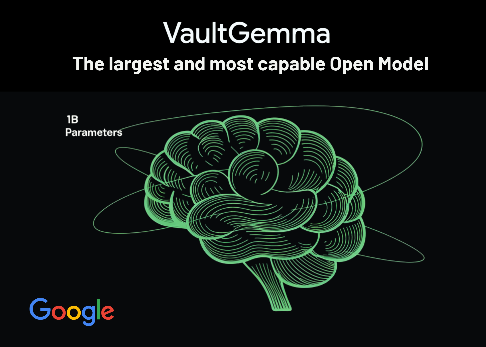

# Google AI Releases VaultGemma: The Largest and Most Capable Open Model (1B-parameters) Trained from Scratch with Differential Privacy

> Google AI Research and DeepMind have released VaultGemma 1B, the largest open-weight large language model trained entirely with differential privacy (DP). This development is a major step toward building AI models that are both powerful and privacy-preserving. Why Do We Need Differential Privacy in LLMs? Large language models trained on vast web-scale datasets are prone […]

Google AI Research and DeepMind have released **VaultGemma 1B**, the largest open-weight large language model trained entirely with **differential privacy (DP)**. This development is a major step toward building AI models that are both powerful and privacy-preserving.

### Why Do We Need Differential Privacy in LLMs?

Large language models trained on vast web-scale datasets are prone to **memorization attacks**, where sensitive or personally identifiable information can be extracted from the model. Studies have shown that verbatim training data can resurface, especially in open-weight releases.

Differential Privacy offers a **mathematical guarantee** that prevents any single training example from significantly influencing the model. Unlike approaches that apply DP only during fine-tuning, VaultGemma enforces **full private pretraining**, ensuring that privacy protection begins at the foundational level.

*https://services.google.com/fh/files/blogs/vaultgemma_tech_report.pdf*

### What Is the Architecture of VaultGemma?

VaultGemma is architecturally similar to earlier Gemma models, but optimized for private training.

- **Model size**: 1B parameters, 26 layers.

- **Transformer type**: Decoder-only.

- **Activations**: GeGLU with feedforward dimension of 13,824.

- **Attention**: Multi-Query Attention (MQA) with global span of 1024 tokens.

- **Normalization**: RMSNorm in pre-norm configuration.

- **Tokenizer**: SentencePiece with a 256K vocabulary.

A notable change is the **reduction of sequence length to 1024 tokens**, which lowers compute costs and enables larger batch sizes under DP constraints.

### What Data Was Used for Training?

VaultGemma was trained on the **same 13 trillion-token dataset** as Gemma 2, composed primarily of English text from web documents, code, and scientific articles.

**The dataset underwent several filtering stages to:**

- Remove unsafe or sensitive content.

- Reduce personal information exposure.

- Prevent evaluation data contamination.

This ensures both safety and fairness in benchmarking.

### How Was Differential Privacy Applied?

VaultGemma used **DP-SGD (Differentially Private Stochastic Gradient Descent)** with gradient clipping and Gaussian noise addition. Implementation was built on **JAX Privacy** and **introduced optimizations for scalability:**

- **Vectorized per-example clipping** for parallel efficiency.

- **Gradient accumulation** to simulate large batches.

- **Truncated Poisson Subsampling** integrated into the data loader for efficient on-the-fly sampling.

The model achieved a **formal DP guarantee** of (ε ≤ 2.0, δ ≤ 1.1e−10) at the sequence level (1024 tokens).

### How Do Scaling Laws Work for Private Training?

Training large models under DP constraints requires new scaling strategies. The VaultGemma team developed **DP-specific scaling laws** with three innovations:

- **Optimal learning rate modeling** using quadratic fits across training runs.

- **Parametric extrapolation of loss values** to reduce reliance on intermediate checkpoints.

- **Semi-parametric fits** to generalize across model size, training steps, and noise-batch ratios.

This methodology enabled precise prediction of achievable loss and efficient resource use on the TPUv6e training cluster.

### What Were the Training Configurations?

VaultGemma was trained on **2048 TPUv6e chips** using GSPMD partitioning and MegaScale XLA compilation.

- **Batch size**: ~518K tokens.

- **Training iterations**: 100,000.

- **Noise multiplier**: 0.614.

The achieved loss was within 1% of predictions from the DP scaling law, validating the approach.

### How Does VaultGemma Perform Compared to Non-Private Models?

**On academic benchmarks, VaultGemma trails its non-private counterparts but shows strong utility:**

- **ARC-C**: 26.45 vs. 38.31 (Gemma-3 1B).

- **PIQA**: 68.0 vs. 70.51 (GPT-2 1.5B).

- **TriviaQA (5-shot)**: 11.24 vs. 39.75 (Gemma-3 1B).

These results suggest that DP-trained models are currently comparable to **non-private models from about five years ago**. Importantly, memorization tests confirmed that **no training data leakage** was detectable in VaultGemma, unlike in non-private Gemma models.

*https://services.google.com/fh/files/blogs/vaultgemma_tech_report.pdf*

### Summary

In summary, VaultGemma 1B proves that large-scale language models can be trained with rigorous differential privacy guarantees without making them impractical to use. While a utility gap remains compared to non-private counterparts, the release of both the model and its training methodology provides the community with a strong foundation for advancing private AI. This work signals a shift toward building models that are not only capable but also inherently safe, transparent, and privacy-preserving.

---

Check out the **[Paper](https://services.google.com/fh/files/blogs/vaultgemma_tech_report.pdf), [Model on Hugging Face](https://huggingface.co/google/vaultgemma-1b)** and **[Technical Details](https://research.google/blog/vaultgemma-the-worlds-most-capable-differentially-private-llm/)_._** Feel free to check out our **[GitHub Page for Tutorials, Codes and Notebooks](https://github.com/Marktechpost/AI-Tutorial-Codes-Included)**. Also, feel free to follow us on **[Twitter](https://x.com/intent/follow?screen_name=marktechpost)** and don’t forget to join our **[100k+ ML SubReddit](https://www.reddit.com/r/machinelearningnews/)** and Subscribe to **[our Newsletter](https://www.aidevsignals.com/)**.
