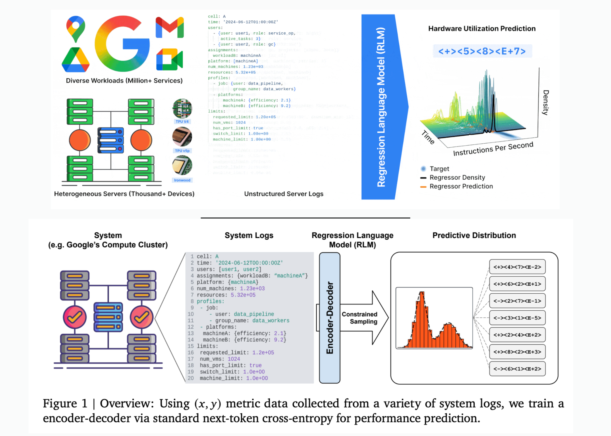

# Google AI’s New Regression Language Model (RLM) Framework Enables LLMs to Predict Industrial System Performance Directly from Raw Text Data

> Google’s new Regression Language Model (RLM) approach enables Large Language Models (LLMs) to predict industrial system performance directly from raw text data, without relying on complex feature engineering or rigid tabular formats. The Challenge of Industrial System Prediction Predicting performance for large-scale industrial systems—like Google’s Borg compute clusters—has traditionally required extensive domain-specific feature engineering and […]

Google’s new Regression Language Model (RLM) approach enables Large Language Models (LLMs) to predict industrial system performance directly from raw text data, without relying on complex feature engineering or rigid tabular formats.

### The Challenge of Industrial System Prediction

Predicting performance for large-scale industrial systems—like Google’s Borg compute clusters—has traditionally required extensive domain-specific feature engineering and tabular data representations, making scalability and adaptation difficult. Logs, configuration files, variable hardware mixes, and nested job data cannot be easily flattened or normalized for classic regression models. As a result, optimization and simulation workflows often become brittle, costly, and slow, especially when new types of workloads or hardware are introduced.

*https://arxiv.org/abs/2506.21718*

### The Main Idea: Text-to-Text Regression

Google’s Regression Language Model (RLM) reformulates regression as a text generation task: all system state data (configuration, logs, workload profiles, hardware descriptions) are serialized into structured text formats like YAML or JSON and used as the input prompt xxx. The regression model then outputs the numerical target yyy—such as efficiency metrics (Millions of Instructions Per Second per Google Compute Unit, MIPS per GCU)—as a text string response.

- **No Tabular Features Required:** This eliminates the need for predefined feature sets, normalization, and rigid encoding schemes.

- **Universal Applicability:** Any system state can be represented as a string; heterogeneous, nested, or dynamically evolving features are natively supported.

### Technical Details: Architecture and Training

The approach uses a relatively small encoder-decoder LLM (60M parameters) that trains via next-token cross-entropy loss on string representations of xxx and yyy. The model is not pretrained on general language modeling—training can start from random initialization, focusing directly on correlating system states with numeric outcomes.

- **Custom Numeric Tokenization:** Outcomes are tokenized efficiently (e.g., P10 mantissa-sign-exponent encoding) to represent floating-point values within the model’s vocabulary.

- **Few-shot Adaptation:** Pretrained RLMs are rapidly fine-tunable on new tasks with as few as 500 examples, adapting to new cluster configurations or months within hours, not weeks.

- **Sequence Length Scaling:** Models can process very long input texts (thousands of tokens), ensuring complex states are fully observed.

### Performance: Results on Google’s Borg Cluster

Testing on the Borg cluster, RLMs achieved up to a **0.99 Spearman rank correlation** (0.9 average) between predicted and true MIPS per GCU, with **100x lower mean squared error** than tabular baselines. The models natively quantify uncertainty by sampling multiple outputs for each input, supporting probabilistic system simulation and Bayesian optimization workflows.

- **Uncertainty Quantification:** RLMs capture both aleatoric (inherent) and epistemic (unknowns due to limited observability) uncertainties, unlike most black-box regressors.

- **Universal Simulators:** The density modeling capabilities of RLMs suggest their use in building universal digital twins for large-scale systems, accelerating infrastructure optimization, and real-time feedback.

### Comparison: RLMs vs Traditional Regression

ApproachData FormatFeature EngineeringAdaptabilityPerformanceUncertaintyTabular RegressionFlat tensors, numbersManual requiredLowLimited by featuresMinimalRLM (Text-to-Text)Structured, nested textNone requiredHighNear-perfect ranksFull-spectrum

### Applications and Summary

- **Cloud and Compute Clusters:** Direct performance prediction and optimization for large, dynamic infrastructure.

- **Manufacturing and IoT:** Universal simulators for outcome prediction across diverse industrial pipelines.

- **Scientific Experiments:** End-to-end modeling where input states are complex, textually described, and numerically diverse.

This new approach—treating regression as language modeling—removes longstanding barriers in system simulation, enables rapid adaptation to new environments, and supports robust uncertainty-aware prediction, all crucial for next-generation industrial AI.

---

Check out the **[Paper](https://arxiv.org/abs/2506.21718), [Codes](https://github.com/google-deepmind/regress-lm) and [Technical details](https://research.google/blog/simulating-large-systems-with-regression-language-models/).** Feel free to check out our **[GitHub Page for Tutorials, Codes and Notebooks](https://github.com/Marktechpost/AI-Tutorial-Codes-Included)**. Also, feel free to follow us on **[Twitter](https://x.com/intent/follow?screen_name=marktechpost)** and don’t forget to join our **[100k+ ML SubReddit](https://www.reddit.com/r/machinelearningnews/)** and Subscribe to **[our Newsletter](https://www.aidevsignals.com/)**.
