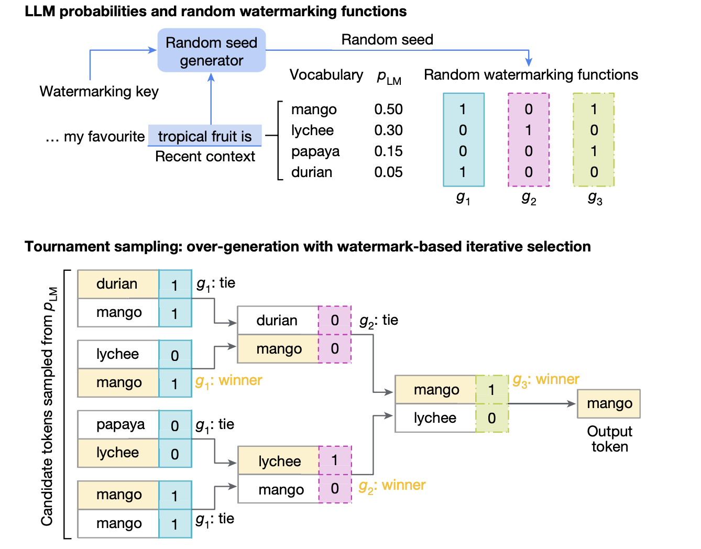

# Google DeepMind Open-Sources SynthID for AI Content Watermarking

> AI-generated content is advancing rapidly, creating both opportunities and challenges. As generative AI tools become mainstream, the blending of human and AI-generated text raises concerns about authenticity, authorship, and misinformation. Differentiating human-authored content from AI-generated content, especially as AI becomes more natural, is a critical challenge that demands effective solutions to ensure transparency. SynthID: Open-Sourced […]

AI-generated content is advancing rapidly, creating both opportunities and challenges. As generative AI tools become mainstream, the blending of human and AI-generated text raises concerns about authenticity, authorship, and misinformation. Differentiating human-authored content from AI-generated content, especially as AI becomes more natural, is a critical challenge that demands effective solutions to ensure transparency.

### SynthID: Open-Sourced for Responsible AI Development

Google has open-sourced SynthID for AI text watermarking, extending its commitment to responsible AI development. By making SynthID freely available, Google aims to democratize access to advanced watermarking tools that can identify AI-generated content without altering its visible features. This move is a significant step toward enhancing the safety, transparency, and traceability of AI-generated content, fostering greater trust in the expanding AI ecosystem.

### Technical Overview and Benefits of SynthID

SynthID integrates an imperceptible watermark directly into AI-generated text using advanced deep learning models. Unlike traditional watermarks that are easily visible or can be stripped from a document, SynthID’s watermark is seamlessly embedded and highly resilient to tampering. By embedding metadata-like signals that work across AI text formats, SynthID can determine whether a given text is AI-generated. This watermark is difficult to remove without significantly compromising the content’s linguistic integrity, making it a robust tool for content verification. SynthID’s resilience, combined with its ability to work in noisy conditions—where texts may have undergone human editing—makes it particularly powerful.

### Insights from SynthID-Text Research

A recently published research paper in _Nature_ provides further insights into SynthID-Text’s development and testing. SynthID-Text is a production-ready watermarking scheme that preserves text quality while ensuring high detection accuracy with minimal latency. Notably, SynthID-Text integrates with speculative sampling, a technique used to increase efficiency in production systems, allowing for scalable watermarking without affecting text generation speed. Evaluations across multiple large language models (LLMs) have shown that SynthID-Text offers improved detectability compared to existing methods, while side-by-side comparisons with human reviewers indicate no loss in text quality. In a large-scale experiment involving nearly 20 million Gemini responses, SynthID-Text preserved text quality, demonstrating its feasibility for real-world applications.

### The Importance of SynthID

The importance of SynthID cannot be overstated in a world where AI-generated content is proliferating rapidly. SynthID not only serves as a verification tool but also provides accountability, which is crucial for countering disinformation, especially as AI-generated content becomes increasingly indistinguishable from human-created work. The results are promising: during testing, SynthID identified watermarked text with an accuracy rate exceeding 95%. Moreover, the integration of a novel sampling algorithm called Tournament sampling within SynthID-Text has enhanced detection performance by embedding statistical signatures that are challenging to remove. By open-sourcing SynthID, Google also invites the developer community to contribute to improving AI-generated text transparency, fostering a more responsible AI landscape.

### Conclusion

Google’s decision to open-source SynthID for AI text watermarking represents a significant step towards responsible AI development. SynthID not only effectively identifies AI-generated content but also promotes a new era of transparency in the evolving digital landscape. By offering robust watermarking technology and opening it to the community, Google is setting a high standard for ethical AI development. As AI-generated content continues to expand, tools like SynthID will be essential for maintaining information integrity and ensuring the responsible growth of AI technologies.

---

Check out the** [Paper](https://www.nature.com/articles/s41586-024-08025-4), [Details](https://deepmind.google/technologies/synthid/), and [Available on Hugging Fac](https://huggingface.co/spaces/google/synthid-text)[e](https://huggingface.co/spaces/google/synthid-text).** All credit for this research goes to the researchers of this project. Also, don’t forget to follow us on **[Twitter](https://twitter.com/Marktechpost)** and join our **[Telegram Channel](https://pxl.to/at72b5j)** and [**LinkedIn Gr**](https://www.linkedin.com/groups/13668564/)[**oup**](https://www.linkedin.com/groups/13668564/). **If you like our work, you will love our**[** newsletter..**](https://marktechpost-newsletter.beehiiv.com/subscribe) Don’t Forget to join our **[55k+ ML SubReddit](https://www.reddit.com/r/machinelearningnews/)**.

**[[Upcoming Live Webinar- Oct 29, 2024] ](https://go.predibase.com/predibase-inference-engine-102924-lp?utm_medium=3rdparty&utm_source=marktechpost)****[The Best Platform for Serving Fine-Tuned Models: Predibase Inference Engine (Promoted)](https://go.predibase.com/predibase-inference-engine-102924-lp?utm_medium=3rdparty&utm_source=marktechpost)**
