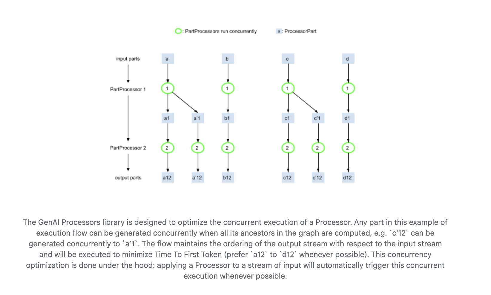

# Google DeepMind Releases GenAI Processors: A Lightweight Python Library that Enables Efficient and Parallel Content Processing

> Google DeepMind recently released GenAI Processors, a lightweight, open-source Python library built to simplify the orchestration of generative AI workflows—especially those involving real-time multimodal content. Launched last week, and available under an Apache‑2.0 license, this library provides a high-throughput, asynchronous stream framework for building advanced AI pipelines. Stream‑Oriented Architecture At the heart of GenAI Processors […]

Google DeepMind recently released **GenAI Processors**, a lightweight, open-source Python library built to simplify the orchestration of generative AI workflows—especially those involving real-time multimodal content. Launched last week, and available under an **Apache‑2.0 license**, this library provides a high-throughput, asynchronous stream framework for building advanced AI pipelines.

### Stream‑Oriented Architecture

At the heart of GenAI Processors is the concept of processing **asynchronous streams** of `ProcessorPart` objects. These parts represent discrete chunks of data—text, audio, images, or JSON—each carrying metadata. By standardizing inputs and outputs into a consistent stream of parts, the library enables seamless chaining, combining, or branching of processing components while maintaining bidirectional flow. Internally, the use of Python’s `asyncio` enables each pipeline element to operate concurrently, dramatically reducing latency and improving overall throughput.

### Efficient Concurrency

GenAI Processors is engineered to **optimize latency** by minimizing “Time To First Token” (TTFT). As soon as upstream components produce pieces of the stream, downstream processors begin work. This pipelined execution ensures that operations—including model inference—overlap and proceed in parallel, achieving efficient utilization of system and network resources.

### Plug‑and‑Play Gemini Integration

The library comes with ready-made connectors for Google’s **Gemini** APIs, including both synchronous text-based calls and the Gemini **Live API** for streaming applications. These “model processors” abstract away the complexity of batching, context management, and streaming I/O, enabling rapid prototyping of interactive systems—such as live commentary agents, multimodal assistants, or tool-augmented research explorers.

### Modular Components & Extensions

GenAI Processors prioritizes **modularity**. Developers build reusable units—processors—each encapsulating a defined operation, from MIME-type conversion to conditional routing. A `contrib/` directory encourages community extensions for custom features, further enriching the ecosystem. Common utilities support tasks such as splitting/merging streams, filtering, and metadata handling, enabling complex pipelines with minimal custom code.

### Notebooks and Real‑World Use Cases

Included with the repository are hands-on examples demonstrating key use cases:

- **Real‑Time Live agent**: Connects audio input to Gemini and optionally a tool like web search, streaming audio output—all in real time.

- **Research agent**: Orchestrates data collection, LLM querying, and dynamic summarization in sequence.

- **Live commentary agent**: Combines event detection with narrative generation, showcasing how different processors sync to produce streamed commentary.

These examples, provided as Jupyter notebooks, serve as blueprints for engineers building responsive AI systems.

### Comparison and Ecosystem Role

GenAI Processors complements tools like the **google-genai SDK** (the GenAI Python client) and **Vertex AI**, but elevates development by offering a structured orchestration layer focused on streaming capabilities. Unlike LangChain—which is focused primarily on LLM chaining—or NeMo—which constructs neural components—GenAI Processors excels in managing streaming data and coordinating asynchronous model interactions efficiently.

### Broader Context: Gemini’s Capabilities

GenAI Processors leverages Gemini’s strengths. Gemini, DeepMind’s multimodal [large language model](https://www.marktechpost.com/2025/01/11/what-are-large-language-model-llms/), supports processing of text, images, audio, and video—most recently seen in the **Gemini 2.5** rollout in. GenAI Processors enables developers to create pipelines that match Gemini’s multimodal skillset, delivering low-latency, interactive AI experiences.

### Conclusion

With GenAI Processors, Google DeepMind provides a **stream-first, asynchronous abstraction layer** tailored for generative AI pipelines. By enabling:

- Bidirectional, metadata-rich streaming of structured data parts

- Concurrent execution of chained or parallel processors

- Integration with Gemini model APIs (including Live streaming)

- Modular, composable architecture with an open extension model

…this library bridges the gap between raw AI models and deployable, responsive pipelines. Whether you’re developing conversational agents, real-time document extractors, or multimodal research tools, GenAI Processors offers a lightweight yet powerful foundation.

Check out the **[Technical Details](https://developers.googleblog.com/en/genai-processors/) and [GitHub Page](https://github.com/google-gemini/genai-processors)**. All credit for this research goes to the researchers of this project. If you’re planning a product launch/release, fundraising, or simply aiming for developer traction—[let us help you hit that goal efficiently.](https://promotion.marktechpost.com/)
