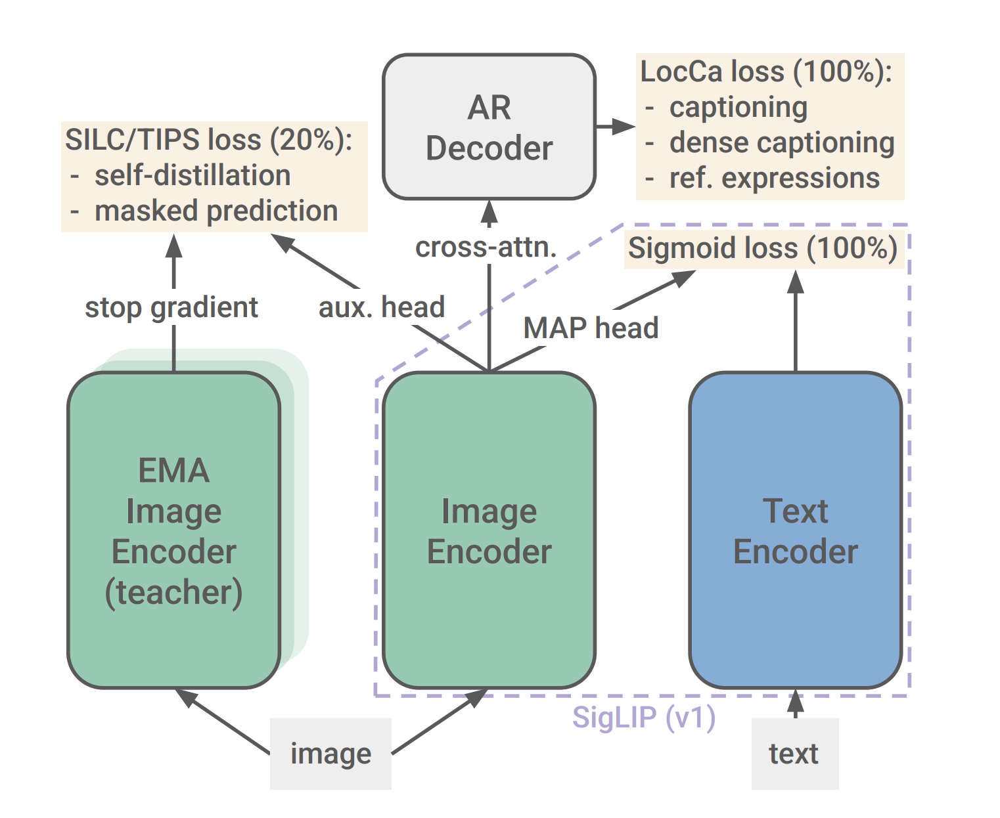

# Google DeepMind Research Releases SigLIP2: A Family of New Multilingual Vision-Language Encoders with Improved Semantic Understanding, Localization, and Dense Features

> Modern vision-language models have transformed how we process visual data, yet they often fall short when it comes to fine-grained localization and dense feature extraction. Many traditional models focus on high-level semantic understanding and zero-shot classification but struggle with detailed spatial reasoning. These limitations can impact applications that require precise localization, such as document analysis […]

Modern vision-language models have transformed how we process visual data, yet they often fall short when it comes to fine-grained localization and dense feature extraction. Many traditional models focus on high-level semantic understanding and zero-shot classification but struggle with detailed spatial reasoning. These limitations can impact applications that require precise localization, such as document analysis or object segmentation.

Moreover, models that primarily rely on contrastive loss sometimes do not perform well in tasks needing refined spatial cues. There is also a challenge in supporting multiple languages and ensuring fair representation across diverse cultural contexts. Addressing these issues is essential to create models that are both technically robust and socially responsible.

Google DeepMind Research Releases SigLIP2: a family of new multilingual vision-language encoders with Improved Semantic Understanding, Localization, and Dense Features. SigLIP 2 extends the original image–text training objective by blending captioning-based pretraining with self-supervised approaches like self-distillation and masked prediction. This combination is designed to enhance both the overall semantic representation and the model’s ability to capture local, detailed features. The training process also includes a mix of multilingual data—primarily English with a smaller proportion of non-English content—and employs de-biasing methods to ensure fairer outcomes.

### Technical Details and Benefits

At its core, SigLIP 2 is built on the foundation of Vision Transformers, ensuring backward compatibility with earlier versions. This means that users can replace the model weights without the need to overhaul their entire system. The model uses a sigmoid loss instead of the traditional contrastive loss, which allows for a more balanced learning of both global and local features.

In addition to the sigmoid loss, SigLIP 2 incorporates a decoder-based loss. This helps in learning tasks like image captioning and region-specific localization, ultimately leading to better performance in dense prediction tasks. The model’s design also includes a MAP head for pooling features from both the image and text components, ensuring that the learned representations are both robust and detailed. Another notable technical aspect is the introduction of the NaFlex variant. NaFlex supports native aspect ratios by processing images at various resolutions using a single checkpoint. This method helps maintain the integrity of the image’s spatial information, which is particularly important in tasks where the aspect ratio can influence the outcome, such as in document understanding or OCR.

Furthermore, the use of self-distillation and masked prediction improves the quality of the local features. By training the model to predict masked patches, it learns to focus on subtle details that are crucial for tasks like segmentation and depth estimation. This careful design allows even smaller models to achieve improved performance through enhanced distillation techniques.

### Results, Data Insights, and Evaluation

The experimental results in the paper support the technical choices made in SigLIP 2. Across several benchmarks—including zero-shot classification tests on ImageNet, ObjectNet, and ImageNet ReaL—the model shows consistent improvements over earlier models. The benefits are particularly clear in tasks that demand detailed spatial understanding.

For multilingual image–text retrieval tasks, such as those evaluated on Crossmodal-3600, SigLIP 2 performs competitively with models designed exclusively for multilingual data. At the same time, it maintains strong performance on English-centered tasks. This balance is achieved through careful data curation and training methods that emphasize both semantic richness and localization precision. In dense prediction tasks, such as semantic segmentation, depth estimation, and surface normal prediction, the model’s advantages are again evident. When tested on open-vocabulary segmentation frameworks like Cat-Seg, SigLIP 2 consistently reports higher mean Intersection-over-Union (mIoU) scores compared to its predecessors and other open-weight models. These results are a testament to the model’s ability to capture intricate details in images.

Localisation tasks also benefit from the model’s refined training. For instance, in referring expression comprehension and open-vocabulary detection, the performance improvements are clear. The model not only aligns text and image features more effectively but also demonstrates a reduced tendency toward biased associations. In evaluations of representation bias, SigLIP 2 shows a marked decrease in unfair object-to-gender associations, underscoring the importance of the de-biasing techniques used during training. The research presents a range of comparative tables and figures that detail these improvements. The data suggest that as the model size increases, the benefits of these training enhancements become even more pronounced. Across various configurations and resolutions, the model’s performance remains robust, making it a strong candidate for both research and practical applications.

### Conclusion

In conclusion, SigLIP 2 represents a measured and well-engineered step forward in the development of vision-language models. It integrates established techniques with thoughtful innovations to address known challenges such as fine-grained localization, dense prediction, and multilingual support. By moving away from solely contrastive losses and incorporating additional self-supervised objectives, SigLIP 2 achieves a more balanced representation of visual data. Its careful handling of native aspect ratios through the NaFlex variant further improves its applicability in real-world scenarios where image integrity matters.

The inclusion of multilingual data and de-biasing measures reflects an awareness of the diverse contexts in which these models operate. This approach not only improves performance across various benchmarks but also ensures that the model is better aligned with broader ethical considerations in AI. Overall, the release of SigLIP 2 is a promising development for the vision-language research community. It offers a versatile, backward-compatible framework that can be readily integrated into existing systems. The model’s ability to deliver reliable performance across a range of tasks—while maintaining fairness and inclusivity—sets a thoughtful benchmark for future research in this field.

---

Check out **_the [Paper](https://arxiv.org/abs/2502.14786), [GitHub Page](https://github.com/google-research/big_vision/blob/main/big_vision/configs/proj/image_text/README_siglip2.md) and [Models on Hugging Face](https://huggingface.co/collections/google/siglip2-67b5dcef38c175486e240107)._** All credit for this research goes to the researchers of this project. Also, feel free to follow us on **[Twitter](https://x.com/intent/follow?screen_name=marktechpost)** and don’t forget to join our **[75k+ ML SubReddit](https://www.reddit.com/r/machinelearningnews/)**.

**🚨 [Recommended Read- LG AI Research Releases NEXUS: An Advanced System Integrating Agent AI System and Data Compliance Standards to Address Legal Concerns in AI Datasets](https://www.marktechpost.com/2025/02/16/lg-ai-research-releases-nexus-an-advanced-system-integrating-agent-ai-system-and-data-compliance-standards-to-address-legal-concerns-in-ai-datasets/)**
