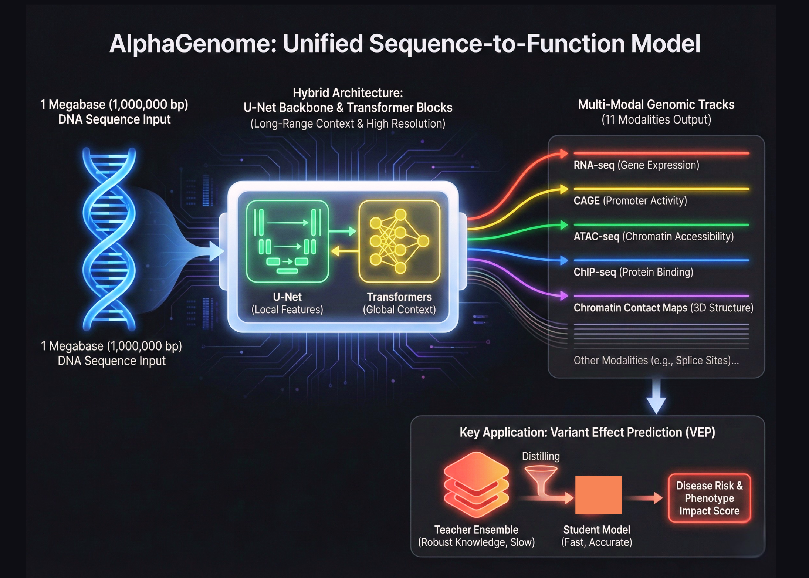

# Google DeepMind Unveils AlphaGenome: A Unified Sequence-to-Function Model Using Hybrid Transformers and U-Nets to Decode the Human Genome

> Google DeepMind is expanding its biological toolkit beyond the world of protein folding. After the success of AlphaFold, the Google’s research team has introduced AlphaGenome. This is a unified deep learning model designed for sequence to function genomics. This represents a major shift in how we model the human genome. AlphaGenome does not treat DNA […]

Google DeepMind is expanding its biological toolkit beyond the world of protein folding. After the success of AlphaFold, the Google’s research team has introduced AlphaGenome. This is a unified deep learning model designed for sequence to function genomics. This represents a major shift in how we model the human genome. AlphaGenome does not treat DNA as simple text. Instead, it processes 1,000,000 base pair windows of raw DNA to predict the functional state of a cell.

### Bridging the Scale Gap with Hybrid Architectures

The complexity of the human genome comes from its scale. Most existing models struggle to see the big picture while keeping track of fine details. AlphaGenome solves this by using a hybrid architecture. It combines a U-Net backbone with Transformer blocks. This allows the model to capture long range interactions across 1 Megabase of sequence while maintaining base pair resolution. This is like building a system that can read a thousand page book and still remember the exact location of a single comma.

### Mapping Sequences to Functional Biological Modalities

AlphaGenome is a sequence to function model. This means its primary goal is to map DNA sequences directly to biological activities. These activities are measured in genomic tracks. The research team trained AlphaGenome to predict 11 different genomic modalities. These modalities include RNA-seq, CAGE, and ATAC-seq. They also include ChIP-seq for various transcription factors and chromatin contact maps. By predicting all these tracks at once, the model gains a holistic understanding of how DNA regulates the cell.

### The Power of Multi-Task Learning in Genomics

The technical advancement of AlphaGenome lies in its ability to handle 11 distinct types of data simultaneously. In the past, researchers often built separate models for each task. AlphaGenome uses a multi-task learning approach. This helps the model learn shared features across different biological processes. If the model understands how a protein binds to DNA, it can better predict how that DNA will be expressed as RNA. This unified approach reduces the need for multiple specialized models.

### Advancing Variant Effect Prediction via Distillation

One of the most critical applications for AlphaGenome is Variant Effect Prediction, or VEP. This process determines how a single mutation in DNA affects the body. Mutations can lead to diseases like cancer or heart disease. AlphaGenome excels at this by using a specific training method called Teacher Student distillation. The research team first created an ensemble of ‘all folds’ teacher models. These teachers were trained on vast amounts of genomic data. Then, they distilled that knowledge into a single student model.

### Compressing Knowledge for Precision Medicine

This distillation process makes the model both faster and more robust. This is a standard way to compress knowledge. However, applying it to genomics at this scale is a new milestone. The student model learns to replicate the high quality predictions of the teacher ensemble. This allows it to identify harmful mutations with high accuracy. The model can even predict how a mutation in a distant regulatory element might impact a gene far away on the DNA strand.

### High-Performance Computing with JAX and TPUs

The architecture is implemented using JAX. JAX is a high performance numerical computing library. It is often used for high scale machine learning at Google. Using JAX allows AlphaGenome to run efficiently on Tensor Processing Units, or TPUs. The research team used sequence parallelism to handle the massive 1 Megabase input windows. This ensures that the memory requirements do not explode as the sequence length increases. This shows the importance of selecting the right framework for large scale biological data.

### Transfer Learning for Data-Scarce Cell Types

AlphaGenome also addresses the challenge of data scarcity in certain cell types. Because it is a foundation model, it can be fine tuned for specific tasks. The model learns general biological rules from large public datasets. These rules can then be applied to rare diseases or specific tissues where data is hard to find. This transfer learning capability is one of the reasons why AlphaGenome is so versatile. It can predict how a gene will behave in a brain cell even if it was primarily trained on liver cell data.

### Toward a New Era of Personalized Care

In the future, AlphaGenome could lead to a new era of personalized medicine. Doctors could use the model to scan a patient’s entire genome in 1,000,000 base pair chunks. They could identify exactly which variants are likely to cause health issues. This would allow for treatments that are tailored to a person’s specific genetic code. AlphaGenome moves us closer to this reality by providing a clear and accurate map of the functional genome.

### Setting the Standard for Biological AI

AlphaGenome also marks a turning point for AI in genomics. It proves that we can model the most complex biological systems using the same principles used in modern AI. By combining U-Net structures with Transformers and using teacher student distillation, Google DeepMind team has set a new standard.

### Key Takeaways

- **Hybrid Sequence Architecture:** AlphaGenome uses a specialized hybrid design that combines a **U-Net** backbone with **Transformer** blocks. This allows the model to process massive windows of **1,000,000 base pairs** while maintaining the high resolution needed to identify single mutations.

- **Multi-Modal Functional Prediction:** The model is trained to predict **11 different genomic modalities** simultaneously, which include RNA-seq, CAGE, and ATAC-seq. By learning these various biological tracks together, the system gains a holistic understanding of how DNA regulates cellular activity across different tissues.

- **Teacher-Student Distillation:** To achieve industry leading accuracy in **Variant Effect Prediction (VEP)**, researchers used a distillation method. They transferred the knowledge from an ensemble of high performing ‘teacher’ models into a single, efficient ‘student’ model that is faster and more robust for identifying disease-causing mutations.

- **Built for High Performance Computing:** The framework is implemented in **JAX** and optimized for **TPUs**. By using sequence parallelism, AlphaGenome can handle the computational load of analyzing megabase scale DNA sequences without exceeding memory limits, making it a powerful tool for large scale research.

---

Check out the **[Paper](https://www.nature.com/articles/s41586-025-10014-0) **and** [Repo](https://github.com/google-deepmind/alphagenome_research)**. Also, feel free to follow us on **[Twitter](https://x.com/intent/follow?screen_name=marktechpost)** and don’t forget to join our **[100k+ ML SubReddit](https://www.reddit.com/r/machinelearningnews/)** and Subscribe to **[our Newsletter](https://www.aidevsignals.com/)**. Wait! are you on telegram? **[now you can join us on telegram as well.](https://t.me/machinelearningresearchnews)**
