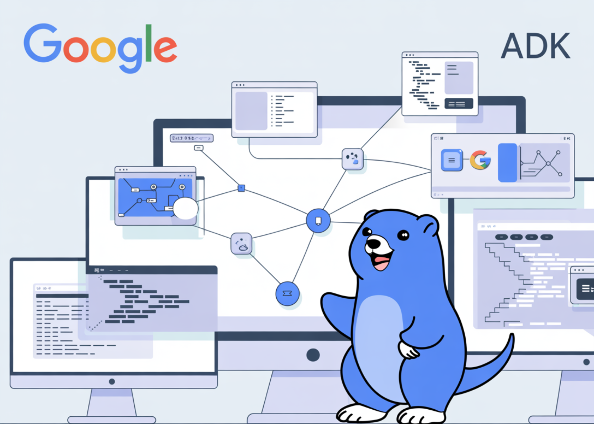

# Google AI Releases ADK Go: A New Open-Source Toolkit Designed to Empower Go Developers to Build Powerful AI Agents

> How do you build reliable AI agents that plug into your existing Go services without bolting on a separate language stack? Google has just released Agent Development Kit for Go. Go developers can now build AI agents with the same framework that already supports Python and Java, while keeping everything inside a familiar Go toolchain […]

How do you build reliable AI agents that plug into your existing Go services without bolting on a separate language stack? Google has just released **Agent Development Kit for Go**. Go developers can now build AI agents with the same framework that already supports Python and Java, while keeping everything inside a familiar Go toolchain and deployment model.

For AI devs and backend developers who already use Go for services, this closes a gap. You no longer need a separate Python based stack for agents. You can express agent logic, orchestration, and tool use directly in Go code, then move the same agents into Vertex AI Agent Builder and Agent Engine when you are ready for production.

### What Agent Development Kit Provides?

Agent Development Kit, or ADK, is an open source framework for developing and deploying AI agents. It is optimized for Gemini and Google Cloud, but the design is model agnostic and deployment agnostic.

**In practical terms, ADK gives you:**

- A code first programming model where agent behavior, tools, and orchestration live in normal source files

- Workflow agents for sequential, parallel, and loop style control flow inside an agent system

- A rich tool ecosystem with built in tools, custom function tools, OpenAPI tools, Google Cloud tools, and ecosystem tools

- Deployment paths that cover local runs, containers, Cloud Run, and Vertex AI Agent Engine

- Built in evaluation and safety patterns, integrated with Vertex AI Agent Builder

For a developer, ADK turns an agent into a normal service. You run it locally, inspect traces, and deploy it to a managed runtime, instead of treating it as a one off script that calls an LLM.

### What ADK for Go Adds?

The Go release keeps the same core feature set as the Python and Java SDKs but exposes it through an idiomatic Go API. The Google AI team describes ADK for Go as an idiomatic and performant way to build agents that use Go concurrency and strong typing.

**Here are some key points:**

- ADK for Go is installed with `go get google.golang.org/adk`

- The project is open source and hosted at `github.com/google/adk-go`

- It supports building, evaluating, and deploying sophisticated AI agents with flexibility and control

- It uses the same abstractions for agents, tools, and workflows as the other ADK languages

This means a Go service can embed agent behavior without switching languages. You can build a multi agent architecture where each agent is a Go component that composes with others using the same framework.

### A2A Protocol Support in Go

**ADK for Go ships with native support for the Agent2Agent protocol, or A2A.**

The A2A protocol defines a way for agents to call other agents over a standard interface. In the Go release, Google highlights that a primary agent can orchestrate and delegate tasks to specialized sub agents. Those sub agents can run locally or as remote deployments. A2A keeps these interactions secure and opaque, so an agent does not need to expose internal memory or proprietary logic to participate.

Google also contributed an A2A Go SDK to the main A2A project. That gives Go developers a protocol level entry point if they want agents that interoperate with other runtimes and frameworks that also support A2A.

### MCP Toolbox for Databases and Tooling

A key detail in the official [Google announcement](https://developers.googleblog.com/en/announcing-the-agent-development-kit-for-go-build-powerful-ai-agents-with-your-favorite-languages/) is native integration with MCP Toolbox for Databases. It states that ADK Go has out of the box support for more than 30 databases through this toolbox.

MCP Toolbox for Databases is an open source MCP server for databases. It handles connection pooling, authentication, and other concerns, and exposes database operations as tools using the Model Context Protocol.

**Within ADK, that means:**

- You register MCP Toolbox for Databases as an MCP tool provider

- The agent calls database operations through MCP tools rather than constructing raw SQL

- The toolbox enforces a set of safe, predefined actions that the agent can perform

This fits the ADK model for tools in general, where agents use a mix of built in tools, Google Cloud tools, ecosystem tools, and MCP tools, all described in the Vertex AI Agent Builder documentation.

### Integration with Vertex AI Agent Builder and Agent Engine

ADK is the primary framework supported in Vertex AI Agent Builder for building multi agent systems.

The latest Agent Builder updates describe a build path where you:

- Develop the agent locally using ADK, now including ADK for Go

- Use the ADK quickstart and dev UI to test the agent with multiple tools

- Deploy the agent to Vertex AI Agent Engine as a managed runtime

For Go teams, this means the language used in services and infrastructure is now available across the full agent lifecycle, from local development to managed production deployment.

### Editorial Comments

This launch positions Agent Development Kit for Go as a practical bridge between AI agents and existing Go services, using the same open source, code first toolkit that underpins Python and Java agents. It brings A2A protocol support and MCP Toolbox for Databases into a Go native environment, aligned with Vertex AI Agent Builder and Vertex AI Agent Engine for deployment, evaluation, and observability. Overall, this release makes Go a first class language for building production ready, interoperable AI agents in Google’s ecosystem.

---

Check out the **[Repo](https://github.com/google/adk-go), [Samples ](https://github.com/google/adk-samples)**and** [Technical details](https://developers.googleblog.com/en/announcing-the-agent-development-kit-for-go-build-powerful-ai-agents-with-your-favorite-languages/)**. Feel free to check out our **[GitHub Page for Tutorials, Codes and Notebooks](https://github.com/Marktechpost/AI-Tutorial-Codes-Included)**. Also, feel free to follow us on **[Twitter](https://x.com/intent/follow?screen_name=marktechpost)** and don’t forget to join our **[100k+ ML SubReddit](https://www.reddit.com/r/machinelearningnews/)** and Subscribe to **[our Newsletter](https://www.aidevsignals.com/)**. Wait! are you on telegram? **[now you can join us on telegram as well.](https://t.me/machinelearningresearchnews)**
