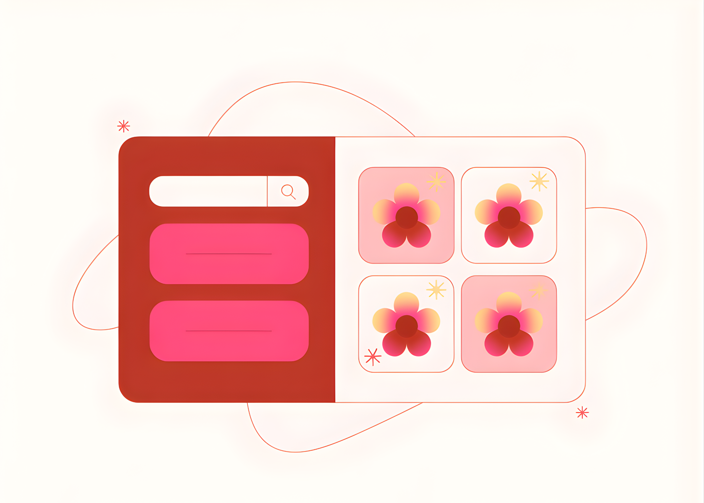

# Google Introduces A2UI (Agent-to-User Interface): An Open Sourc Protocol for Agent Driven Interfaces

> Google has open sourced A2UI, an Agent to User Interface specification and set of libraries that lets agents describe rich native interfaces in a declarative JSON format while client applications render them with their own components. The project targets a clear problem, how to let remote agents present secure, interactive interfaces across trust boundaries without […]

Google has open sourced A2UI, an Agent to User Interface specification and set of libraries that lets agents describe rich native interfaces in a declarative JSON format while client applications render them with their own components. The project targets a clear problem, how to let remote agents present secure, interactive interfaces across trust boundaries without sending executable code.

### What is A2UI?

A2UI is an open standard and implementation that allows agents to speak UI. An agent does not output HTML or JavaScript. It outputs an A2UI response, which is a JSON payload that describes a set of components, their properties and a data model. The client application reads this description and maps each component to its own native widgets, for example Angular components, Flutter widgets, web components, React components or SwiftUI views.

### The Problem, Agents Need to Speak UI

Most chat based agents respond with long text. For tasks such as restaurant booking or data entry, this produces many turns and dense answers. The A2UI launch post shows a restaurant example where a user asks for a table, then the agent asks several follow up questions in text, which is slow. A better experience is a small form with a date picker, time selector and submit button. A2UI lets the agent request that form as a structured UI description instead of narrating it in natural language.

The problem becomes harder in a multi agent mesh. In that setting, an orchestrator in one organization may delegate work to a remote A2A agent in another organization. The remote agent cannot touch the Document Object Model of the host application. It can only send messages. Historically that meant HTML or script inside an iframe. That approach is heavy, often visually inconsistent with the host and risky from a security point of view. A2UI defines a data format that is safe like data but expressive enough to describe complex layouts.

### Core Design, Security and LLM Friendly Structure

A2UI focuses on security, LLM friendliness and portability.

- Security first. A2UI is a declarative data format, not executable code. The client maintains a catalog of trusted components such as Card, Button or TextField. The agent can only reference types in this catalog. This reduces the risk of UI injection and avoids arbitrary script execution from model output.

- LLM friendly representation. The UI is represented as a flat list of components with identifier references. This makes it easier for language models to generate or update interfaces incrementally and supports streaming updates. The agent can adjust a view as the conversation progresses without regenerating a full nested JSON tree.

- Framework agnostic. A single A2UI payload can be rendered on multiple clients. The agent describes a component tree and associated data model. The client maps that structure to native widgets in frameworks such as Angular, Flutter, React or SwiftUI. This allows reuse of the same agent logic across web, mobile and desktop surfaces.

- Progressive rendering. Because the format is designed for streaming, clients can show partial interfaces while the agent continues computing. Users see the interface assemble in real time rather than waiting for a complete response.

### Architecture and Data Flow

A2UI is a pipeline that separates generation, transport and rendering.

- A user sends a message to an agent through a chat or another surface.

- The agent, often backed by Gemini or another model that can generate JSON, produces an A2UI response. This response describes components, layout and data bindings.

- The A2UI messages stream to the client over a transport such as the Agent to Agent protocol or the AG UI protocol.

- The client uses an A2UI renderer library. The renderer parses the payload and resolves each component type into a concrete widget in the host codebase.

- User actions, for example button clicks or form submissions, are sent back as events to the agent. The agent may respond with new A2UI messages that update the existing interface.

### Key Takeaways

- A2UI is an open standard and library set from Google that lets agents ‘speak UI’ by sending a declarative JSON specification for interfaces, while clients render them using native components such as Angular, Flutter or Lit.

- The specification focuses on security by treating UI as data, not code, so agents only reference a client controlled catalog of components, which reduces UI injection risk and avoids executing arbitrary scripts from model output.

- The internal format uses an updateable, flat representation of components that is optimized for LLMs, which supports streaming and incremental updates, so agents can progressively refine the interface during a session.

- A2UI is transport agnostic and is already used with the A2A protocol and AG UI, which allows orchestrator agents and remote sub agents to send UI payloads across trust boundaries while host applications keep control of branding, layout and accessibility.

- The project is in early stage public preview at version v0.8, released under Apache 2.0, with reference renderers, quickstart samples and production integrations in projects such as Opal, Gemini Enterprise and Flutter GenUI, making it directly usable by engineers building agentic applications now.

---

Check out the **[Github Repo](https://github.com/google/A2UI/)** and **[Technical Details](https://developers.googleblog.com/introducing-a2ui-an-open-project-for-agent-driven-interfaces/)**. Also, feel free to follow us on **[Twitter](https://x.com/intent/follow?screen_name=marktechpost)** and don’t forget to join our **[100k+ ML SubReddit](https://www.reddit.com/r/machinelearningnews/)** and Subscribe to **[our Newsletter](https://www.aidevsignals.com/)**. Wait! are you on telegram? **[now you can join us on telegram as well.](https://t.me/machinelearningresearchnews)**
