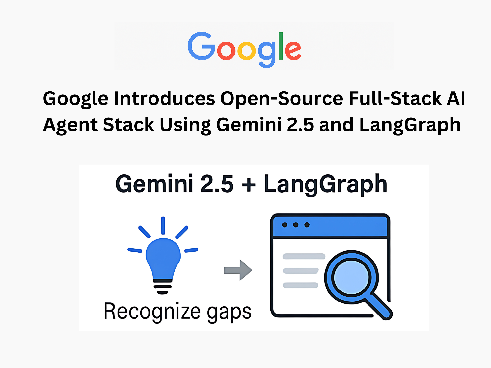

# Google Introduces Open-Source Full-Stack AI Agent Stack Using Gemini 2.5 and LangGraph for Multi-Step Web Search, Reflection, and Synthesis

> Introduction: The Need for Dynamic AI Research Assistants Conversational AI has rapidly evolved beyond basic chatbot frameworks. However, most large language models (LLMs) still suffer from a critical limitation—they generate responses based only on static training data, lacking the ability to self-identify knowledge gaps or perform real-time information synthesis. As a result, these models often […]

## Introduction: The Need for Dynamic AI Research Assistants

Conversational AI has rapidly evolved beyond basic chatbot frameworks. However, most large language models (LLMs) still suffer from a critical limitation—they generate responses based only on static training data, lacking the ability to self-identify knowledge gaps or perform real-time information synthesis. As a result, these models often deliver incomplete or outdated answers, particularly for evolving or niche topics.

To overcome these issues, AI agents must go beyond passive querying. They need to recognize informational gaps, perform autonomous web searches, validate results, and refine responses—effectively mimicking a human research assistant.

## Google’s Full-Stack Research Agent: Gemini 2.5 + LangGraph

**Google**, in collaboration with contributors from **Hugging Face** and other open-source communities, has developed a **full-stack research agent** stack designed to solve this problem. Built with a **React frontend** and a **FastAPI + LangGraph backend**, this system combines language generation with intelligent control flow and dynamic web search.

The research agent stack utilizes the **Gemini 2.5 API** to process user queries, generating structured search terms. It then performs recursive search-and-reflection cycles using the **Google Search API**, verifying whether each result sufficiently answers the original query. This iterative process continues until the agent generates a validated, well-cited response.

## Architecture Overview: Developer-Friendly and Extensible

- **Frontend:** Built with **Vite + React**, offering hot reloading and clean module separation.

- **Backend:** Powered by **Python (3.8+)**, FastAPI, and LangGraph, enabling decision control, evaluation loops, and autonomous query refinement.

- **Key Directories:** The agent logic resides in `backend/src/agent/graph.py`, while UI components are structured under `frontend/`.

- **Local Setup:** Requires Node.js, Python, and a Gemini API Key. Run with `make dev`, or launch frontend/backend separately.

- **Endpoints:**

Backend API: `http://127.0.0.1:2024`

- Frontend UI: `http://localhost:5173`

This separation of concerns ensures that developers can easily modify the agent’s behavior or UI presentation, making the project suitable for global research teams and tech developers alike.

## Technical Highlights and Performance

- **Reflective Looping:** The LangGraph agent evaluates search results and identifies coverage gaps, autonomously refining queries without human intervention.

- **Delayed Response Synthesis:** The AI waits until it gathers sufficient information before generating an answer.

- **Source Citations:** Answers include embedded hyperlinks to original sources, improving trust and traceability.

- **Use Cases:** Ideal for **academic research**, **enterprise knowledge bases**, **technical support bots**, and **consulting tools** where accuracy and validation matter.

## Why It Matters: A Step Towards Autonomous Web Research

This system illustrates how **autonomous reasoning** and **search synthesis** can be integrated directly into LLM workflows. The agent doesn’t just respond—it investigates, verifies, and adapts. This reflects a broader shift in AI development: from stateless Q&A bots to **real-time reasoning agents**.

The agent enables developers, researchers, and enterprises in regions such as **North America**, **Europe**, **India**, and **Southeast Asia** to deploy AI research assistants with minimal setup. By using globally accessible tools like FastAPI, React, and Gemini APIs, the project is well-positioned for widespread adoption.

## Key Takeaways

- 🧠 **Agent Design:** Modular React + LangGraph system supports autonomous query generation and reflection.

- 🔁 **Iterative Reasoning:** Agent refines search queries until confidence thresholds are met.

- 🔗 **Citations Built-In:** Outputs include direct links to web sources for transparency.

- ⚙️ **Developer-Ready:** Local setup requires Node.js, Python 3.8+, and a Gemini API key.

- 🌐 **Open-Source:** Publicly available for community contribution and extension.

## Conclusion

By combining Google’s Gemini 2.5 with LangGraph’s logic orchestration, this project delivers a breakthrough in autonomous AI reasoning. It showcases how research workflows can be automated without compromising accuracy or traceability. As conversational agents evolve, systems like this one set the standard for intelligent, trustworthy, and developer-friendly AI research tools.

---

**Check out the [GitHub Page](https://github.com/google-gemini/gemini-fullstack-langgraph-quickstart)_._** All credit for this research goes to the researchers of this project. Also, feel free to follow us on **[Twitter](https://x.com/intent/follow?screen_name=marktechpost)** and don’t forget to join our **[99k+ ML SubReddit](https://www.reddit.com/r/machinelearningnews/)** and Subscribe to **[our Newsletter](https://www.airesearchinsights.com/subscribe)**.
