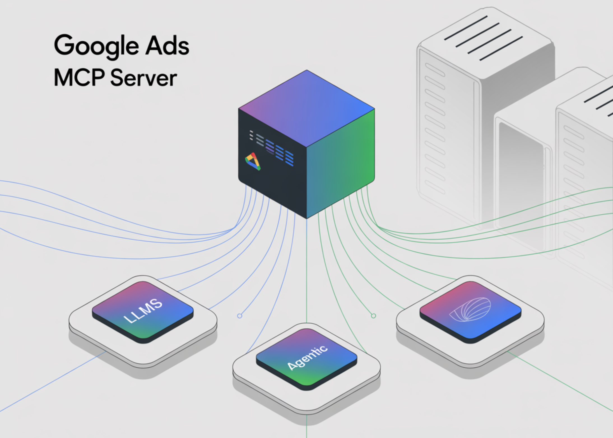

# Google Open-Sources an MCP Server for the Google Ads API, Bringing LLM-Native Access to Ads Data

> Google has open-sourced a Model Context Protocol (MCP) server that exposes read-only access to the Google Ads API for agentic and LLM applications. The repository googleads/google-ads-mcp implements an MCP server in Python that surfaces two tools today: search (GAQL queries over Ads accounts) and list_accessible_customers (enumeration of customer resources). It includes setup via pipx, Google […]

Google has open-sourced a [Model Context Protocol (MCP) server](https://github.com/googleads/google-ads-mcp) that exposes read-only access to the Google Ads API for agentic and LLM applications. The repository `googleads/google-ads-mcp` implements an MCP server in Python that surfaces two tools today: `search` (GAQL queries over Ads accounts) and `list_accessible_customers` (enumeration of customer resources). It includes setup via `pipx`, Google Ads developer tokens, OAuth2 scopes (`https://www.googleapis.com/auth/adwords`), and Gemini CLI / Code Assist integration through a standard MCP client configuration. The project is labeled “Experimental.”

### So, why it matters?

MCP is emerging as a common interface for wiring models to external systems. By shipping a reference [server](https://www.marktechpost.com/2025/08/08/proxy-servers-explained-types-use-cases-trends-in-2025-technical-deep-dive/) for the Ads API, Google lowers the integration cost for LLM agents that need campaign telemetry, budget pacing, and performance diagnostics without bespoke SDK glue.

### How it works? (developer view)

- **Protocol:** MCP standardizes “tools” that models can invoke with typed parameters and responses. The Ads MCP server advertises tools mapped to Google Ads API operations; MCP clients (Gemini CLI/Code Assist, others) discover and call them during a session.

- **Auth & scopes:** You enable the Google Ads API in a Cloud project, obtain a developer token, and configure Application Default Credentials or the Ads Python client. Required scope is `adwords`. For manager-account hierarchies, set a login customer ID.

- **Client wiring:** Add a `~/.gemini/settings.json` entry pointing to the MCP server invocation (`pipx run git+https://github.com/googleads/google-ads-mcp.git google-ads-mcp`) and pass credentials via env vars. Then query via `/mcp` in Gemini or by prompting for campaigns, performance, etc.

### Ecosystem signal

Google’s server arrives amid broader MCP adoption across vendors and open-source clients, reinforcing MCP as a pragmatic path to agent-to-SaaS interoperability. For PPC and growth teams experimenting with agentic workflows, the reference server is a low-friction way to validate LLM-assisted QA, anomaly triage, and weekly reporting without granting write privileges.

### Key Takeaways

- Google open-sourced a **read-only** Google Ads API **MCP server**, showcasing two tools: `search` (GAQL) and `list_accessible_customers`.

- Implementation details: Python project on GitHub (`googleads/google-ads-mcp`), **Apache-2.0** license, marked **Experimental**; install/run via `pipx` and configure OAuth2 with the `https://www.googleapis.com/auth/adwords` scope (dev token + optional login-customer ID).

- Works with **MCP-compatible clients** (e.g., Gemini CLI / Code Assist) so agents can issue GAQL queries and analyze Ads accounts through natural-language prompts.

### Conclusion

In practical terms, Google’s open-sourced **Google Ads API MCP server** gives teams a standards-based, read-only path for LLM agents to run GAQL queries against Ads accounts without bespoke SDK wiring. The Apache-licensed repo is marked experimental, exposes `search` and `list_accessible_customers`, and integrates with MCP clients like Gemini CLI/Code Assist; production use should account for OAuth scope (`adwords`), developer token management, and the data-exposure caveat noted in the README.

---

Check out the **[GitHub Page](https://github.com/googleads/google-ads-mcp) and [technical blog](https://ads-developers.googleblog.com/2025/10/open-source-google-ads-api-mcp-server.html)**. Feel free to check out our **[GitHub Page for Tutorials, Codes and Notebooks](https://github.com/Marktechpost/AI-Tutorial-Codes-Included)**. Also, feel free to follow us on **[Twitter](https://x.com/intent/follow?screen_name=marktechpost)** and don’t forget to join our **[100k+ ML SubReddit](https://www.reddit.com/r/machinelearningnews/)** and Subscribe to **[our Newsletter](https://www.aidevsignals.com/)**. Wait! are you on telegram? **[now you can join us on telegram as well.](https://t.me/machinelearningresearchnews)**
