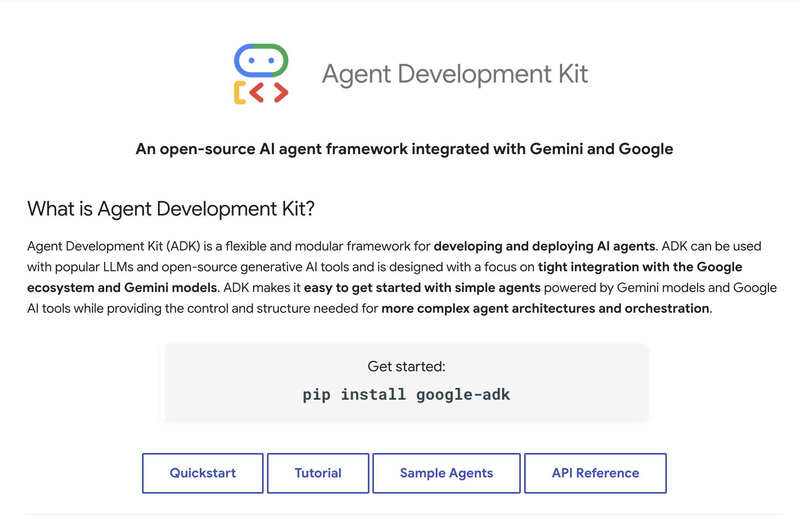

# Google Releases Agent Development Kit (ADK): An Open-Source AI Framework Integrated with Gemini to Build, Manage, Evaluate and Deploy Multi Agents

> Google has released the Agent Development Kit (ADK), an open-source framework aimed at making it easier for developers to build, manage, and deploy multi-agent systems. ADK is written in Python and focuses on modularity and flexibility, making it suitable for both simple and more complex use cases involving multiple interacting agents. Summary What is ADK? […]

Google has released the **Agent Development Kit (ADK)**, an open-source framework aimed at making it easier for developers to build, manage, and deploy multi-agent systems. ADK is written in Python and focuses on modularity and flexibility, making it suitable for both simple and more complex use cases involving multiple interacting agents.

### Summary

- Set up a basic multi-agent system with under 100 lines of Python.

- Customize agents and tools using a flexible API.

- Currently Python-based, with plans to support other languages in the future.

### What is ADK?

ADK is a developer-oriented framework for creating multi-agent systems. It provides a set of components like agents, tools, orchestrators, and memory modules, all of which can be extended or replaced. The idea is to give developers control over how agents interact and manage their internal state, while also providing a structure that’s easy to understand and work with.

### Core Features

- **Code-first approach:** You write plain Python to define behavior.

- **Multi-agent support:** Run and coordinate multiple agents.

- **Custom tools and memory:** Extend with your own logic and state management.

- **Streaming support:** Agents can exchange information in real time.

### Example: A Basic Multi-Agent Setup

Here’s a short script that shows how to define and run a multi-agent system using ADK:

Copy CodeCopiedUse a different Browser
```
from adk import Agent, Orchestrator, Tool

class EchoTool(Tool):
    def run(self, input: str) -> str:
        return f"Echo: {input}"

echo_agent = Agent(name="EchoAgent", tools=[EchoTool()])
relay_agent = Agent(name="RelayAgent")

orchestrator = Orchestrator(agents=[echo_agent, relay_agent])

if __name__ == "__main__":
    input_text = "Hello from ADK!"
    result = orchestrator.run(input_text)
    print(result)
```

This script creates two agents and a simple custom tool. One agent uses the tool to process input, and the orchestrator manages the interaction between them.

### Development Workflow

ADK is designed to fit into standard development workflows. You can:

- Log and debug agent behavior.

- Manage short- and long-term memory.

- Extend agents with custom tools and APIs.

### Adding a Custom Tool

You can define your own tools to let agents call APIs or execute logic. For example:

Copy CodeCopiedUse a different Browser
```
class SearchTool(Tool):
    def run(self, query: str) -> str:
        # Placeholder for API logic
        return f"Results for '{query}'"
```

Attach the tool to an agent and include it in the orchestrator to let your system perform searches or external tasks.

### Integrations and Tooling

ADK integrates well with Google’s broader AI ecosystem. It supports Gemini models and connects to Vertex AI, allowing access to models from providers like Anthropic, Meta, Mistral, and others. Developers can choose the best models for their application needs.

Google also introduced **Agent Engine**, a managed runtime for deploying agents into production. It handles context management, scaling, security, evaluation, and monitoring. Though it complements ADK, Agent Engine is also compatible with other agent frameworks such as LangGraph and CrewAI.

To help developers get started, Google provides **Agent Garden**, a collection of pre-built agents and tools. This library allows teams to prototype faster by reusing existing components rather than starting from scratch.

### Security and Governance

For enterprise-grade applications, ADK and its supporting tools offer several built-in safeguards:

- **Output control** to moderate agent responses.

- **Identity permissions** to restrict what agents can access or perform.

- **Input screening** to catch problematic inputs.

- **Behavior monitoring** to log and audit agent actions.

These features help teams deploy AI agents with more confidence in secure or sensitive environments.

### What’s Next

Right now, ADK supports Python, and the team behind it has shared plans to support other languages over time. Since the project is open-source, contributions and extensions are encouraged, and the framework may evolve based on how developers use it in real-world settings.

### Conclusion

ADK offers a structured but flexible way to build multi-agent systems. It’s especially useful if you want to experiment with agent workflows without having to build everything from scratch. With integration options, prebuilt libraries, and production-grade tooling, ADK can be a practical starting point for teams developing AI-driven applications.

Whether you’re experimenting with small agent workflows or exploring more involved systems, ADK is a practical tool to consider.

---

Check out **_the [GitHub Page](https://github.com/google/adk-python) and [Documentation](https://google.github.io/adk-docs/)._** All credit for this research goes to the researchers of this project. Also, feel free to follow us on **[Twitter](https://x.com/intent/follow?screen_name=marktechpost)** and don’t forget to join our **[85k+ ML SubReddit](https://www.reddit.com/r/machinelearningnews/)**.

[**🔥 [Register Now] miniCON Virtual Conference on OPEN SOURCE AI: FREE REGISTRATION + Certificate of Attendance + 3 Hour Short Event (April 12, 9 am- 12 pm PST) + Hands on Workshop [Sponsored]**](https://pxl.to/hki7r39)
