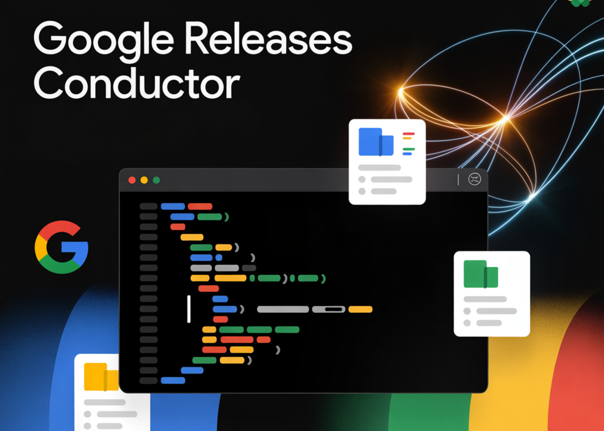

# Google Releases Conductor: a context driven Gemini CLI extension that stores knowledge as Markdown and orchestrates agentic workflows

> Google has introduced Conductor, an open source preview extension for Gemini CLI that turns AI code generation into a structured, context driven workflow. Conductor stores product knowledge, technical decisions, and work plans as versioned Markdown inside the repository, then drives Gemini agents from those files instead of ad hoc chat prompts. From chat based coding […]

Google has introduced Conductor, an open source preview extension for Gemini CLI that turns AI code generation into a structured, context driven workflow. Conductor stores product knowledge, technical decisions, and work plans as versioned Markdown inside the repository, then drives Gemini agents from those files instead of ad hoc chat prompts.

### From chat based coding to context driven development

Most AI coding today is session based. You paste code into a chat, describe the task, and the context disappears when the session ends. Conductor treats that as a core problem.

Instead of ephemeral prompts, Conductor maintains a persistent context directory inside the repo. It captures product goals, constraints, tech stack, workflow rules, and style guides as Markdown. Gemini then reads these files on every run. This makes AI behavior repeatable across machines, shells, and team members.

**Conductor also enforces a simple lifecycle:**

**Context → Spec and Plan → Implement**

The extension does not jump directly from a natural language request to code edits. It first creates a track, writes a spec, generates a plan, and only then executes.

### Installing Conductor into Gemini CLI

Conductor runs as a Gemini CLI extension. Installation is one command:

Copy CodeCopiedUse a different Browser
```
gemini extensions install https://github.com/gemini-cli-extensions/conductor --auto-update
```

The `--auto-update` flag is optional and keeps the extension synchronized with the latest release. After installation, Conductor commands are available inside Gemini CLI when you are in a project directory.

### Project setup with /conductor:setup

The workflow starts with project level setup:

Copy CodeCopiedUse a different Browser
```
/conductor:setup
```

This command runs an interactive session that builds the base context. Conductor asks about the product, users, requirements, tech stack, and development practices. From these answers it generates a `conductor/` directory with several files,** for example:**

- `conductor/product.md`

- `conductor/product-guidelines.md`

- `conductor/tech-stack.md`

- `conductor/workflow.md`

- `conductor/code_styleguides/`

- `conductor/tracks.md`

These artifacts define how the AI should reason about the project. They describe the target users, high level features, accepted technologies, testing expectations, and coding conventions. They live in Git with the rest of the source code, so changes to context are reviewable and auditable.

### Tracks: spec and plan as first class artifacts

Conductor introduces **tracks** to represent units of work such as features or bug fixes. **You create a track with:**

Copy CodeCopiedUse a different Browser
```
/conductor:newTrack
```

or with a short description:

Copy CodeCopiedUse a different Browser
```
/conductor:newTrack "Add dark mode toggle to settings page"
```

For each new track, Conductor creates a directory under `conductor/tracks/<track_id>/` **containing:**

- `spec.md`

- `plan.md`

- `metadata.json`

`spec.md` holds the detailed requirements and constraints for the track. `plan.md` contains a stepwise execution plan broken into phases, tasks, and subtasks. `metadata.json` stores identifiers and status information.

Conductor helps draft spec and plan using the existing context files. The developer then edits and approves them. The important point is that all implementation must follow a plan that is explicit and version controlled.

### Implementation with /conductor:implement

Once the plan is ready,** you hand control to the agent:**

Copy CodeCopiedUse a different Browser
```
/conductor:implement
```

Conductor reads `plan.md`, selects the next pending task, and runs the configured workflow. **Typical cycles include:**

- Inspect relevant files and context.

- Propose code changes.

- Run tests or checks according to `conductor/workflow.md`.

- Update task status in `plan.md` and global `tracks.md`.

The extension also inserts checkpoints at phase boundaries. At these points Conductor pauses for human verification before continuing. This keeps the agent from applying large, unreviewed refactors.

**Several operational commands support this flow:**

- `/conductor:status` shows track and task progress.

- `/conductor:review` helps validate completed work against product and style guidelines.

- `/conductor:revert` uses Git to roll back a track, phase, or task.

Reverts are defined in terms of tracks, not raw commit hashes, which is easier to reason about in a multi change workflow.

### Brownfield projects and team workflows

Conductor is designed to work on brownfield codebases, not only fresh projects. When you run `/conductor:setup` in an existing repository, the context session becomes a way to extract implicit knowledge from the team into explicit Markdown. Over time, as more tracks run, the context directory becomes a compact representation of the system’s architecture and constraints.

Team level behavior is encoded in `workflow.md`, `tech-stack.md`, and style guide files. Any engineer or AI agent that uses Conductor in that repo inherits the same rules. This is useful for enforcing test strategies, linting expectations, or approved frameworks across contributors.

Because context and plans are in Git, they can be code reviewed, discussed, and changed with the same process as source files.

### Key Takeaways

- **Conductor is a Gemini CLI extension for context-driven development**: It is an open source, Apache 2.0 licensed extension that runs inside Gemini CLI and drives AI agents from repository-local Markdown context instead of ad hoc prompts.

- **Project context is stored as versioned Markdown under `conductor/`**: Files like `product.md`, `tech-stack.md`, `workflow.md`, and code style guides define product goals, tech choices, and workflow rules that the agent reads on each run.

- **Work is organized into tracks with `spec.md` and `plan.md`**: `/conductor:newTrack` creates a track directory containing `spec.md`, `plan.md`, and `metadata.json`, making requirements and execution plans explicit, reviewable, and tied to Git.

- **Implementation is controlled via `/conductor:implement` and track-aware ops**: The agent executes tasks according to `plan.md`, updates progress in `tracks.md`, and supports `/conductor:status`, `/conductor:review`, and `/conductor:revert` for progress inspection and Git-backed rollback.

---

Check out the **[Repo](https://github.com/gemini-cli-extensions/conductor) and [Technical details](https://developers.googleblog.com/conductor-introducing-context-driven-development-for-gemini-cli/)**. Also, feel free to follow us on **[Twitter](https://x.com/intent/follow?screen_name=marktechpost)** and don’t forget to join our **[100k+ ML SubReddit](https://www.reddit.com/r/machinelearningnews/)** and Subscribe to **[our Newsletter](https://www.aidevsignals.com/)**. Wait! are you on telegram? **[now you can join us on telegram as well.](https://t.me/machinelearningresearchnews)**
