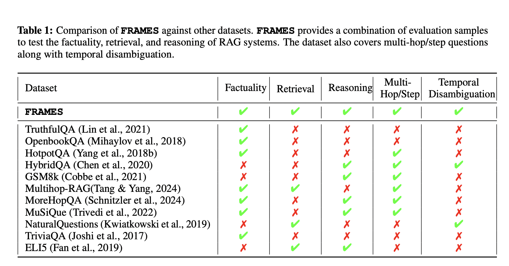

# Google Releases FRAMES: A Comprehensive Evaluation Dataset Designed to Test Retrieval-Augmented Generation (RAG) Applications on Factuality, Retrieval Accuracy, and Reasoning

> Retrieval-augmented generation (RAG) has been a transformative approach in natural language processing, combining retrieval mechanisms with generative models to enhance factual accuracy and reasoning capabilities. RAG systems excel in generating complex responses by leveraging external sources and synthesizing the retrieved information into coherent narratives. Unlike traditional models that rely solely on pre-existing knowledge, RAG systems […]

Retrieval-augmented generation (RAG) has been a transformative approach in natural language processing, combining retrieval mechanisms with generative models to enhance factual accuracy and reasoning capabilities. RAG systems excel in generating complex responses by leveraging external sources and synthesizing the retrieved information into coherent narratives. Unlike traditional models that rely solely on pre-existing knowledge, RAG systems can incorporate real-time data, making them valuable for tasks requiring up-to-date information and multi-hop reasoning. This research explores how RAG systems handle complex queries involving multiple documents and temporal disambiguation, thereby accurately reflecting how these systems perform in real-world scenarios.

The challenge with evaluating RAG systems is that current methods often need to catch up in capturing their true performance. Existing benchmarks, such as TruthfulQA, HotpotQA, and TriviaQA, evaluate isolated components like factual accuracy or retrieval precision but need to offer a unified view of how these systems integrate multiple aspects to provide end-to-end reasoning solutions. As a result, it becomes difficult to assess these systems’ effectiveness in handling complex, multi-document queries that require synthesizing information from diverse sources.

Existing methods to evaluate RAG systems rely on datasets designed for single-turn question answering or factual verification, limiting their applicability to more complex, multi-step tasks. For instance, the TruthfulQA dataset focuses primarily on verifying the factual correctness of responses. In contrast, datasets like HotpotQA emphasize retrieving relevant documents without assessing the reasoning needed to synthesize this information. Consequently, the lack of a comprehensive evaluation set results in an incomplete understanding of RAG systems’ performance.

The researchers from Google and Harvard University developed the [**FRAMES (F**actuality**, R**etrieval,** A**nd** reasoning ME**asurement** S**et**) dataset**](https://huggingface.co/datasets/google/frames-benchmark), comprising 824 challenging multi-hop questions that demand integrating information from multiple sources. This unique dataset evaluates RAG systems on three core capabilities: factuality, retrieval, and reasoning. The questions cover various topics, from history and sports to scientific phenomena, each requiring 2-15 Wikipedia articles to answer. Approximately 36% of the questions involve reasoning through multiple constraints, 20% demand numerical comparisons, and 16% require temporal disambiguation. The FRAMES dataset is designed to offer a realistic representation of queries encountered in real-world applications, thus providing a rigorous test bed for evaluating state-of-the-art RAG systems.

The research introduced a multi-step retrieval method to improve the performance of RAG systems on complex queries. Traditional single-step approaches achieved an accuracy of only 0.40, highlighting the difficulty even advanced models face in synthesizing information from multiple sources. However, the new multi-step retrieval method showed a significant improvement, with accuracy increasing to 0.66 when models iteratively retrieved and synthesized relevant information. This method generates multiple search queries in iterative steps, where each query retrieves top-ranking documents added to the model’s context. The model gains access to more relevant information with each iteration, enhancing its ability to reason through complex constraints and accurately answer multi-hop questions.

Despite these advancements, the researchers found that the models should have performed better in certain reasoning categories. For example, the accuracy for numerical reasoning, tabular data extraction, and post-processing remained low, even when all relevant documents were provided. The state-of-the-art model achieved 0.40 accuracy in a single-step evaluation scenario, improving to 0.45 with two additional documents and 0.47 with four. The Oracle Prompt, where all necessary documents were present in the context, yielded an accuracy of 0.73, demonstrating the potential of perfect retrieval systems to maximize model performance. The study concludes that while RAG systems have made significant strides, they still face challenges integrating retrieved information into coherent answers, especially in complex scenarios.

This research highlights the need for further development in RAG systems, particularly in enhancing retrieval mechanisms and reasoning capabilities. The findings provide a solid foundation for future work to focus on improving the integration of complex, multi-document retrievals and refining reasoning frameworks. By addressing these gaps, RAG systems could become even more robust and capable of handling real-world queries more precisely and consistently.

Key Takeaways from the release:

- The FRAMES dataset introduced 824 questions to evaluate factuality, retrieval, and reasoning capabilities.

- Approximately 36% of the dataset involves reasoning through multiple constraints, and 20% includes numerical comparisons.

- Single-step evaluation methods achieved an accuracy of 0.40, while multi-step methods improved accuracy to 0.66.

- The Oracle Prompt, which included all necessary documents, was 0.73 accurate, indicating the potential of ideal retrieval systems.

- Despite iterative retrieval improvements, the study underscores significant gaps in numerical, tabular, and post-processing reasoning tasks.

In conclusion, this research provides a comprehensive framework for evaluating RAG systems, showcasing both the progress and the challenges in developing robust multi-hop reasoning capabilities. The FRAMES dataset offers a clearer picture of how RAG systems perform in real-world applications, setting the stage for future innovations to bridge the existing gaps and advance these systems’ capabilities.

---

Check out the **[Paper](https://arxiv.org/abs/2409.12941)** and **[Dataset](https://huggingface.co/datasets/google/frames-benchmark)**. All credit for this research goes to the researchers of this project. Also, don’t forget to follow us on **[Twitter](https://twitter.com/Marktechpost)** and join our **[Telegram Channel](https://pxl.to/at72b5j)** and [**LinkedIn Gr**](https://www.linkedin.com/groups/13668564/)[**oup**](https://www.linkedin.com/groups/13668564/). **If you like our work, you will love our**[** newsletter..**](https://marktechpost-newsletter.beehiiv.com/subscribe)

Don’t Forget to join our **[50k+ ML SubReddit](https://www.reddit.com/r/machinelearningnews/)**
