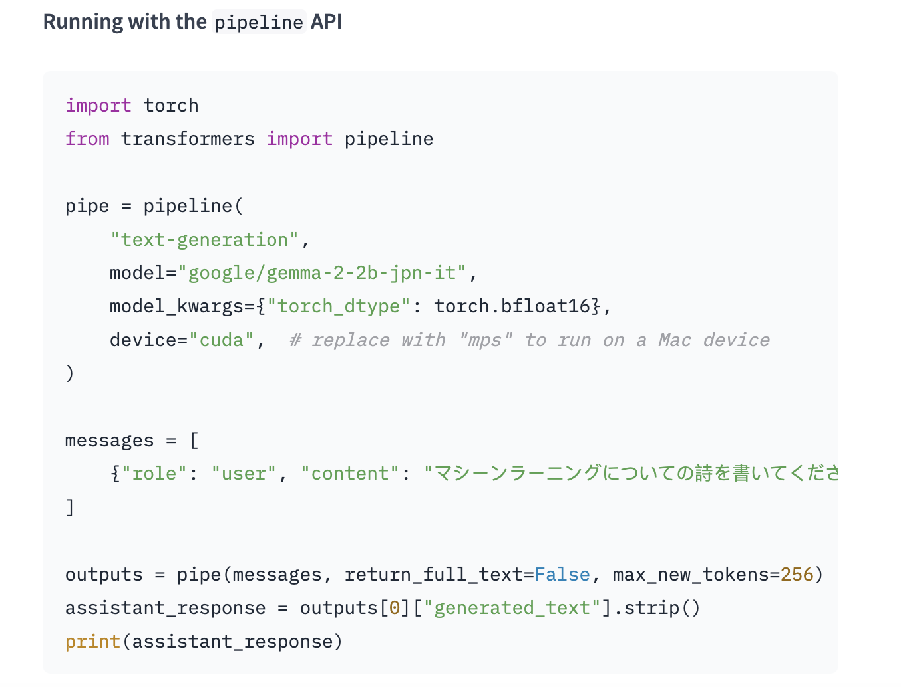

# Google Releases Gemma-2-JPN: A 2B AI Model Fine-Tuned on Japanese Text

> Google has launched the “gemma-2-2b-jpn-it” model, a new addition to its Gemma family of language models. The model is designed to cater specifically to the Japanese language and showcases the company’s continued investment in advancing large language model (LLM) capabilities. Gemma-2-2b-jpn-it stands out as a text-to-text, decoder-only large language model with open weights, which means […]

Google has launched the “[**gemma-2-2b-jpn-it**](https://huggingface.co/google/gemma-2-2b-jpn-it)” model, a new addition to its Gemma family of language models. The model is designed to cater specifically to the Japanese language and showcases the company’s continued investment in advancing large language model (LLM) capabilities. Gemma-2-2b-jpn-it stands out as a text-to-text, decoder-only large language model with open weights, which means it is publicly accessible and can be fine-tuned for a variety of text generation tasks, including question-answering summarization, and reasoning.

The Gemma-2-2b series has been fine-tuned for Japanese text, allowing it to perform comparably to its English counterparts. This ensures that it can handle queries in Japanese with the same level of fluency and accuracy as in English, making it a valuable tool for developers and researchers focused on the Japanese market.

**Technical Specifications and Capabilities**

The gemma-2-2b-jpn-it model features 2.61 billion parameters and utilizes the BF16 tensor type. It is a state-of-the-art model that draws its architectural inspiration from Google’s Gemini family of models. The model is equipped with advanced technical documentation and resources, including inference APIs that make it easier for developers to integrate it into various applications. One key advantage of this model is its compatibility with Google’s latest Tensor Processing Unit (TPU) hardware, specifically TPUv5p. This hardware provides significant computational power, enabling faster training and better model performance than traditional CPU-based infrastructure. The TPUs are designed to handle the large-scale matrix operations involved in training LLMs, which enhances the speed and efficiency of the model’s training process.

[**Image Source**](https://huggingface.co/google/gemma-2-2b-jpn-it)

Regarding software, gemma-2-2b-jpn-it utilizes the JAX and ML Pathways frameworks for training. JAX is specifically optimized for high-performance machine learning applications, while ML Pathways provides a flexible platform for orchestrating the entire training process. This combination allows Google to achieve a streamlined and efficient training workflow, as described in their technical paper on the Gemini family of models.

**Applications and Use-Cases**

The release of gemma-2-2b-jpn-it has opened up numerous possibilities for its application across various domains. The model can be used in content creation and communication, generating creative text formats like poems, scripts, code, marketing copy, and even chatbot responses. Its text generation capabilities also extend to summarization tasks, where it can condense large bodies of text into concise summaries. This makes it suitable for research, education, and knowledge exploration.

Another area where gemma-2-2b-jpn-it excels is in natural language processing (NLP) research. Researchers can use this model to experiment with various NLP techniques, develop new algorithms, and contribute to advancing the field. Its ability to handle interactive language learning experiences also makes it a valuable asset for language learning platforms, where it can aid in grammar correction and provide real-time feedback for writing practice.

**Limitations and Ethical Considerations**

Despite its strengths, the gemma-2-2b-jpn-it model has certain limitations that users should know. The model’s performance relies on the diversity and quality of its training data. Biases or gaps in the training dataset can limit the model’s responses. Moreover, since LLMs are not inherently knowledge bases, they may generate incorrect or outdated factual statements, particularly when dealing with complex queries.

Ethical considerations are too a key focus in the development of gemma-2-2b-jpn-it. The model has undergone rigorous evaluation to address concerns related to text-to-text content safety, representational harms, and memorization of training data. The evaluation process includes structured assessments and internal red-teaming testing against various categories relevant to ethics and safety. To mitigate risks, Google has implemented several measures, including filtering techniques to exclude harmful content, enforcing content safety guidelines, and establishing a framework for transparency and accountability. Developers are encouraged to monitor continuously and adopt privacy-preserving techniques to ensure compliance with data privacy regulations.

**Conclusion**

The launch of gemma-2-2b-jpn-it represents a significant step forward in Google’s efforts to develop high-quality, open large language models tailored to the Japanese language. With its robust performance, comprehensive technical documentation, and diverse application potential, this model is poised to become a valuable tool for developers and researchers.

---

Check out the **[Models on Hugging Face](https://huggingface.co/google/gemma-2-2b-jpn-it)**. All credit for this research goes to the researchers of this project. Also, don’t forget to follow us on **[Twitter](https://twitter.com/Marktechpost)** and join our **[Telegram Channel](https://pxl.to/at72b5j)** and [**LinkedIn Gr**](https://www.linkedin.com/groups/13668564/)[**oup**](https://www.linkedin.com/groups/13668564/). **If you like our work, you will love our**[** newsletter..**](https://marktechpost-newsletter.beehiiv.com/subscribe) Don’t Forget to join our **[50k+ ML SubReddit](https://www.reddit.com/r/machinelearningnews/)**

**Interested in promoting your company, product, service, or event to over 1 Million AI developers and researchers? [Let’s collaborate!](https://pxl.to/9z1g32d)**
