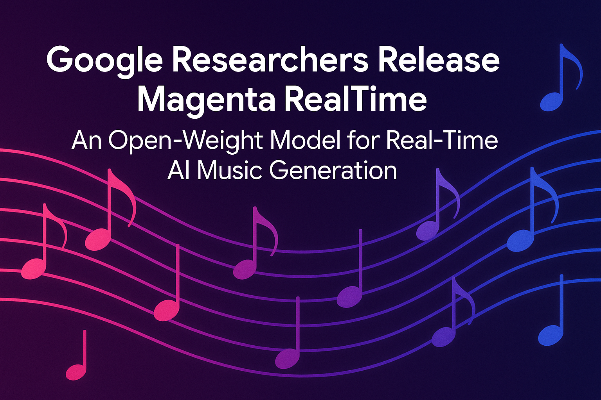

# Google Researchers Release Magenta RealTime: An Open-Weight Model for Real-Time AI Music Generation

> Google’s Magenta team has introduced Magenta RealTime (Magenta RT), an open-weight, real-time music generation model that brings unprecedented interactivity to generative audio. Licensed under Apache 2.0 and available on GitHub and Hugging Face, Magenta RT is the first large-scale music generation model that supports real-time inference with dynamic, user-controllable style prompts. Background: Real-Time Music Generation […]

Google’s Magenta team has introduced _Magenta RealTime_ (Magenta RT), an open-weight, real-time music generation model that brings unprecedented interactivity to generative audio. Licensed under Apache 2.0 and available on [GitHub](https://github.com/magenta/magenta-realtime) and [Hugging Face](https://huggingface.co/google/magenta-realtime), Magenta RT is the first large-scale music generation model that supports real-time inference with dynamic, user-controllable style prompts.

### Background: Real-Time Music Generation 

Real-time control and live interactivity are foundational to musical creativity. While prior Magenta projects like Piano Genie and DDSP emphasized expressive control and signal modeling, Magenta RT extends these ambitions to full-spectrum audio synthesis. It closes the gap between generative models and _human-in-the-loop_ composition by enabling instantaneous feedback and dynamic musical evolution.

Magenta RT builds upon MusicLM and MusicFX’s underlying modeling techniques. However, unlike their API- or batch-oriented modes of generation, Magenta RT supports **streaming synthesis** with forward real-time factor (RTF) >1—meaning it can generate faster than real-time, even on free-tier Colab TPUs.

### Technical Overview

Magenta RT is a Transformer-based language model trained on discrete audio tokens. These tokens are produced via a neural audio codec, which operates at 48 kHz stereo fidelity. The model leverages an 800 million parameter Transformer architecture that has been optimized for:

- **Streaming generation** in 2-second audio segments

- **Temporal conditioning** with a 10-second audio history window

- **Multimodal style control**, using either text prompts or reference audio

To support this, the model architecture adapts MusicLM’s staged training pipeline, integrating a **new joint music-text embedding module** known as _MusicCoCa_ (a hybrid of MuLan and CoCa). This allows semantically meaningful control over genre, instrumentation, and stylistic progression in real time.

### Data and Training

Magenta RT is trained on ~190,000 hours of instrumental stock music. This large and diverse dataset ensures wide genre generalization and smooth adaptation across musical contexts. The training data was tokenized using a hierarchical codec, which enables compact representations without losing fidelity. Each 2-second chunk is conditioned not only on a user-specified prompt but also on a rolling context of 10 seconds of prior audio, enabling smooth, coherent progression.

**The model supports two input modalities for style prompts:**

- **Textual prompts**, which are converted into embeddings using MusicCoCa

- **Audio prompts**, encoded into the same embedding space via a learned encoder

This fusion of modalities permits _real-time genre morphing_ and dynamic instrument blending—capabilities essential for live composition and DJ-like performance scenarios.

### Performance and Inference

Despite the model’s scale (800M parameters), Magenta RT achieves a generation speed of **1.25 seconds for every 2 seconds of audio**. This is sufficient for real-time usage (RTF ~0.625), and inference can be executed on free-tier TPUs in Google Colab.

The generation process is chunked to allow continuous streaming: each 2s segment is synthesized in a forward pipeline, with overlapping windowing to ensure continuity and coherence. Latency is further minimized via optimizations in model compilation (XLA), caching, and hardware scheduling.

### Applications and Use Cases

**Magenta RT is designed for integration into:**

- **Live performances**, where musicians or DJs can steer generation on-the-fly

- **Creative prototyping tools**, offering rapid auditioning of musical styles

- **Educational tools**, helping students understand structure, harmony, and genre fusion

- **Interactive installations**, enabling responsive generative audio environments

Google has hinted at upcoming support for **on-device inference** and **personal fine-tuning**, which would allow creators to adapt the model to their unique stylistic signatures.

### Comparison to Related Models

Magenta RT complements Google DeepMind’s MusicFX (DJ Mode) and Lyria’s RealTime API, but differs critically in being open source and self-hostable. It also stands apart from latent diffusion models (e.g., Riffusion) and autoregressive decoders (e.g., Jukebox) by focusing on codec-token prediction with minimal latency.

Compared to models like MusicGen or MusicLM, Magenta RT delivers lower latency and enables **interactive generation**, which is often missing from current prompt-to-audio pipelines that require full track generation upfront.

### Conclusion

Magenta RealTime pushes the boundaries of real-time generative audio. By blending high-fidelity synthesis with dynamic user control, it opens up new possibilities for AI-assisted music creation. Its architecture balances scale and speed, while its open licensing ensures accessibility and community contribution. For researchers, developers, and musicians alike, Magenta RT represents a foundational step toward responsive, collaborative AI music systems.

---

Check out the** [Model on Hugging Face](https://huggingface.co/google/magenta-realtime), [GitHub Page](https://github.com/magenta/magenta-realtime), [Technical Details](https://magenta.withgoogle.com/magenta-realtime) and [Colab Notebook](https://colab.research.google.com/github/magenta/magenta-realtime/blob/main/notebooks/Magenta_RT_Demo.ipynb)_._** All credit for this research goes to the researchers of this project. Also, feel free to follow us on **[Twitter](https://x.com/intent/follow?screen_name=marktechpost)** and don’t forget to join our **[100k+ ML SubReddit](https://www.reddit.com/r/machinelearningnews/)** and Subscribe to **[our Newsletter](https://www.airesearchinsights.com/subscribe)**.

**[FREE REGISTRATION: miniCON AI Infrastructure 2025 (Aug 2, 2025)](https://minicon.marktechpost.com/) [Speakers: Jessica Liu, VP Product Management @ Cerebras, Andreas Schick, Director AI @ US FDA, Volkmar Uhlig, VP AI Infrastructure @ IBM, Daniele Stroppa, WW Sr. Partner Solutions Architect @ Amazon, Aditya Gautam, Machine Learning Lead @ Meta, Sercan Arik, Research Manager @ Google Cloud AI, Valentina Pedoia, Senior Director AI/ML @ the Altos Labs, Sandeep Kaipu, Software Engineering Manager @ Broadcom ]**
