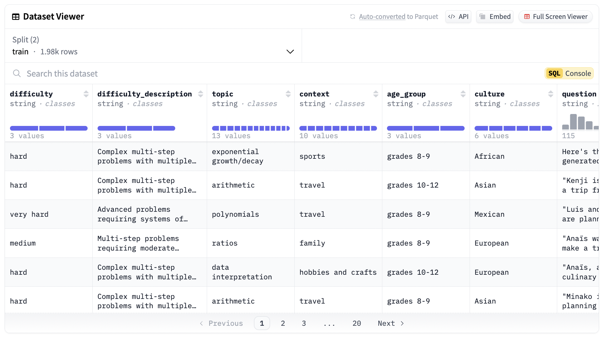

# Gretel AI Open-Sourced Synthetic-GSM8K-Reflection-405B Dataset: Advancing AI Model Training with Multi-Step Reasoning, Reflection Techniques, and Real-World Problem-Solving Scenarios

> With AI, the demand for high-quality datasets that can support the training & evaluation of models in various domains is increasing. One such milestone is the open-sourcing of the Synthetic-GSM8K-reflection-405B dataset by Gretel.ai, which holds significant promise for reasoning tasks, specifically those requiring multi-step problem-solving capabilities. This newly released dataset, hosted on Hugging Face, was […]

With AI, the demand for high-quality datasets that can support the training & evaluation of models in various domains is increasing. One such milestone is the open-sourcing of the [**Synthetic-GSM8K-reflection-405B**](https://huggingface.co/datasets/gretelai/synthetic-gsm8k-reflection-405b) dataset by Gretel.ai, which holds significant promise for reasoning tasks, specifically those requiring multi-step problem-solving capabilities. This newly released dataset, hosted on Hugging Face, was synthetically generated using Gretel Navigator, with Meta-Llama-3.1-405B serving as the agent language model (LLM). Its creation reflects advancements in leveraging synthetic data generation and AI reflections for developing robust AI models. 

**Synthetic Data Generation Using Reflection Techniques**

One of the standout features of the synthetic-GSM8K-reflection-405B dataset is its reliance on synthetic data generation. Artificially generated rather than collected from real-world events, synthetic data is increasingly vital in training AI models. In this case, the dataset was created using Gretel Navigator, a sophisticated synthetic data generation tool. This unique dataset uses Meta-Llama-3.1-405B, an advanced LLM, as the generating agent.

The dataset draws inspiration from the popular GSM8K dataset but takes a step further by incorporating reflection techniques. These techniques allow the model to engage in step-by-step reflections during the question-and-answer stages of multi-step problems. The goal of using reflections is to mimic human-like reasoning, where the AI systematically breaks down complex questions into smaller, manageable steps, reflecting on each before moving forward. This approach enhances the model’s ability to understand and solve problems requiring logical thinking, making it an invaluable asset for reasoning tasks.

**Diverse Real-World Contexts and Rigorous Validation**

Another key feature of the synthetic-GSM8K-reflection-405B dataset is the diversity of its questions. The dataset’s design ensures that the problems are stratified by difficulty and topic, encompassing a wide range of real-world contexts. This diversity makes the dataset highly versatile and applicable to various domains, from academic challenges to industry-specific scenarios that require robust problem-solving skills. 

The dataset also stands out for its rigorously verified nature. All the calculations and problem-solving processes have been meticulously validated using Python’s sympy library. Sympy is a powerful tool for symbolic mathematics, ensuring that the calculations in the dataset are accurate and reliable. This rigorous validation adds a layer of credibility to the dataset, making it a useful tool for AI training and reliable for developing models that can handle complex reasoning tasks with precision.

**Train and Test Sets for Model Development**

The synthetic-GSM8K-reflection-405B dataset is thoughtfully designed to support AI model development. It comes with both training and test sets, containing a total of 300 examples. These examples are categorized by difficulty levels: medium, hard, and very hard, ensuring that models trained on this dataset can handle a wide spectrum of reasoning challenges. The division into train and test sets is crucial for model evaluation. By providing separate sets for training and testing, the dataset allows developers to train their models on one portion of the data and evaluate their performance on a different portion. This separation helps assess how well the model generalizes to unseen data, a key indicator of the model’s robustness and effectiveness.

**Potential Applications and Impact**

Gretel.ai’s open-sourcing of synthetic-GSM8K-reflection-405B by Gretel.ai is poised to significantly impact the AI and machine learning community. Its focus on reasoning tasks makes it an ideal dataset for developing models that require step-by-step problem-solving capabilities. These models can be applied in many fields, such as education, where AI can assist in solving complex mathematical problems, or in industries like finance and engineering, where multi-step reasoning is crucial for decision-making processes.

One of the most exciting aspects of this dataset is its ability to enhance the development of AI models that can handle real-world scenarios. The dataset’s stratification by difficulty and topic covers various contexts, from everyday problems to highly specialized challenges. As a result, models trained on this dataset can be deployed in various applications, offering solutions to common and niche problems.

Moreover, the dataset’s reliance on reflection techniques aligns with the growing trend of developing AI systems that mimic human thought processes. By breaking down complex and challenging problems into smaller steps and reflecting on each, the models trained on this dataset are more likely to offer accurate and efficient solutions. This capability is particularly important in fields where accuracy and logical reasoning are paramount.

*[**Image Source**](https://huggingface.co/datasets/gretelai/synthetic-gsm8k-reflection-405b)*

**The Role of Hugging Face in Democratizing AI**

The open-sourcing of synthetic-GSM8K-reflection-405B on Hugging Face is another step toward democratizing AI. Hugging Face has become a central hub for AI developers and researchers, offering access to many models and datasets. By making this dataset freely available, Gretel.ai contributes to the collaborative nature of AI development, where researchers and developers worldwide can access and build upon existing resources.

Hugging Face’s platform also ensures that the dataset reaches a wide audience, from AI researchers in academia to developers in the industry. The platform’s ease of access and robust model training and evaluation support make it an ideal venue for hosting this dataset. The synthetic-GSM8K-reflection-405B dataset’s open-source nature means that developers can use it to train their models, share their findings, and contribute to advancing AI reasoning capabilities.

_**‘Datasets like GSM8K are crucial for advancing AI reasoning, as these complex problems are challenging to produce at scale. By releasing an enhanced synthetic GSM8K dataset using Reflection techniques, we’re aiming to push the community beyond current benchmarks and teach AI systems to generate more thoughtful and explainable responses.’ – Alex Watson, Co-founder and CPO**_

**Conclusion**

The synthetic-GSM8K-reflection-405B dataset by Gretel.ai represents a significant advancement in AI and machine learning, particularly in reasoning tasks. Its use of synthetic data generation, reflection techniques, and rigorous validation ensures that it is a high-quality resource for training AI models that can handle complex, multi-step problems. By making this dataset open-source on Hugging Face, Gretel.ai democratizes AI development, allowing researchers and developers worldwide to access and utilize this valuable resource.

With its diverse real-world contexts and carefully stratified examples, the synthetic-GSM8K-reflection-405B dataset is set to play a crucial role in improving the reasoning capabilities of AI models. Whether used in academic research, industry applications, or model development for specific problem-solving tasks, this dataset holds great potential for advancing AI systems that can think and reason like humans.

---

Check out the **[HF Page](https://huggingface.co/datasets/gretelai/synthetic-gsm8k-reflection-405b)**. All credit for this research goes to the researchers of this project. Also, don’t forget to follow us on **[Twitter](https://twitter.com/Marktechpost)** and join our **[Telegram Channel](https://pxl.to/at72b5j)** and [**LinkedIn Gr**](https://www.linkedin.com/groups/13668564/)[**oup**](https://www.linkedin.com/groups/13668564/). **If you like our work, you will love our**[** newsletter..**](https://marktechpost-newsletter.beehiiv.com/subscribe)

Don’t Forget to join our **[50k+ ML SubReddit](https://www.reddit.com/r/machinelearningnews/)**

**[⏩ ⏩ FREE AI WEBINAR: ‘SAM 2 for Video: How to Fine-tune On Your Data’ (Wed, Sep 25, 4:00 AM – 4:45 AM EST)](https://encord.com/webinar/sam2-for-video/?utm_medium=affiliate&utm_source=newsletter&utm_campaign=marktechpost&utm_content=sam2video)**
