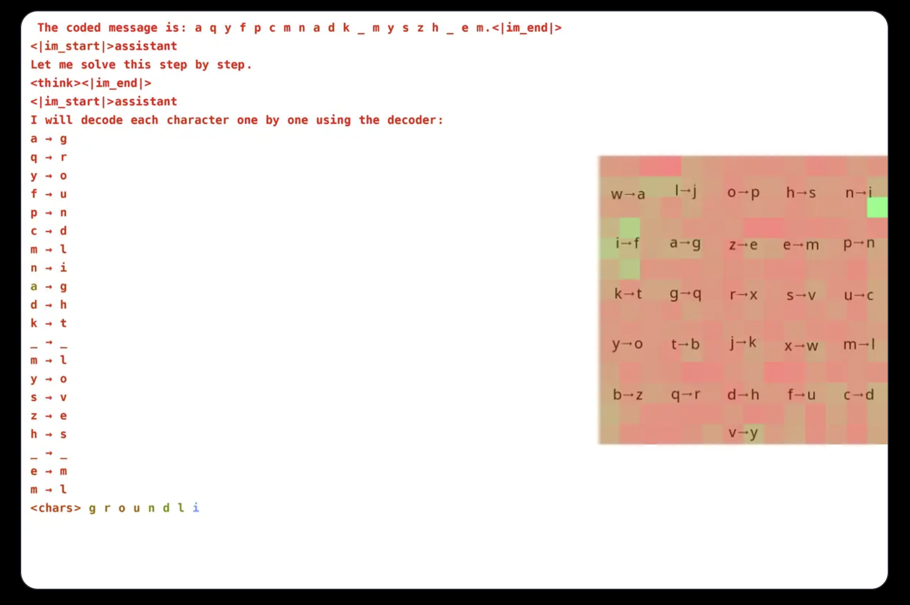

# Groundlight Research Team Released an Open-Source AI Framework that Makes It Easy to Build Visual Reasoning Agents (with GRPO)

> Modern VLMs struggle with tasks requiring complex visual reasoning, where understanding an image alone is insufficient, and deeper interpretation is needed. While recent advancements in LLMs have significantly improved text-based reasoning, similar progress in the visual domain remains limited. Existing VLMs often fail when required to combine visual and textual cues for logical deductions, highlighting […]

Modern VLMs struggle with tasks requiring complex visual reasoning, where understanding an image alone is insufficient, and deeper interpretation is needed. While recent advancements in LLMs have significantly improved text-based reasoning, similar progress in the visual domain remains limited. Existing VLMs often fail when required to combine visual and textual cues for logical deductions, highlighting a critical gap in their capabilities. This limitation is particularly evident in tasks that demand stepwise reasoning, where merely recognizing objects in an image is inadequate without an underlying understanding of relationships and contextual information.

Prior research on multimodal AI has primarily focused on object detection, captioning, and question answering, with limited exploration of higher-order reasoning. Some studies have attempted to enhance VLMs with chain-of-thought prompting or explicit reasoning structures. Still, these approaches are either restricted to textual data or fail to generalize across diverse visual tasks. Moreover, most open-source efforts in this area remain underdeveloped, making it difficult to advance visual reasoning beyond simple recognition tasks. Addressing these gaps is crucial for developing VLMs to perform sophisticated reasoning on real-world images.

Groundlight researchers explored training VLMs for visual reasoning using reinforcement learning, leveraging GRPO to enhance efficiency. While prior work, such as Deepseek’s research and advanced reasoning in language models, had little been done to extend these techniques to VLMs, they designed a cryptogram-solving task requiring both visual and textual processing to demonstrate their approach. The model deciphers encoded messages using a randomly generated decoder image, achieving 96% accuracy with a 3B parameter model. Attention analysis confirms the model actively engages with visual input, highlighting its ability to focus on relevant decoder regions while solving the task.

Training VLMs with GRPO presents multiple challenges, particularly in tokenization and reward design. Since models process text as tokens rather than individual characters, tasks requiring precise character-level reasoning can be problematic. To mitigate this, researchers formatted messages with spaces between letters to simplify decoding. Reward design was another crucial aspect, as reinforcement learning models require well-structured feedback to learn effectively. Three reward types were used: a format reward ensuring consistency in output, a decoding reward encouraging meaningful transformations of scrambled text, and a correctness reward refining accuracy. By carefully balancing these rewards, the researchers prevented unintended learning shortcuts, ensuring the model genuinely improved at cryptogram solving.

GRPO, which optimizes learning by comparing multiple outputs rather than relying on direct gradient computation, provided advantages in stabilizing training. By generating various responses per query and evaluating them relative to each other, the approach allowed for smoother learning curves. The research also highlighted the potential of VLMs in reasoning-based tasks but acknowledged the high computational costs associated with complex vision models. Techniques like selective model escalation were proposed to address efficiency concerns, where expensive models are used only for ambiguous cases. Additionally, integrating pre-trained models for object detection, segmentation, and depth estimation was suggested to enhance reasoning without significantly increasing computational overhead. This tool-based approach offers a scalable alternative to training massive end-to-end models, emphasizing efficiency without compromising accuracy.

In conclusion, The Groundlight team has made significant strides in enhancing VLMs by integrating reinforcement learning techniques, specifically GRPO. Their approach was tested on a cryptogram-solving task, where the model demonstrated impressive accuracy. This advancement underscores the potential of combining visual and textual data to improve VLM performance. By open-sourcing their methodology and tools, Groundlight aims to empower the broader community to further develop visual reasoning capabilities in AI systems.

---

Check out **_the [Technical details](https://www.groundlight.ai/blog/visual-reasoning-models), [GitHub Page](https://github.com/groundlight/r1_vlm?tab=readme-ov-file) and [Demo](https://huggingface.co/spaces/Groundlight/grpo-vlm-decoder)._** All credit for this research goes to the researchers of this project. Also, feel free to follow us on **[Twitter](https://x.com/intent/follow?screen_name=marktechpost)** and don’t forget to join our **[80k+ ML SubReddit](https://www.reddit.com/r/machinelearningnews/)**.
