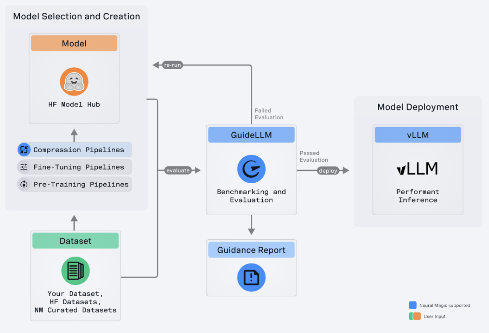

# GuideLLM Released by Neural Magic: A Powerful Tool for Evaluating and Optimizing the Deployment of Large Language Models (LLMs)

> The deployment and optimization of large language models (LLMs) have become critical for various applications. Neural Magic has introduced GuideLLM to address the growing need for efficient, scalable, and cost-effective LLM deployment. This powerful open-source tool is designed to evaluate and optimize the deployment of LLMs, ensuring they meet real-world inference requirements with high performance […]

The deployment and optimization of large language models (LLMs) have become critical for various applications. Neural Magic has introduced [**GuideLLM **](https://github.com/neuralmagic/guidellm?tab=readme-ov-file)to address the growing need for efficient, scalable, and cost-effective LLM deployment. This powerful open-source tool is designed to evaluate and optimize the deployment of LLMs, ensuring they meet real-world inference requirements with high performance and minimal resource consumption.

**Overview of GuideLLM**

GuideLLM is a comprehensive solution that helps users gauge the performance, resource needs, and cost implications of deploying large language models on various hardware configurations. By simulating real-world inference workloads, GuideLLM enables users to ensure that their LLM deployments are efficient and scalable without compromising service quality. This tool is particularly valuable for organizations looking to deploy LLMs in production environments where performance and cost are critical factors.

*[**Image Source**](https://github.com/neuralmagic/guidellm?tab=readme-ov-file)*

**Key Features of GuideLLM**

GuideLLM offers several key features that make it an indispensable tool for optimizing LLM deployments:

- **Performance Evaluation: **GuideLLM allows users to analyze the performance of their LLMs under different load scenarios. This feature ensures the deployed models meet the desired service level objectives (SLOs), even under high demand.

- **Resource Optimization:** By evaluating different hardware configurations, GuideLLM helps users determine the most suitable setup for running their models effectively. This leads to optimized resource utilization and potentially significant cost savings.

- **Cost Estimation: **Understanding the financial impact of various deployment strategies is crucial for making informed decisions. GuideLLM gives users insights into the cost implications of different configurations, enabling them to minimize expenses while maintaining high performance.

- **Scalability Testing: **GuideLLM can simulate scaling scenarios to handle large numbers of concurrent users. This feature is essential for ensuring the deployment can scale without performance degradation, which is critical for applications that experience variable traffic loads.

**Getting Started with GuideLLM**

To start using GuideLLM, users need to have a compatible environment. The tool supports Linux and MacOS operating systems and requires Python versions 3.8 to 3.12. Installation is straightforward through PyPI, the Python Package Index, using the pip command. Once installed, users can evaluate their LLM deployments by starting an OpenAI-compatible server, such as vLLM, which is recommended for running evaluations.

**Running Evaluations**

GuideLLM provides a command-line interface (CLI) that users can utilize to evaluate their LLM deployments. GuideLLM can simulate various load scenarios and output detailed performance metrics by specifying the model name and server details. These metrics include request latency, time to first token (TTFT), and inter-token latency (ITL), which are crucial for understanding the deployment’s efficiency and responsiveness.

For example, if a latency-sensitive chat application is deployed, users can optimize for low TTFT and ITL to ensure smooth and fast interactions. On the other hand, for throughput-sensitive applications like text summarization, GuideLLM can help determine the maximum count of requests the server can handle per second, guiding users to make necessary adjustments to meet demand.

**Customizing Evaluations**

GuideLLM is highly configurable, allowing users to tailor evaluations to their needs. Users can adjust the duration of benchmark runs, the number of concurrent requests, and the request rate to match their deployment scenarios. The tool also supports various data types for benchmarking, including emulated data, files, and transformers, providing flexibility in testing different deployment aspects.

**Analyzing and Using Results**

Once an evaluation is complete, GuideLLM provides a comprehensive summary of the results. These results are invaluable for identifying performance bottlenecks, optimizing request rates, and selecting the most cost-effective hardware configurations. By leveraging these insights, users can make data-driven decisions to enhance their LLM deployments and meet performance and cost requirements.

**Community and Contribution**

Neural Magic encourages community involvement in the development and improvement of GuideLLM. Users are invited to contribute to the codebase, report bugs, suggest any new features, and participate in discussions to help the tool evolve. The project is open-source and licensed under the Apache License 2.0, promoting collaboration and innovation within the AI community.

In conclusion, GuideLLM provides tools to evaluate performance, optimize resources, estimate costs, and test scalability. It empowers users to deploy LLMs efficiently and effectively in real-world environments. Whether for research or production, GuideLLM offers the insights needed to ensure that LLM deployments are high-performing and cost-efficient.

---

Check out the **[GitHub link](https://github.com/neuralmagic/guidellm).** All credit for this research goes to the researchers of this project. Also, don’t forget to follow us on **[Twitter](https://twitter.com/Marktechpost)** and join our **[Telegram Channel](https://www.zyphra.com/post/zamba2-mini)** and [**LinkedIn Gr**](https://www.linkedin.com/groups/13668564/)[**oup**](https://www.linkedin.com/groups/13668564/). **If you like our work, you will love our**[** newsletter..**](https://marktechpost-newsletter.beehiiv.com/subscribe)

Don’t Forget to join our **[50k+ ML SubReddit](https://www.reddit.com/r/machinelearningnews/)**

Here is a highly recommended webinar from our sponsor: **[‘Building Performant AI Applications with NVIDIA NIMs and Haystack’](https://landing.deepset.ai/webinar-nvidia-nims-and-haystack?utm_campaign=2409-campaign-nvidia-nims-and-haystack-&utm_source=marktechpost&utm_medium=banner-ad-desktop)**
