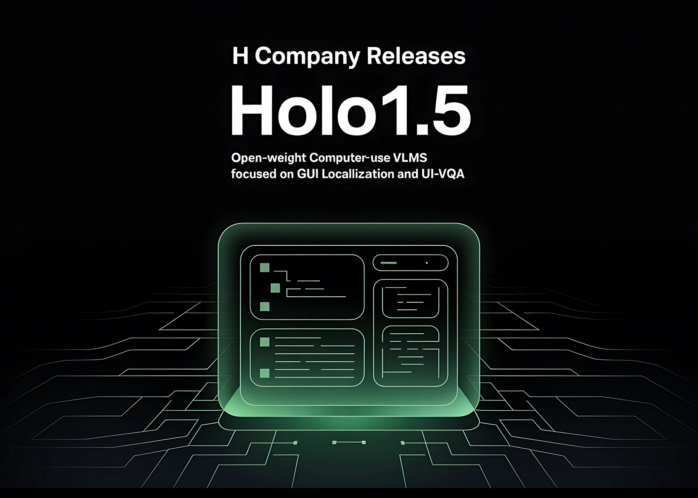

# H Company Releases Holo1.5: An Open-Weight Computer-Use VLMs Focused on GUI Localization and UI-VQA

> H Company (A french AI startup) releases Holo1.5, a family of open foundation vision models purpose-built for computer-use (CU) agents that act on real user interfaces via screenshots and pointer/keyboard actions. The release includes 3B, 7B, and 72B checkpoints with a documented ~10% accuracy gain over Holo1 across sizes. The 7B model is Apache-2.0; the […]

H Company (A french AI startup) releases Holo1.5, a family of open foundation vision models purpose-built for computer-use (CU) agents that act on real user interfaces via screenshots and pointer/keyboard actions. **The release includes 3B, 7B, and 72B** checkpoints with a documented ~10% accuracy gain over Holo1 across sizes. The 7B model is Apache-2.0; the 3B and 72B inherit research-only constraints from their upstream bases. The series targets two core capabilities that matter for CU stacks: precise UI element localization (coordinate prediction) and UI visual question answering (UI-VQA) for state understanding.

*https://www.hcompany.ai/blog/holo-1-5*

### Why does UI element localization matter?

Localization is how an agent converts an intent into a pixel-level action: “Open Spotify” → predict the clickable coordinates of the correct control on the current screen. Failures here cascade: a single off-by-one click can derail a multi-step workflow. Holo1.5 is trained and evaluated for high-resolution screens (up to 3840×2160) across desktop (macOS, Ubuntu, Windows), web, and mobile interfaces, improving robustness on dense professional UIs where iconography and small targets increase error rates.

### How is Holo1.5 different from general VLMs?

General VLMs optimize for broad grounding and captioning; CU agents need reliable pointing plus interface comprehension. Holo1.5 aligns its data and objectives with these requirements: large-scale SFT on GUI tasks followed by GRPO-style reinforcement learning to tighten coordinate accuracy and decision reliability. The models are delivered as perception components to be embedded in planners/executors (e.g., Surfer-style agents), not as end-to-end agents.

### How does Holo1.5 perform on localization benchmarks?

Holo1.5 reports state-of-the-art GUI grounding across ScreenSpot-v2, ScreenSpot-Pro, GroundUI-Web, Showdown, and WebClick. Representative 7B numbers (averages over six localization tracks):

- **Holo1.5-7B:** **77.32**

- **Qwen2.5-VL-7B:** **60.73**

On **ScreenSpot-Pro** (professional apps with dense layouts), Holo1.5-7B achieves **57.94** vs **29.00** for Qwen2.5-VL-7B, indicating materially better target selection under realistic conditions. The 3B and 72B checkpoints exhibit similar relative gains versus their Qwen2.5-VL counterparts.

*https://www.hcompany.ai/blog/holo-1-5*

*https://www.hcompany.ai/blog/holo-1-5*

### Does it also improve UI understanding (UI-VQA)?

Yes. On VisualWebBench, WebSRC, and ScreenQA (short/complex), Holo1.5 yields consistent accuracy improvements. Reported 7B averages are **≈88.17**, with the 72B variant around **≈90.00**. This matters for agent reliability: queries like “Which tab is active?” or “Is the user signed in?” reduce ambiguity and enable verification between actions.

### How does it compare to specialized and closed systems?

Under the published evaluation setup, Holo1.5 outperforms open baselines (Qwen2.5-VL), competitive specialized systems (e.g., UI-TARS, UI-Venus) and shows advantages versus closed generalist models (e.g., Claude Sonnet 4) on the cited UI tasks. Since protocols, prompts, and screen resolutions influence outcomes, practitioners should replicate with their harness before drawing deployment-level conclusions.

### What are the integration implications for CU agents?

- **Higher click reliability at native resolution:** Better ScreenSpot-Pro performance suggests reduced misclicks in complex applications (IDEs, design suites, admin consoles).

- **Stronger state tracking:** Higher UI-VQA accuracy improves detection of logged-in state, active tab, modal visibility, and success/failure cues.

- **Pragmatic licensing path:** **7B (Apache-2.0)** is suitable for production. The **72B** checkpoint is currently research-only; use it for internal experiments or to bound headroom.

### Where does Holo1.5 fit in a modern Computer-Use (CU) stack?

Think of Holo1.5 as the **screen perception layer**:

- **Input:** full-resolution screenshots (optionally with UI metadata).

- **Outputs:** target coordinates with confidence; short textual answers about screen state.

- **Downstream:** action policies convert predictions into click/keyboard events; monitoring verifies post-conditions and triggers retries or fallbacks.

### Summary

Holo1.5 narrows a practical gap in CU systems by pairing strong coordinate grounding with concise interface understanding. If you need a commercially usable base today, start with **Holo1.5-7B (Apache-2.0)**, benchmark on your screens, and instrument your planner/safety layers around it.

---

Check out the **[Models on Hugging Face](https://huggingface.co/Hcompany/Holo1.5-7B) **and**[ Technical details](https://www.hcompany.ai/blog/holo-1-5)_._** Feel free to check out our **[GitHub Page for Tutorials, Codes and Notebooks](https://github.com/Marktechpost/AI-Tutorial-Codes-Included)**. Also, feel free to follow us on **[Twitter](https://x.com/intent/follow?screen_name=marktechpost)** and don’t forget to join our **[100k+ ML SubReddit](https://www.reddit.com/r/machinelearningnews/)** and Subscribe to **[our Newsletter](https://www.aidevsignals.com/)**.
