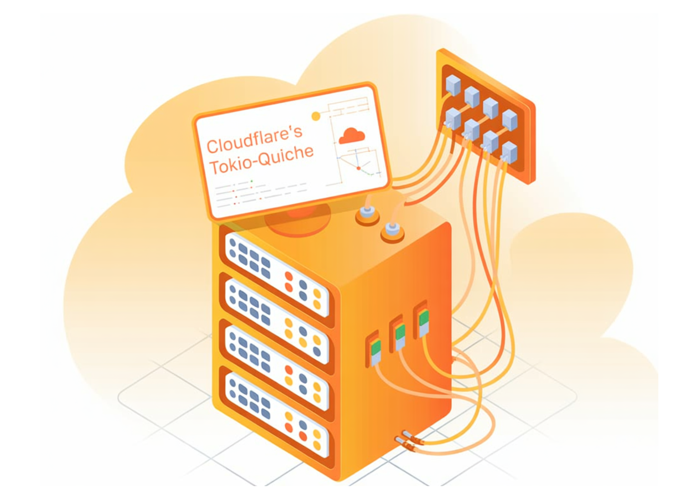

# How Cloudflare’s tokio-quiche Makes QUIC and HTTP/3 a First Class Citizen in Rust Backends

> Cloudflare has open sourced tokio-quiche, an asynchronous QUIC and HTTP/3 Rust library that wraps its battle tested quiche implementation with the Tokio runtime. The library has been refined inside production systems such as Apple iCloud Private Relay, next generation Oxy based proxies and WARP’s MASQUE client, where it handles millions of HTTP/3 requests per second […]

Cloudflare has open sourced tokio-quiche, an asynchronous QUIC and HTTP/3 Rust library that wraps its battle tested quiche implementation with the Tokio runtime. The library has been refined inside production systems such as Apple iCloud Private Relay, next generation Oxy based proxies and WARP’s MASQUE client, where it handles millions of HTTP/3 requests per second with low latency and high throughput. tokio-quiche targets Rust teams that want QUIC and HTTP/3 without writing their own UDP and event loop integration code.

### From quiche to tokio-quiche

quiche is Cloudflare’s open source QUIC and HTTP/3 implementation written in Rust and designed as a low level, sans-io library. It implements the QUIC transport state machine, including connection establishment, flow control and stream multiplexing, while making no assumptions about how applications perform IO. To use quiche directly, integrators must open UDP sockets, send and receive datagrams, manage timers and feed all packet data into quiche in the correct order. This design gives flexibility, but it makes integration error prone and time consuming.

tokio-quiche packages this integration work into a reusable crate. It combines the sans-io QUIC or HTTP/3 implementation from quiche with the Tokio async runtime, and exposes an API that already manages UDP sockets, packet routing and calls into the quiche state machine.

### Actor based architecture on Tokio

Internally, tokio-quiche uses an actor model on top of Tokio. Actors are small tasks with local state that communicate through message passing over channels, which aligns well with sans-io protocol implementations that own internal state and operate on message like buffers.

The primary actor is the IO loop actor, which moves packets between quiche and the UDP socket. One of the key message types is an `Incoming` struct that describes received UDP packets. Async integration follows a fixed pattern, the IO loop awaits new messages, translates them into inputs for quiche, advances the QUIC state machine, then translates outputs into outbound packets that are written back to the socket.

For each UDP socket, tokio-quiche spawns two important tasks. `InboundPacketRouter` owns the receiving half of the socket and routes inbound datagrams by destination connection ID to per connection channels. `IoWorker` is the per connection IO loop and drives a single quiche `Connection`, interleaving calls to quiche with calls to application specific logic implemented through `ApplicationOverQuic`. This design encapsulates connection state inside each actor and keeps QUIC processing isolated from higher level protocol code.

### ApplicationOverQuic and H3Driver

QUIC is a transport protocol and can carry multiple application protocols. HTTP/3, DNS over QUIC and Media over QUIC are examples covered by IETF specifications. To avoid coupling tokio-quiche to a single protocol, Cloudflare team exposes an `ApplicationOverQuic` trait. The trait abstracts over quiche methods and the underlying IO, and presents higher level events and hooks to the application that implements the protocol. For example, the HTTP/3 debug and test client h3i uses a non HTTP/3 implementation of `ApplicationOverQuic`.

On top of this trait, tokio-quiche ships a dedicated HTTP/3 focused implementation named `H3Driver`. `H3Driver` connects quiche’s HTTP/3 module to the IO loop actor and converts raw HTTP/3 events into higher level events with asynchronous body streams that are convenient for application code. `H3Driver` is generic and exposes `ServerH3Driver` and `ClientH3Driver` variants that add server side and client side behavior on top of the core driver. These components provide the building blocks for HTTP/3 servers and clients that share implementation patterns with Cloudflare’s internal infrastructure.

### Production usage and roadmap

tokio-quiche has been used for several years inside Cloudflare before its public release. It powers Proxy B in Apple iCloud Private Relay, Oxy based HTTP/3 servers and the WARP MASQUE client, as well as the async version of h3i. In the WARP client, MASQUE based tunnels built on tokio-quiche replace earlier WireGuard based tunnels with QUIC based tunnels. These systems run at Cloudflare edge scale and demonstrate that the integration can sustain millions of HTTP/3 requests per second in production.

Cloudflare positions tokio-quiche as a foundation rather than a complete HTTP/3 framework. The library exposes low level protocol capabilities and example client and server event loops, and leaves room for higher level projects to implement opinionated HTTP servers, DNS over QUIC clients, MASQUE based VPNs and other QUIC applications on top. By releasing the crate, Cloudflare aims to lower the barrier for Rust teams to adopt QUIC, HTTP/3 and MASQUE, and to align external integrations with the same transport stack used in its edge services.

### Key Takeaways

- **tokio-quiche = quiche + Tokio**: tokio-quiche is an async Rust library that integrates Cloudflare’s sans-io QUIC and HTTP/3 implementation, quiche, with the Tokio runtime, so developers do not need to hand write UDP and event loop plumbing.

- **Actor based architecture for QUIC connections**: The library uses an actor model on Tokio, with an `InboundPacketRouter` that routes UDP datagrams by connection ID and an `IoWorker` that drives a single quiche `Connection` per task, keeping transport state isolated and composable.

- **ApplicationOverQuic abstraction**: Protocol logic is separated through the `ApplicationOverQuic` trait, which abstracts over quiche and I O details so different QUIC based protocols such as HTTP/3, DNS over QUIC or custom protocols can be implemented on top of the same transport core.

- **HTTP/3 via H3Driver, ServerH3Driver and ClientH3Driver**: tokio-quiche ships `H3Driver` plus `ServerH3Driver` and `ClientH3Driver` variants that bridge quiche’s HTTP/3 module to async Rust code, exposing HTTP/3 streams and bodies in a way that fits typical Tokio based services.

---

Check out the **[Technical details](https://blog.cloudflare.com/async-quic-and-http-3-made-easy-tokio-quiche-is-now-open-source/)**. Also, feel free to follow us on **[Twitter](https://x.com/intent/follow?screen_name=marktechpost)** and don’t forget to join our **[100k+ ML SubReddit](https://www.reddit.com/r/machinelearningnews/)** and Subscribe to **[our Newsletter](https://www.aidevsignals.com/)**. Wait! are you on telegram? **[now you can join us on telegram as well.](https://t.me/machinelearningresearchnews)**
