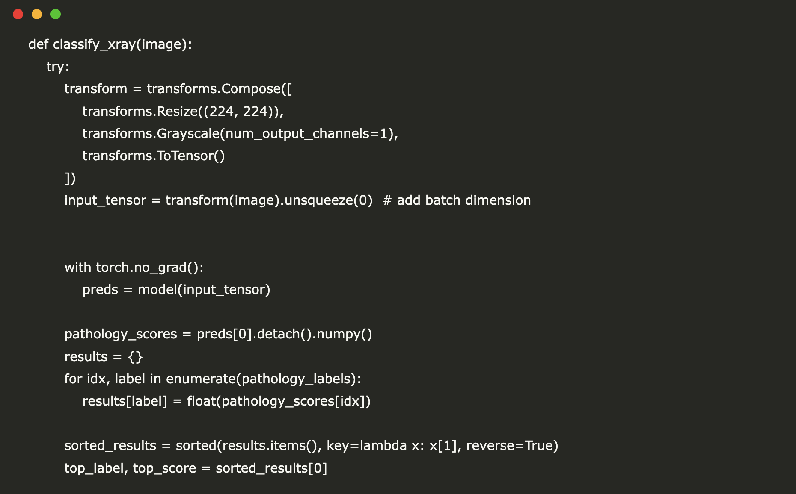

# How to Build a Prototype X-ray Judgment Tool (Open Source Medical Inference System) Using TorchXRayVision, Gradio, and PyTorch

> In this tutorial, we demonstrate how to build a prototype X-ray judgment tool using open-source libraries in Google Colab. By leveraging the power of TorchXRayVision for loading pre-trained DenseNet models and Gradio for creating an interactive user interface, we show how to process and classify chest X-ray images with minimal setup. This notebook guides you […]

In this tutorial, we demonstrate how to build a prototype X-ray judgment tool using open-source libraries in Google Colab. By leveraging the power of TorchXRayVision for loading pre-trained DenseNet models and Gradio for creating an interactive user interface, we show how to process and classify chest X-ray images with minimal setup. This notebook guides you through image preprocessing, model inference, and result interpretation, all designed to run seamlessly on Colab without requiring external API keys or logins. Please note that this demo is intended for educational purposes only and should not be used as a substitute for professional clinical diagnosis.

Copy CodeCopiedUse a different Browser
```
!pip install torchxrayvision gradio
```

First, we install the torchxrayvision library for X-ray analysis and Gradio to create an interactive interface.

Copy CodeCopiedUse a different Browser
```
import torch
import torchxrayvision as xrv
import torchvision.transforms as transforms
import gradio as gr
```

We import PyTorch for [deep learning](https://www.marktechpost.com/2025/01/15/what-is-deep-learning-2/) operations, TorchXRayVision for X‑ray analysis, torchvision’s transforms for image preprocessing, and Gradio for building an interactive UI.

Copy CodeCopiedUse a different Browser
```
model = xrv.models.DenseNet(weights="densenet121-res224-all")
model.eval()  
```

Then, we load a pre-trained DenseNet model using the “densenet121-res224-all” weights and set it to evaluation mode for inference.

Copy CodeCopiedUse a different Browser
```
try:
    pathology_labels = model.meta["labels"]
    print("Retrieved pathology labels from model.meta.")
except Exception as e:
    print("Could not retrieve labels from model.meta. Using fallback labels.")
    pathology_labels = [
         "Atelectasis", "Cardiomegaly", "Consolidation", "Edema",
         "Emphysema", "Fibrosis", "Hernia", "Infiltration", "Mass",
         "Nodule", "Pleural Effusion", "Pneumonia", "Pneumothorax", "No Finding"
    ]

```

Now, we attempt to retrieve pathology labels from the model’s metadata and fall back to a predefined list if the retrieval fails.

Copy CodeCopiedUse a different Browser
```
def classify_xray(image):
    try:
        transform = transforms.Compose([
            transforms.Resize((224, 224)),
            transforms.Grayscale(num_output_channels=1),
            transforms.ToTensor()
        ])
        input_tensor = transform(image).unsqueeze(0)  # add batch dimension

        with torch.no_grad():
            preds = model(input_tensor)
       
        pathology_scores = preds[0].detach().numpy()
        results = {}
        for idx, label in enumerate(pathology_labels):
            results[label] = float(pathology_scores[idx])
       
        sorted_results = sorted(results.items(), key=lambda x: x[1], reverse=True)
        top_label, top_score = sorted_results[0]
       
        judgement = (
            f"Prediction: {top_label} (score: {top_score:.2f})nn"
            f"Full Scores:n{results}"
        )
        return judgement
    except Exception as e:
        return f"Error during inference: {str(e)}"
```

Here, with this function, we preprocess an input X-ray image, run inference using the pre-trained model, extract pathology scores, and return a formatted summary of the top prediction and all scores while handling errors gracefully.

Copy CodeCopiedUse a different Browser
```
iface = gr.Interface(
    fn=classify_xray,
    inputs=gr.Image(type="pil"),
    outputs="text",
    title="X-ray Judgement Tool (Prototype)",
    description=(
        "Upload a chest X-ray image to receive a classification judgement. "
        "This demo is for educational purposes only and is not intended for clinical use."
    )
)

iface.launch()

```

Finally, we build and launch a Gradio interface that lets users upload a chest X-ray image. The classify_xray function processes the image to output a diagnostic judgment.


**Gradio Interface for the tool**

Through this tutorial, we’ve explored the development of an interactive X-ray judgment tool that integrates advanced deep learning techniques with a user-friendly interface. Despite the inherent limitations, such as the model not being fine-tuned for clinical diagnostics, this prototype serves as a valuable starting point for experimenting with medical imaging applications. We encourage you to build upon this foundation, considering the importance of rigorous validation and adherence to medical standards for real-world use.

---

Here is the **_[Colab Notebook](https://colab.research.google.com/drive/1V4BBbdF1jh6gl7zHAY4xCjGxWtxZmpC4)_**. Also, don’t forget to follow us on **[Twitter](https://x.com/intent/follow?screen_name=marktechpost)** and join our **[Telegram Channel](https://arxiv.org/abs/2406.09406)** and [**LinkedIn Gr**](https://www.linkedin.com/groups/13668564/)[**oup**](https://www.linkedin.com/groups/13668564/). Don’t Forget to join our **[85k+ ML SubReddit](https://www.reddit.com/r/machinelearningnews/)**.
