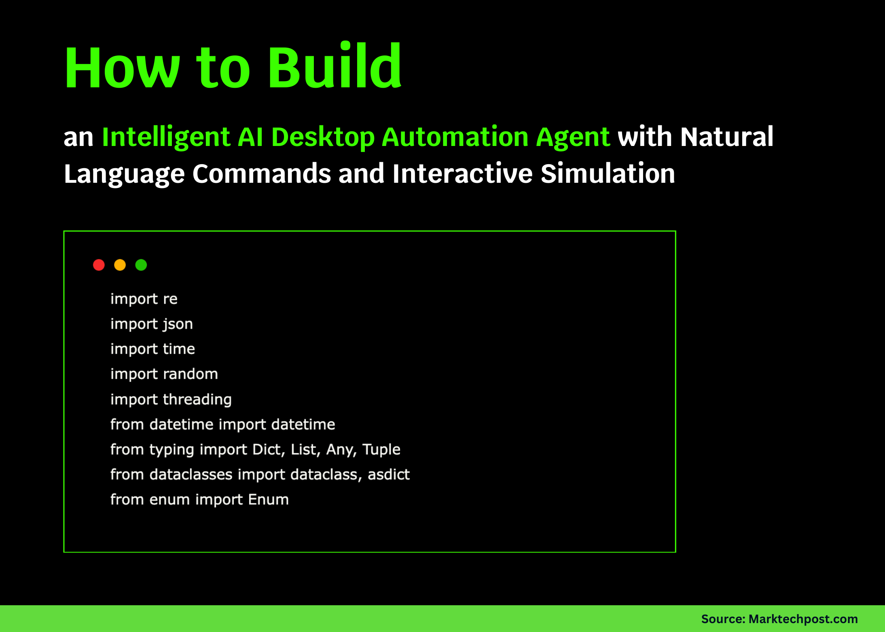

# How to Build an Intelligent AI Desktop Automation Agent with Natural Language Commands and Interactive Simulation?

> In this tutorial, we walk through the process of building an advanced AI desktop automation agent that runs seamlessly in Google Colab. We design it to interpret natural language commands, simulate desktop tasks such as file operations, browser actions, and workflows, and provide interactive feedback through a virtual environment. By combining NLP, task execution, and […]

In this tutorial, we walk through the process of building an advanced AI desktop automation agent that runs seamlessly in Google Colab. We design it to interpret natural language commands, simulate desktop tasks such as file operations, browser actions, and workflows, and provide interactive feedback through a virtual environment. By combining NLP, task execution, and a simulated desktop, we create a system that feels both intuitive and powerful, allowing us to experience automation concepts without relying on external APIs. Check out the **[FULL CODES here](https://github.com/Marktechpost/AI-Tutorial-Codes-Included/blob/main/AI%20Agents%20Codes/ai_desktop_automation_agent_tutorial_Marktechpost.ipynb)**.

Copy CodeCopiedUse a different Browser
```
import re
import json
import time
import random
import threading
from datetime import datetime
from typing import Dict, List, Any, Tuple
from dataclasses import dataclass, asdict
from enum import Enum

try:
   from IPython.display import display, HTML, clear_output
   import matplotlib.pyplot as plt
   import numpy as np
   COLAB_MODE = True
except ImportError:
   COLAB_MODE = False
```

We begin by importing essential Python libraries that support data handling, visualization, and simulation. We set up Colab-specific tools to run the tutorial interactively in a seamless environment. Check out the **[FULL CODES here](https://github.com/Marktechpost/AI-Tutorial-Codes-Included/blob/main/AI%20Agents%20Codes/ai_desktop_automation_agent_tutorial_Marktechpost.ipynb)**.

Copy CodeCopiedUse a different Browser
```
class TaskType(Enum):
   FILE_OPERATION = "file_operation"
   BROWSER_ACTION = "browser_action"
   SYSTEM_COMMAND = "system_command"
   APPLICATION_TASK = "application_task"
   WORKFLOW = "workflow"

@dataclass
class Task:
   id: str
   type: TaskType
   command: str
   status: str = "pending"
   result: str = ""
   timestamp: str = ""
   execution_time: float = 0.0
```

We define the structure of our automation system. We create an enum to categorize task types and a Task dataclass that helps us track each command with its details, status, and execution results. Check out the **[FULL CODES here](https://github.com/Marktechpost/AI-Tutorial-Codes-Included/blob/main/AI%20Agents%20Codes/ai_desktop_automation_agent_tutorial_Marktechpost.ipynb)**.

Copy CodeCopiedUse a different Browser
```
class VirtualDesktop:
   """Simulates a desktop environment with applications and file system"""
  
   def __init__(self):
       self.applications = {
           "browser": {"status": "closed", "tabs": [], "current_url": ""},
           "file_manager": {"status": "closed", "current_path": "/home/user"},
           "text_editor": {"status": "closed", "current_file": "", "content": ""},
           "email": {"status": "closed", "unread": 3, "inbox": []},
           "terminal": {"status": "closed", "history": []}
       }
      
       self.file_system = {
           "/home/user/": {
               "documents/": {
                   "report.txt": "Important quarterly report content...",
                   "notes.md": "# Meeting Notes\n- Project update\n- Budget review"
               },
               "downloads/": {
                   "data.csv": "name,age,city\nJohn,25,NYC\nJane,30,LA",
                   "image.jpg": "[Binary image data]"
               },
               "desktop/": {}
           }
       }
      
       self.screen_state = {
           "active_window": None,
           "mouse_position": (0, 0),
           "clipboard": ""
       }
  
   def get_system_info(self) -> Dict:
       return {
           "cpu_usage": random.randint(5, 25),
           "memory_usage": random.randint(30, 60),
           "disk_space": random.randint(60, 90),
           "network_status": "connected",
           "uptime": "2 hours 15 minutes"
       }

class NLPProcessor:
   """Processes natural language commands and extracts intents"""
  
   def __init__(self):
       self.intent_patterns = {
           TaskType.FILE_OPERATION: [
               r"(open|create|delete|copy|move|find)\s+(file|folder|document)",
               r"(save|edit|write)\s+.*\.(txt|doc|pdf|csv)",
               r"(list|show)\s+(files|directories)",
               r"(download|upload)\s+.*"
           ],
           TaskType.BROWSER_ACTION: [
               r"(open|visit|go to|navigate)\s+.*\.(com|org|net)",
               r"(search|google|find)\s+.*",
               r"(click|press|select)\s+(button|link)",
               r"(fill|enter|type)\s+.*"
           ],
           TaskType.SYSTEM_COMMAND: [
               r"(check|show)\s+(system|cpu|memory|disk)",
               r"(run|execute|start)\s+program",
               r"(restart|shutdown|sleep)",
               r"(install|update|configure)\s+.*"
           ],
           TaskType.APPLICATION_TASK: [
               r"(open|start|launch)\s+(browser|editor|email|terminal)",
               r"(close|quit|exit)\s+.*",
               r"(send|compose|reply)\s+(email|message)",
               r"(edit|modify|change)\s+.*"
           ],
           TaskType.WORKFLOW: [
               r"(automate|batch|bulk)\s+.*",
               r"(combine|merge|join)\s+.*",
               r"(schedule|remind|notify)\s+.*",
               r"(backup|sync|export)\s+.*"
           ]
       }
  
   def extract_intent(self, command: str) -> Tuple[TaskType, float]:
       """Extract task type and confidence from natural language command"""
       command_lower = command.lower()
       best_match = TaskType.SYSTEM_COMMAND
       best_confidence = 0.0
      
       for task_type, patterns in self.intent_patterns.items():
           for pattern in patterns:
               if re.search(pattern, command_lower):
                   confidence = len(re.findall(pattern, command_lower)) * 0.3
                   if confidence > best_confidence:
                       best_match = task_type
                       best_confidence = confidence
      
       return best_match, min(best_confidence, 1.0)
  
   def extract_parameters(self, command: str, task_type: TaskType) -> Dict[str, str]:
       """Extract parameters from command based on task type"""
       params = {}
       command_lower = command.lower()
      
       if task_type == TaskType.FILE_OPERATION:
           file_match = re.search(r'[\w/.-]+\.\w+', command)
           if file_match:
               params['filename'] = file_match.group()
          
           path_match = re.search(r'/[\w/.-]+', command)
           if path_match:
               params['path'] = path_match.group()
      
       elif task_type == TaskType.BROWSER_ACTION:
           url_match = re.search(r'https?://[\w.-]+|[\w.-]+\.(com|org|net|edu)', command)
           if url_match:
               params['url'] = url_match.group()
          
           search_match = re.search(r'(?:search|find|google)\s+["\']?([^"\']+)["\']?', command_lower)
           if search_match:
               params['query'] = search_match.group(1)
      
       elif task_type == TaskType.APPLICATION_TASK:
           app_match = re.search(r'(browser|editor|email|terminal|calculator)', command_lower)
           if app_match:
               params['application'] = app_match.group(1)
      
       return params
```

We simulate a virtual desktop with applications, a file system, and system states while also building an NLP processor. We establish rules to identify user intents from natural language commands and extract useful parameters, such as filenames, URLs, or application names. This allows us to bridge natural language input with structured automation tasks. Check out the **[FULL CODES here](https://github.com/Marktechpost/AI-Tutorial-Codes-Included/blob/main/AI%20Agents%20Codes/ai_desktop_automation_agent_tutorial_Marktechpost.ipynb)**.

Copy CodeCopiedUse a different Browser
```
class TaskExecutor:
   """Executes tasks on the virtual desktop"""
  
   def __init__(self, desktop: VirtualDesktop):
       self.desktop = desktop
       self.execution_log = []
  
   def execute_file_operation(self, params: Dict[str, str], command: str) -> str:
       """Simulate file operations"""
       if "open" in command.lower():
           filename = params.get('filename', 'unknown.txt')
           return f"✓ Opened file: {filename}\n📁 File contents loaded in text editor"
      
       elif "create" in command.lower():
           filename = params.get('filename', 'new_file.txt')
           return f"✓ Created new file: {filename}\n📝 File ready for editing"
      
       elif "list" in command.lower():
           files = list(self.desktop.file_system["/home/user/documents/"].keys())
           return f"📂 Files found:\n" + "\n".join([f"  • {f}" for f in files])
      
       return "✓ File operation completed successfully"
  
   def execute_browser_action(self, params: Dict[str, str], command: str) -> str:
       """Simulate browser actions"""
       if "open" in command.lower() or "visit" in command.lower():
           url = params.get('url', 'example.com')
           self.desktop.applications["browser"]["current_url"] = url
           self.desktop.applications["browser"]["status"] = "open"
           return f"🌐 Navigated to: {url}\n✓ Page loaded successfully"
      
       elif "search" in command.lower():
           query = params.get('query', 'search term')
           return f"🔍 Searching for: '{query}'\n✓ Found 1,247 results"
      
       return "✓ Browser action completed"
  
   def execute_system_command(self, params: Dict[str, str], command: str) -> str:
       """Simulate system commands"""
       if "check" in command.lower() or "show" in command.lower():
           info = self.desktop.get_system_info()
           return f"💻 System Status:\n" + \
                  f"  CPU: {info['cpu_usage']}%\n" + \
                  f"  Memory: {info['memory_usage']}%\n" + \
                  f"  Disk: {info['disk_space']}% used\n" + \
                  f"  Network: {info['network_status']}"
      
       return "✓ System command executed"
  
   def execute_application_task(self, params: Dict[str, str], command: str) -> str:
       """Simulate application tasks"""
       app = params.get('application', 'unknown')
      
       if "open" in command.lower():
           self.desktop.applications[app]["status"] = "open"
           return f"🚀 Launched {app.title()}\n✓ Application ready for use"
      
       elif "close" in command.lower():
           if app in self.desktop.applications:
               self.desktop.applications[app]["status"] = "closed"
               return f"❌ Closed {app.title()}"
      
       return f"✓ {app.title()} task completed"
  
   def execute_workflow(self, params: Dict[str, str], command: str) -> str:
       """Simulate complex workflow execution"""
       steps = [
           "Analyzing workflow requirements...",
           "Preparing automation steps...",
           "Executing batch operations...",
           "Validating results...",
           "Generating report..."
       ]
      
       result = "🔄 Workflow Execution:\n"
       for i, step in enumerate(steps, 1):
           result += f"  {i}. {step} ✓\n"
           if COLAB_MODE:
               time.sleep(0.1) 
      
       return result + "✅ Workflow completed successfully!"

class DesktopAgent:
   """Main desktop automation agent class - coordinates all components"""
  
   def __init__(self):
       self.desktop = VirtualDesktop()
       self.nlp = NLPProcessor()
       self.executor = TaskExecutor(self.desktop)
       self.task_history = []
       self.active = True
       self.stats = {
           "tasks_completed": 0,
           "success_rate": 100.0,
           "average_execution_time": 0.0
       }
  
   def process_command(self, command: str) -> Task:
       """Process a natural language command and execute it"""
       start_time = time.time()
      
       task_id = f"task_{len(self.task_history) + 1:04d}"
       task_type, confidence = self.nlp.extract_intent(command)
      
       task = Task(
           id=task_id,
           type=task_type,
           command=command,
           timestamp=datetime.now().strftime("%H:%M:%S")
       )
      
       try:
           params = self.nlp.extract_parameters(command, task_type)
          
           if task_type == TaskType.FILE_OPERATION:
               result = self.executor.execute_file_operation(params, command)
           elif task_type == TaskType.BROWSER_ACTION:
               result = self.executor.execute_browser_action(params, command)
           elif task_type == TaskType.SYSTEM_COMMAND:
               result = self.executor.execute_system_command(params, command)
           elif task_type == TaskType.APPLICATION_TASK:
               result = self.executor.execute_application_task(params, command)
           elif task_type == TaskType.WORKFLOW:
               result = self.executor.execute_workflow(params, command)
           else:
               result = "⚠️ Command type not recognized"
          
           task.status = "completed"
           task.result = result
           self.stats["tasks_completed"] += 1
          
       except Exception as e:
           task.status = "failed"
           task.result = f"❌ Error: {str(e)}"
      
       task.execution_time = round(time.time() - start_time, 3)
       self.task_history.append(task)
       self.update_stats()
      
       return task
  
   def update_stats(self):
       """Update agent statistics"""
       if self.task_history:
           successful_tasks = sum(1 for t in self.task_history if t.status == "completed")
           self.stats["success_rate"] = round((successful_tasks / len(self.task_history)) * 100, 1)
          
           total_time = sum(t.execution_time for t in self.task_history)
           self.stats["average_execution_time"] = round(total_time / len(self.task_history), 3)
  
   def get_status_dashboard(self) -> str:
       """Generate a status dashboard"""
       recent_tasks = self.task_history[-5:] if self.task_history else []
      
       dashboard = f"""
╭━━━━━━━━━━━━━━━━━━━━━━━━━━━━━━━━━━━━━━━━━━━━━━━━━━━━━━━━╮
│                🤖 AI DESKTOP AGENT STATUS            │
├──────────────────────────────────────────────────────┤
│ 📊 Statistics:                                       │
│   • Tasks Completed: {self.stats['tasks_completed']:

We implement the executor that turns our parsed intents into concrete actions and realistic outputs on the virtual desktop. We then wire everything together in the DesktopAgent, where we process natural language, execute tasks, and continuously track success, latency, and a live status dashboard. Check out the **[FULL CODES here](https://github.com/Marktechpost/AI-Tutorial-Codes-Included/blob/main/AI%20Agents%20Codes/ai_desktop_automation_agent_tutorial_Marktechpost.ipynb)**.

Copy CodeCopiedUse a different Browser
```
def run_advanced_demo():
   """Run an advanced interactive demo of the AI Desktop Agent"""
  
   print("🚀 Initializing Advanced AI Desktop Automation Agent...")
   time.sleep(1)
  
   agent = DesktopAgent()
  
   print("\n" + "="*60)
   print("🤖 AI DESKTOP AUTOMATION AGENT - ADVANCED TUTORIAL")
   print("="*60)
   print("A sophisticated AI agent that understands natural language")
   print("commands and automates desktop tasks in a simulated environment.")
   print("\n💡 Try these example commands:")
   print("  • 'open the browser and go to github.com'")
   print("  • 'create a new file called report.txt'")
   print("  • 'check system performance'")
   print("  • 'show me the files in documents folder'")
   print("  • 'automate email processing workflow'")
  
   demo_commands = [
       "check system status and show CPU usage",
       "open browser and navigate to github.com",
       "create a new file called meeting_notes.txt",
       "list all files in the documents directory",
       "launch text editor application",
       "automate data backup workflow"
   ]
  
   print(f"\n🎯 Running {len(demo_commands)} demonstration commands...\n")
  
   for i, command in enumerate(demo_commands, 1):
       print(f"[{i}/{len(demo_commands)}] Command: '{command}'")
       print("-" * 50)
      
       task = agent.process_command(command)
      
       print(f"Task ID: {task.id}")
       print(f"Type: {task.type.value}")
       print(f"Status: {task.status}")
       print(f"Execution Time: {task.execution_time}s")
       print(f"Result:\n{task.result}")
       print()
      
       if COLAB_MODE:
           time.sleep(0.5) 
  
   print("\n" + "="*60)
   print("📊 FINAL AGENT STATUS")
   print("="*60)
   print(agent.get_status_dashboard())
  
   return agent

def interactive_mode(agent):
   """Run interactive mode for user input"""
   print("\n🎮 INTERACTIVE MODE ACTIVATED")
   print("Type your commands below (type 'quit' to exit, 'status' for dashboard):")
   print("-" * 60)
  
   while True:
       try:
           user_input = input("\n🤖 Agent> ").strip()
          
           if user_input.lower() in ['quit', 'exit', 'q']:
               print("👋 AI Agent shutting down. Goodbye!")
               break
          
           elif user_input.lower() in ['status', 'dashboard']:
               print(agent.get_status_dashboard())
               continue
          
           elif user_input.lower() in ['help', '?']:
               print("📚 Available commands:")
               print("  • Any natural language command")
               print("  • 'status' - Show agent dashboard")
               print("  • 'help' - Show this help")
               print("  • 'quit' - Exit AI Agent")
               continue
          
           elif not user_input:
               continue
          
           print(f"Processing: '{user_input}'...")
           task = agent.process_command(user_input)
          
           print(f"\n✨ Task {task.id} [{task.type.value}] - {task.status}")
           print(task.result)
          
       except KeyboardInterrupt:
           print("\n\n👋 AI Agent interrupted. Goodbye!")
           break
       except Exception as e:
           print(f"❌ Error: {e}")

if __name__ == "__main__":
   agent = run_advanced_demo()
  
   if COLAB_MODE:
       print("\n🎮 To continue with interactive mode, run:")
       print("interactive_mode(agent)")
   else:
       interactive_mode(agent)
```

We run a scripted demo that processes realistic commands, prints results, and finishes with a live status dashboard. We then provide an interactive loop where we type natural language tasks, check the status, and receive immediate feedback. Finally, we auto-start the demo and, in Colab, we show how to launch interactive mode with a single call.

In conclusion, we demonstrate how an AI agent can handle a wide variety of desktop-like tasks in a simulated environment using only Python. We see how natural language inputs are translated into structured tasks, executed with realistic outputs, and summarized in a visual dashboard. With this foundation, we position ourselves to extend the agent with more complex behaviors, richer interfaces, and real-world integrations, making desktop automation smarter, more interactive, and easier to use.

---

Check out the **[FULL CODES here](https://github.com/Marktechpost/AI-Tutorial-Codes-Included/blob/main/AI%20Agents%20Codes/ai_desktop_automation_agent_tutorial_Marktechpost.ipynb)**. Feel free to check out our **[GitHub Page for Tutorials, Codes and Notebooks](https://github.com/Marktechpost/AI-Tutorial-Codes-Included)**. Also, feel free to follow us on **[Twitter](https://x.com/intent/follow?screen_name=marktechpost)** and don’t forget to join our **[100k+ ML SubReddit](https://www.reddit.com/r/machinelearningnews/)** and Subscribe to **[our Newsletter](https://www.aidevsignals.com/)**.
