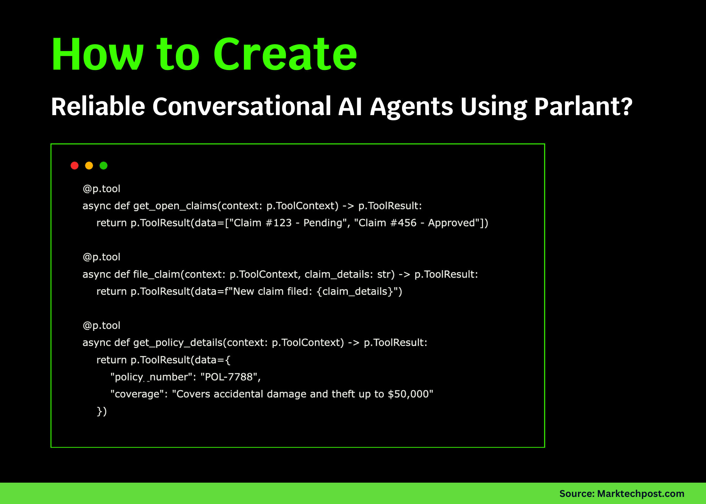

# How to Create Reliable Conversational AI Agents Using Parlant?

> Parlant is a framework designed to help developers build production-ready AI agents that behave consistently and reliably. A common challenge when deploying large language model (LLM) agents is that they often perform well in testing but fail when interacting with real users. They may ignore carefully designed system prompts, generate inaccurate or irrelevant responses at […]

Parlant is a framework designed to help developers build production-ready AI agents that behave consistently and reliably. A common challenge when deploying large language model (LLM) agents is that they often perform well in testing but fail when interacting with real users. They may ignore carefully designed system prompts, generate inaccurate or irrelevant responses at critical moments, struggle with edge cases, or produce inconsistent behavior from one conversation to another. 

Parlant addresses these challenges by shifting the focus from prompt engineering to principle-driven development. Instead of relying on prompts alone, it provides mechanisms to define clear rules and tool integrations, ensuring that an agent can access and process real-world data safely and predictably.

In this tutorial, we will create an insurance agent that can retrieve open claims, file new claims, and provide detailed policy information, demonstrating how to integrate domain-specific tools into a Parlant-powered AI system for consistent and reliable customer support. Check out the **[FULL CODES here](https://github.com/Marktechpost/AI-Tutorial-Codes-Included/blob/main/AI%20Agents%20Codes/parlant.py)**.

### Installing & importing the dependencies

Copy CodeCopiedUse a different Browser
```
pip install parlant
```

Copy CodeCopiedUse a different Browser
```
import asyncio
from datetime import datetime
import parlant.sdk as p
```

### Defining the tools

The following code block introduces three tools that simulate interactions an insurance assistant might need. 

- The **get_open_claims **tool represents an asynchronous function that retrieves a list of open insurance claims, allowing the agent to provide users with up-to-date information about pending or approved claims.

- The **file_claim **tool accepts claim details as input and simulates the process of filing a new insurance claim, returning a confirmation message to the user.

Finally, the **get_policy_details **tool provides essential policy information, such as the policy number and coverage limits, enabling the agent to respond accurately to questions about insurance coverage. Check out the **[FULL CODES here](https://github.com/Marktechpost/AI-Tutorial-Codes-Included/blob/main/AI%20Agents%20Codes/parlant.py)**.

Copy CodeCopiedUse a different Browser
```
@p.tool
async def get_open_claims(context: p.ToolContext) -> p.ToolResult:
    return p.ToolResult(data=["Claim #123 - Pending", "Claim #456 - Approved"])
@p.tool
async def file_claim(context: p.ToolContext, claim_details: str) -> p.ToolResult:
    return p.ToolResult(data=f"New claim filed: {claim_details}")
@p.tool
async def get_policy_details(context: p.ToolContext) -> p.ToolResult:
    return p.ToolResult(data={
        "policy_number": "POL-7788",
        "coverage": "Covers accidental damage and theft up to $50,000"
    })
```

### Defining Glossary & Journeys

In this section, we define the glossary and journeys that shape how the agent handles domain knowledge and conversations. The glossary contains important business terms, such as the customer service number and operating hours, allowing the agent to reference them accurately when needed. 

The journeys describe step-by-step processes for specific tasks. In this example, one journey walks a customer through filing a new insurance claim, while another focuses on retrieving and explaining policy coverage details. Check out the **[FULL CODES here](https://github.com/Marktechpost/AI-Tutorial-Codes-Included/blob/main/AI%20Agents%20Codes/parlant.py)**.

Copy CodeCopiedUse a different Browser
```
async def add_domain_glossary(agent: p.Agent):
    await agent.create_term(
        name="Customer Service Number",
        description="You can reach us at +1-555-INSURE",
    )
    await agent.create_term(
        name="Operating Hours",
        description="We are available Mon-Fri, 9AM-6PM",
    )
async def create_claim_journey(agent: p.Agent) -> p.Journey:
    journey = await agent.create_journey(
        title="File an Insurance Claim",
        description="Helps customers report and submit a new claim.",
        conditions=["The customer wants to file a claim"],
    )
    s0 = await journey.initial_state.transition_to(chat_state="Ask for accident details")
    s1 = await s0.target.transition_to(tool_state=file_claim, condition="Customer provides details")
    s2 = await s1.target.transition_to(chat_state="Confirm claim was submitted")
    await s2.target.transition_to(state=p.END_JOURNEY)
    return journey
async def create_policy_journey(agent: p.Agent) -> p.Journey:
    journey = await agent.create_journey(
        title="Explain Policy Coverage",
        description="Retrieves and explains customer's insurance coverage.",
        conditions=["The customer asks about their policy"],
    )
    s0 = await journey.initial_state.transition_to(tool_state=get_policy_details)
    await s0.target.transition_to(
        chat_state="Explain the policy coverage clearly",
        condition="Policy info is available",
    )
    await agent.create_guideline(
        condition="Customer presses for legal interpretation of coverage",
        action="Politely explain that legal advice cannot be provided",
    )
    return journey
```

# Defining the main runner

The main runner ties together all the components defined in earlier cells and launches the agent. It starts a Parlant [server](https://www.marktechpost.com/2025/08/08/proxy-servers-explained-types-use-cases-trends-in-2025-technical-deep-dive/), creates the insurance support agent, and loads its glossary, journeys, and global guidelines. It also handles edge cases such as ambiguous customer intent by prompting the agent to choose between relevant journeys. Finally, once the script is executed, the server becomes active and prints a confirmation message. You can then open your browser and navigate to **http://localhost:8800** to access the Parlant UI and begin interacting with the insurance agent in real time. Check out the **[FULL CODES here](https://github.com/Marktechpost/AI-Tutorial-Codes-Included/blob/main/AI%20Agents%20Codes/parlant.py)**.

Copy CodeCopiedUse a different Browser
```
async def main():
    async with p.Server() as server:
        agent = await server.create_agent(
            name="Insurance Support Agent",
            description="Friendly and professional; helps with claims and policy queries.",
        )
        await add_domain_glossary(agent)
        claim_journey = await create_claim_journey(agent)
        policy_journey = await create_policy_journey(agent)
        # Disambiguation: if intent is unclear
        status_obs = await agent.create_observation(
            "Customer mentions an issue but doesn't specify if it's a claim or policy"
        )
        await status_obs.disambiguate([claim_journey, policy_journey])
        # Global guideline
        await agent.create_guideline(
            condition="Customer asks about unrelated topics",
            action="Kindly redirect them to insurance-related support only",
        )
        print("✅ Insurance Agent is ready! Open the Parlant UI to chat.")
if __name__ == "__main__":
    import asyncio
    asyncio.run(main())
```


---

Check out the **[FULL CODES here](https://github.com/Marktechpost/AI-Tutorial-Codes-Included/blob/main/AI%20Agents%20Codes/parlant.py)**. Feel free to check out our **[GitHub Page for Tutorials, Codes and Notebooks](https://github.com/Marktechpost/AI-Tutorial-Codes-Included)**. Also, feel free to follow us on **[Twitter](https://x.com/intent/follow?screen_name=marktechpost)** and don’t forget to join our **[100k+ ML SubReddit](https://www.reddit.com/r/machinelearningnews/)** and Subscribe to **[our Newsletter](https://www.aidevsignals.com/)**.

**For content partnership with marktechpost.com, please [TALK to us](https://calendly.com/marktechpost/marktechpost-promotion-call)**
