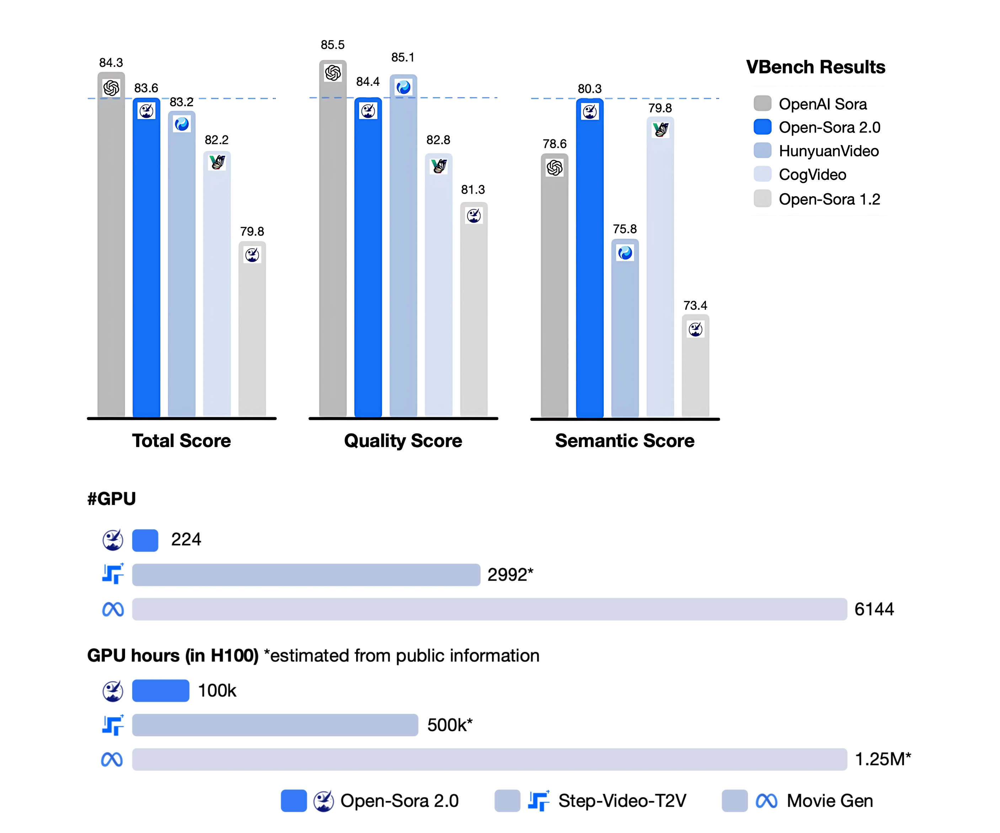

# HPC-AI Tech Releases Open-Sora 2.0: An Open-Source SOTA-Level Video Generation Model Trained for Just $200K

> AI-generated videos from text descriptions or images hold immense potential for content creation, media production, and entertainment. Recent advancements in deep learning, particularly in transformer-based architectures and diffusion models, have propelled this progress. However, training these models remains resource-intensive, requiring large datasets, extensive computing power, and significant financial investment. These challenges limit access to cutting-edge […]

AI-generated videos from text descriptions or images hold immense potential for content creation, media production, and entertainment. Recent advancements in [deep learning](https://www.marktechpost.com/2025/01/15/what-is-deep-learning-2/), particularly in transformer-based architectures and diffusion models, have propelled this progress. However, training these models remains resource-intensive, requiring large datasets, extensive computing power, and significant financial investment. These challenges limit access to cutting-edge video generation technologies, making them primarily available to well-funded research groups and organizations.

Training AI video models is expensive and computationally demanding. High-performance models require millions of training samples and powerful GPU clusters, making them difficult to develop without significant funding. Large-scale models, such as OpenAI’s Sora, push video generation quality to new heights but demand enormous computational resources. The high cost of training restricts access to advanced AI-driven video synthesis, limiting innovation to a few major organizations. Addressing these financial and technical barriers is essential to making AI video generation more widely available and encouraging broader adoption.

Different approaches have been developed to handle the computational demands of AI video generation. Proprietary models like Runway Gen-3 Alpha feature highly optimized architectures but are closed-source, restricting broader research contributions. Open-source models like HunyuanVideo and Step-Video-T2V offer transparency but require significant computing power. Many rely on extensive datasets, autoencoder-based compression, and hierarchical diffusion techniques to enhance video quality. However, each approach comes with trade-offs between efficiency and performance. While some models focus on high-resolution output and motion accuracy, others prioritize lower computational costs, resulting in varying performance levels across evaluation metrics. Researchers continue to seek an optimal balance that preserves video quality while reducing financial and computational burdens.

HPC-AI Tech researchers introduce [Open-Sora 2.0](https://github.com/hpcaitech/Open-Sora), a commercial-level AI video generation model that achieves state-of-the-art performance while significantly reducing training costs. This model was developed with an investment of only $200,000, making it five to ten times more cost-efficient than competing models such as MovieGen and Step-Video-T2V. Open-Sora 2.0 is designed to democratize AI video generation by making high-performance technology accessible to a wider audience. Unlike previous high-cost models, this approach integrates multiple efficiency-driven innovations, including improved data curation, an advanced autoencoder, a novel hybrid transformer framework, and highly optimized training methodologies.

The research team implemented a hierarchical data filtering system that refines video datasets into progressively higher-quality subsets, ensuring optimal training efficiency. A significant breakthrough was the introduction of the Video DC-AE autoencoder, which improves video compression while reducing the number of tokens required for representation. The model’s architecture incorporates full attention mechanisms, multi-stream processing, and a hybrid diffusion transformer approach to enhance video quality and motion accuracy. Training efficiency was maximized through a three-stage pipeline: text-to-video learning on low-resolution data, image-to-video adaptation for improved motion dynamics, and high-resolution fine-tuning. This structured approach allows the model to understand complex motion patterns and spatial consistency while maintaining computational efficiency.

The model was tested across multiple dimensions: visual quality, prompt adherence, and motion realism. Human preference evaluations showed that Open-Sora 2.0 outperforms proprietary and open-source competitors in at least two categories. In VBench evaluations, the performance gap between Open-Sora and OpenAI’s Sora was reduced from 4.52% to just 0.69%, demonstrating substantial improvements. Open-Sora 2.0 also achieved a higher VBench score than HunyuanVideo and CogVideo, establishing itself as a strong contender among current open-source models. Also, the model integrates advanced training optimizations such as parallelized processing, activation checkpointing, and automated failure recovery, ensuring continuous operation and maximizing GPU efficiency.

Key takeaways from the research on Open-Sora 2.0 include :

- Open-Sora 2.0 was trained for only $200,000, making it five to ten times more cost-efficient than comparable models.

- The hierarchical data filtering system refines video datasets through multiple stages, improving training efficiency.

- The Video DC-AE autoencoder significantly reduces token counts while maintaining high reconstruction fidelity.

- The three-stage training pipeline optimizes learning from low-resolution data to high-resolution fine-tuning.

- Human preference evaluations indicate that Open-Sora 2.0 outperforms leading proprietary and open-source models in at least two performance categories.

- The model reduced the performance gap with OpenAI’s Sora from 4.52% to 0.69% in VBench evaluations.

- Advanced system optimizations, such as activation checkpointing and parallelized training, maximize GPU efficiency and reduce hardware overhead.

- Open-Sora 2.0 demonstrates that high-performance AI video generation can be achieved with controlled costs, making the technology more accessible to researchers and developers worldwide.

---

Check out **_the [Paper ](https://arxiv.org/abs/2503.09642v1)and [GitHub Page](https://github.com/hpcaitech/Open-Sora?tab=readme-ov-file)._** All credit for this research goes to the researchers of this project. Also, feel free to follow us on **[Twitter](https://x.com/intent/follow?screen_name=marktechpost)** and don’t forget to join our **[80k+ ML SubReddit](https://www.reddit.com/r/machinelearningnews/)**.
