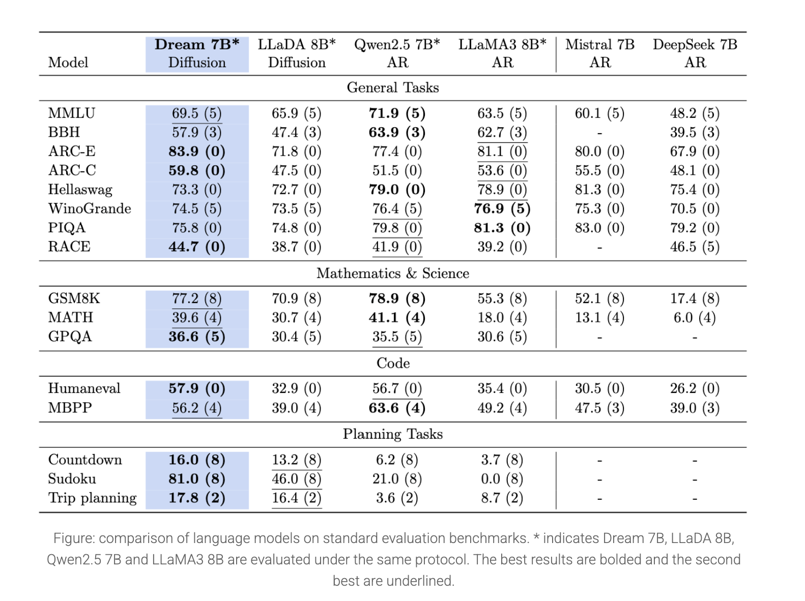

# Huawei Noah’s Ark Lab Released Dream 7B: A Powerful Open Diffusion Reasoning Model with Advanced Planning and Flexible Inference Capabilities

> LLMs have revolutionized artificial intelligence, transforming various applications across industries. Autoregressive (AR) models dominate current text generation, with leading systems like GPT-4, DeepSeek, and Claude all using sequential left-to-right architectures. Despite impressive capabilities, fundamental questions about next-generation architectural paradigms have emerged as AR models exhibit limitations at scale. These challenges include complex reasoning difficulties, inadequate […]

LLMs have revolutionized artificial intelligence, transforming various applications across industries. Autoregressive (AR) models dominate current text generation, with leading systems like GPT-4, DeepSeek, and Claude all using sequential left-to-right architectures. Despite impressive capabilities, fundamental questions about next-generation architectural paradigms have emerged as AR models exhibit limitations at scale. These challenges include complex reasoning difficulties, inadequate long-term planning, and struggles maintaining coherence across extended contexts. These are problematic for emerging applications in embodied AI, autonomous agents, and long-horizon decision-making systems where sustained reasoning and contextual understanding are essential for success.

Discrete diffusion models (DMs) are a promising alternative to autoregressive approaches for sequence generation. Unlike AR models that generate tokens sequentially, DMs refine all sequences in parallel from a fully noised state. This difference provides significant advantages: bidirectional contextual modeling enhances global coherence, flexible controllable generation occurs naturally through iterative refinement, and potential exists for fundamental sampling acceleration through efficient noise-to-data mapping. Recent advancements show diffusion’s growing potential in language tasks, with models like DiffuLLaMA and LLaDA scaling to 7B parameters, while Mercury Coder shows impressive inference efficiency in code generation.

Researchers from the University of Hong Kong and Huawei Noah’s Ark Lab released Dream 7B (Diffusion reasoning model), the most powerful open diffusion [large language model](https://www.marktechpost.com/2025/01/11/what-are-large-language-model-llms/) to date. The model matches or exceeds similarly-sized AR models on general tasks, mathematics, and coding benchmarks. Dream 7B shows exceptional zero-shot planning capabilities and inference flexibility, outperforming larger models like DeepSeek V3 (671B) on structured tasks. Trained on 580B tokens from diverse datasets, including Dolma and OpenCoder, the model employs mask-based diffusion with autoregressive weight initialization from Qwen2.5 7B. Its architecture enables powerful bidirectional context processing, arbitrary-order generation, infilling capabilities, and adjustable quality-speed tradeoffs during inference.

Dream 7B builds upon previous work in diffusion language modeling, utilizing RDM’s theoretical foundation and DiffuLLaMA’s adaptation strategy. It implements a mask diffusion paradigm with architecture designed for diverse applications. Training data uses text, mathematics, and code from sources, including Dolma v1.7, OpenCoder, and DCLM-Baseline. Pretraining utilized 580 billion tokens, executed on 96 NVIDIA H800 GPUs over 256 hours without unrecoverable loss spikes. Extensive design experimentation at the 1B parameter level identified critical components, including weight initialization from autoregressive models like Qwen2.5 and LLaMA3, along with context-adaptive token-level noise rescheduling that proved essential for Dream 7B training.

The proposed method is evaluated on Countdown and Sudoku tasks with adjustable planning difficulty, comparing against LLaDA 8B, Qwen2.5 7B, LLaMA3 8B, and DeepSeek V3 671B. It outperforms similarly-sized baseline models, with both diffusion models surpassing autoregressive alternatives. These diffusion models occasionally exceed DeepSeek V3 despite its vastly larger parameter count, showing diffusion models’ effectiveness for multi-constraint problem-solving and specific-objective tasks. The method underwent supervised fine-tuning post-training using 1.8M instruction pairs from Tulu 3 and SmolLM2 datasets over three epochs. Results indicate Dream’s capability to match autoregressive model performance:

In conclusion, researchers introduced Dream 7B, which represents a breakthrough family of diffusion language models characterized by efficiency, scalability, and flexibility through carefully developed training methodologies. These models perform comparably with leading autoregressive models of similar size across general tasks, mathematics, and coding applications. Dream’s most distinctive strengths emerge in advanced planning scenarios and flexible inference capabilities, where its diffusion-based architecture provides significant advantages over traditional autoregressive approaches. This achievement shows the viability of diffusion models as a compelling alternative path forward in language model development.

---

Check out **_the [Dream-org/Dream-v0-Instruct-7B](https://huggingface.co/Dream-org/Dream-v0-Instruct-7B)_** and **_[Dream-org/Dream-v0-Base-7B](https://huggingface.co/Dream-org/Dream-v0-Base-7B)._** All credit for this research goes to the researchers of this project. Also, feel free to follow us on **[Twitter](https://x.com/intent/follow?screen_name=marktechpost)** and don’t forget to join our **[85k+ ML SubReddit](https://www.reddit.com/r/machinelearningnews/)**.

[**🔥 [Register Now] miniCON Virtual Conference on OPEN SOURCE AI: FREE REGISTRATION + Certificate of Attendance + 3 Hour Short Event (April 12, 9 am- 12 pm PST) + Hands on Workshop [Sponsored]**](https://pxl.to/hki7r39)
