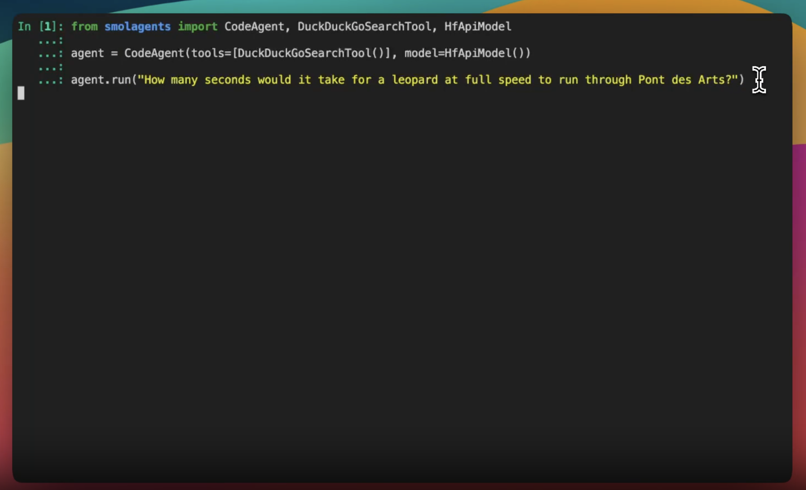

# Hugging Face Just Released SmolAgents: A Smol Library that Enables to Run Powerful AI Agents in a Few Lines of Code

> Creating intelligent agents has traditionally been a complex task, often requiring significant technical expertise and time. Developers encounter challenges like integrating APIs, configuring environments, and managing dependencies—all of which can make building these systems both daunting and resource-intensive. Simplifying these processes is critical for democratizing AI development and expanding its accessibility. Hugging Face Introduces SmolAgents: […]

Creating intelligent agents has traditionally been a complex task, often requiring significant technical expertise and time. Developers encounter challenges like integrating APIs, configuring environments, and managing dependencies—all of which can make building these systems both daunting and resource-intensive. Simplifying these processes is critical for democratizing AI development and expanding its accessibility.

### Hugging Face Introduces SmolAgents: A Simple Way to Build Code Agents

Hugging Face’s SmolAgents takes the complexity out of creating intelligent agents. With this new toolkit, developers can build agents with built-in search tools in just three lines of code. Yes, only three lines! SmolAgents uses Hugging Face’s powerful pretrained models to make the process as straightforward as possible, focusing on usability and efficiency.

The framework is lightweight and designed for simplicity. It seamlessly integrates with Hugging Face’s ecosystem, allowing developers to easily tackle tasks like data retrieval, summarization, and even code execution. This simplicity lets developers focus on solving real problems instead of wrestling with technical details.

### What Makes SmolAgents Work

SmolAgents is built around an intuitive API that makes creating agents quick and easy. Here are some of its standout features:

- **Understanding Language:** SmolAgents taps into advanced NLP models to understand commands and queries.

- **Smart Searching:** It connects to external data sources to deliver fast, accurate results.

- **Running Code on the Fly:** The agents can dynamically generate and execute code snippets tailored to specific tasks.

The toolkit’s modular design means it can adapt to various needs, from rapid prototyping to full-scale production. Using pretrained models also saves time and effort, delivering strong performance without requiring extensive customization. Plus, its lightweight nature makes it a great choice for smaller teams or individual developers working with limited resources.

### Real-World Results and Examples

Even though SmolAgents is relatively new, it’s already proving its worth. Developers are using it to automate tasks like generating code, fetching real-time data, and summarizing complex information. The fact that these tasks can be done with just three lines of code shows how much time and effort SmolAgents can save.

Take one example: a developer used SmolAgents to create an agent that fetches stock market trends and generates Python scripts to visualize the data. This project, completed in a matter of seconds, highlights how SmolAgents can tackle real-world challenges with minimal setup and effort.

### Conclusion

Hugging Face’s SmolAgents is a refreshing take on AI development, offering an easy, efficient way to create intelligent agents. Its three-line setup lowers the barrier to entry, making it an appealing option for developers at all skill levels. By leaning on Hugging Face’s pretrained models and keeping the design lightweight, SmolAgents is versatile enough for both experimentation and production.

For anyone curious to try it out, the open-source SmolAgents repository is packed with resources and examples to get you started. By simplifying the traditionally complex process of building AI agents, SmolAgents makes powerful AI tools more accessible and practical than ever before.

---

Check out **_the [GitHub Page](https://github.com/huggingface/smolagents)_**. All credit for this research goes to the researchers of this project. Also, don’t forget to follow us on **[Twitter](https://twitter.com/Marktechpost)** and join our **[Telegram Channel](https://github.com/XGenerationLab/XiYan-SQL)** and [**LinkedIn Gr**](https://www.linkedin.com/groups/13668564/)[**oup**](https://www.linkedin.com/groups/13668564/). Don’t Forget to join our **[60k+ ML SubReddit](https://www.reddit.com/r/machinelearningnews/)**.

**[🚨 Trending: LG AI Research Releases EXAONE 3.5: Three Open-Source Bilingual Frontier AI-level Models Delivering Unmatched Instruction Following and Long Context Understanding for Global Leadership in Generative AI Excellence….](https://www.marktechpost.com/2024/12/11/lg-ai-research-releases-exaone-3-5-three-open-source-bilingual-frontier-ai-level-models-delivering-unmatched-instruction-following-and-long-context-understanding-for-global-leadership-in-generative-a/)**
