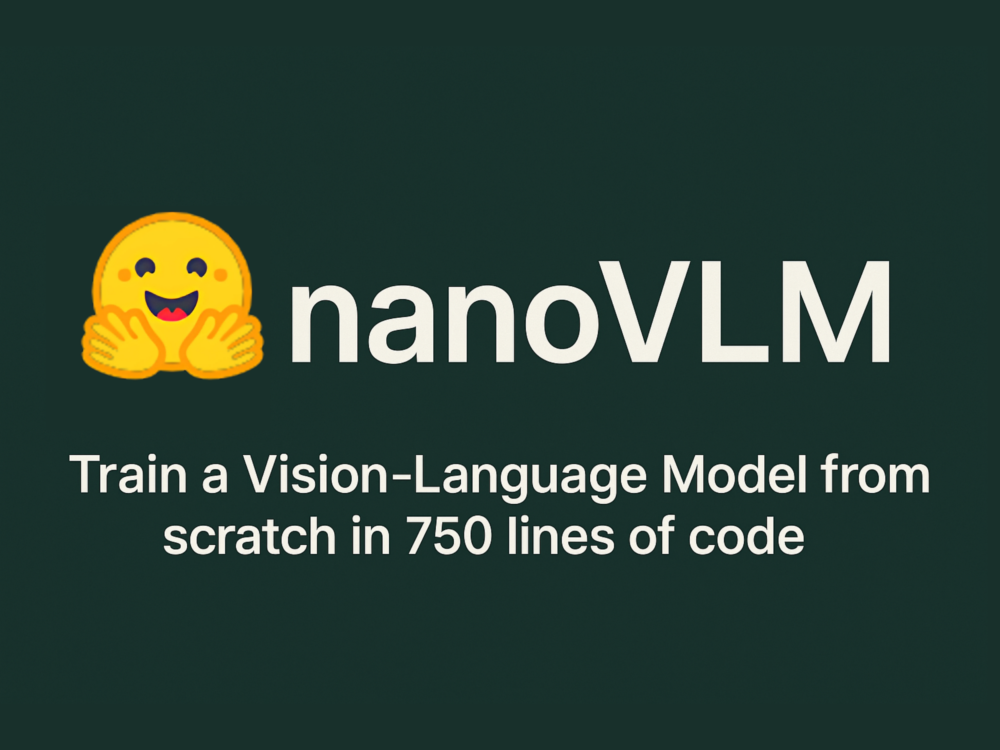

# Hugging Face Releases nanoVLM: A Pure PyTorch Library to Train a Vision-Language Model from Scratch in 750 Lines of Code

> In a notable step toward democratizing vision-language model development, Hugging Face has released nanoVLM, a compact and educational PyTorch-based framework that allows researchers and developers to train a vision-language model (VLM) from scratch in just 750 lines of code. This release follows the spirit of projects like nanoGPT by Andrej Karpathy—prioritizing readability and modularity without […]

In a notable step toward democratizing vision-language model development, Hugging Face has released **nanoVLM**, a compact and educational PyTorch-based framework that allows researchers and developers to train a vision-language model (VLM) from scratch in just 750 lines of code. This release follows the spirit of projects like nanoGPT by Andrej Karpathy—prioritizing readability and modularity without compromising on real-world applicability.

nanoVLM is a minimalist, PyTorch-based framework that distills the core components of vision-language modeling into just 750 lines of code. By abstracting only what’s essential, it offers a lightweight and modular foundation for experimenting with image-to-text models, suitable for both research and educational use.

### Technical Overview: A Modular Multimodal Architecture

At its core, nanoVLM combines together a visual encoder, a lightweight language decoder, and a modality projection mechanism to bridge the two. The vision encoder is based on **SigLIP-B/16**, a transformer-based architecture known for its robust feature extraction from images. This visual backbone transforms input images into embeddings that can be meaningfully interpreted by the language model.

On the textual side, nanoVLM uses **SmolLM2**, a causal decoder-style transformer that has been optimized for efficiency and clarity. Despite its compact nature, it is capable of generating coherent, contextually relevant captions from visual representations.

The fusion between vision and language is handled via a straightforward projection layer, aligning the image embeddings into the language model’s input space. The entire integration is designed to be transparent, readable, and easy to modify—perfect for educational use or rapid prototyping.

### Performance and Benchmarking

While simplicity is a defining feature of nanoVLM, it still achieves surprisingly competitive results. Trained on 1.7 million image-text pairs from the open-source `the_cauldron` dataset, the model reaches **35.3% accuracy on the MMStar benchmark**—a metric comparable to larger models like SmolVLM-256M, but using fewer parameters and significantly less compute.

The pre-trained model released alongside the framework, **nanoVLM-222M**, contains 222 million parameters, balancing scale with practical efficiency. It demonstrates that thoughtful architecture, not just raw size, can yield strong baseline performance in vision-language tasks.

This efficiency also makes nanoVLM particularly suitable for low-resource settings—whether it’s academic institutions without access to massive GPU clusters or developers experimenting on a single workstation.

### Designed for Learning, Built for Extension

Unlike many production-level frameworks which can be opaque and over-engineered, nanoVLM emphasizes **transparency**. Each component is clearly defined and minimally abstracted, allowing developers to trace data flow and logic without navigating a labyrinth of interdependencies. This makes it ideal for educational purposes, reproducibility studies, and workshops.

nanoVLM is also forward-compatible. Thanks to its modularity, users can swap in larger vision encoders, more powerful decoders, or different projection mechanisms. It’s a solid base to explore cutting-edge research directions—whether that’s cross-modal retrieval, zero-shot captioning, or instruction-following agents that combine visual and textual reasoning.

### Accessibility and Community Integration

In keeping with Hugging Face’s open ethos, both the code and the pre-trained nanoVLM-222M model are available on [GitHub](https://github.com/huggingface/nanoVLM) and the [Hugging Face Hub](https://huggingface.co/lusxvr/nanoVLM-222M). This ensures integration with Hugging Face tools like Transformers, Datasets, and Inference Endpoints, making it easier for the broader community to deploy, fine-tune, or build on top of nanoVLM.

Given Hugging Face’s strong ecosystem support and emphasis on open collaboration, it’s likely that nanoVLM will evolve with contributions from educators, researchers, and developers alike.

### Conclusion

nanoVLM is a refreshing reminder that building sophisticated AI models doesn’t have to be synonymous with engineering complexity. In just 750 lines of clean PyTorch code, Hugging Face has distilled the essence of vision-language modeling into a form that’s not only usable, but genuinely instructive.

As multimodal AI becomes increasingly important across domains—from robotics to assistive technology—tools like nanoVLM will play a critical role in onboarding the next generation of researchers and developers. It may not be the largest or most advanced model on the leaderboard, but its impact lies in its clarity, accessibility, and extensibility.

---

Check out the **[Model](https://huggingface.co/lusxvr/nanoVLM-222M) **and **[Repo](https://github.com/huggingface/nanoVLM)**. Also, don’t forget to follow us on **[Twitter](https://x.com/intent/follow?screen_name=marktechpost)**.

**Here’s a brief overview of what we’re building at Marktechpost:**

- **Newsletter– [airesearchinsights.com/](https://minicon.marktechpost.com/)(30k+ subscribers)**

- **miniCON AI Events – [minicon.marktechpost.com](https://minicon.marktechpost.com/)**

- **AI Reports & Magazines – [magazine.marktechpost.com](https://magazine.marktechpost.com/)**

- **AI Dev & Research News – [marktechpost.com](https://marktechpost.com/) (1M+ monthly readers)**

- **ML News Community –[ r/machinelearningnews](https://www.reddit.com/r/machinelearningnews/) (92k+ members)**
