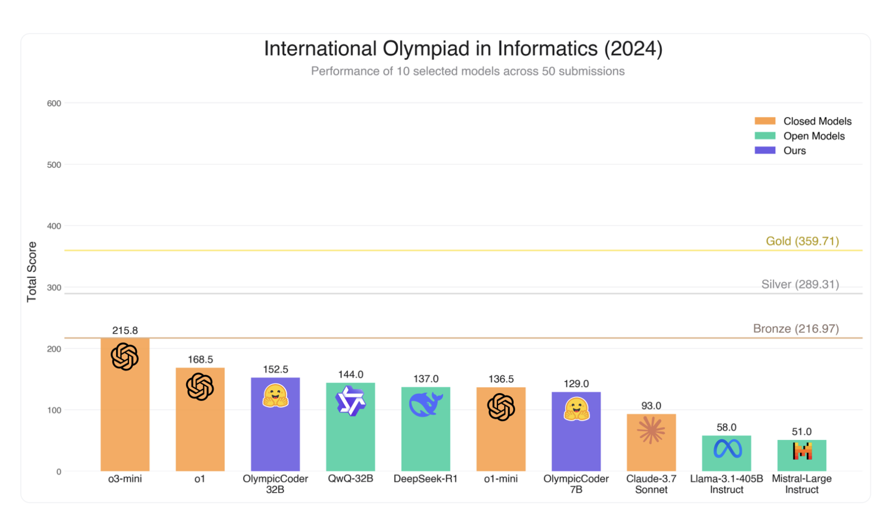

# Hugging Face Releases OlympicCoder: A Series of Open Reasoning AI Models that can Solve Olympiad-Level Programming Problems

> In the realm of competitive programming, both human participants and artificial intelligence systems encounter a set of unique challenges. Many existing code generation models struggle to consistently meet the high standards required for solving complex, olympiad-level problems. A recurring issue is the difficulty in processing long chain-of-thought reasoning, often leading to solutions that pass only […]

In the realm of competitive programming, both human participants and artificial intelligence systems encounter a set of unique challenges. Many existing code generation models struggle to consistently meet the high standards required for solving complex, olympiad-level problems. A recurring issue is the difficulty in processing long chain-of-thought reasoning, often leading to solutions that pass only simplified test cases while failing under more stringent contest conditions. Datasets available today frequently capture only a fragment of the problems seen on platforms like CodeForces or in international competitions such as the International Olympiad in Informatics (IOI). This situation calls for models that can not only generate syntactically correct code but also follow a logical reasoning path that mirrors the careful thought process required in real contests.

### Meet OlympicCoder

Hugging Face has recently introduced OlympicCoder, a series of models specifically designed to tackle the demands of olympiad-level programming challenges. This series consists of two fine-tuned models—OlympicCoder-7B and OlympicCoder-32B—that have been refined using a carefully curated dataset known as CodeForces-CoTs, which contains nearly 100,000 high-quality chain-of-thought samples. Notably, these models outperform closed-source frontier models like Claude 3.7 Sonnet on IOI problems, demonstrating that open-source models can compete with, and even exceed, the performance of larger proprietary systems. By integrating detailed explanations and multiple correct solutions into the training data, the OlympicCoder models are well-equipped to address the nuances of coding tasks that involve complex reasoning and problem-solving.

### Technical Details and Benefits

Both OlympicCoder-7B and OlympicCoder-32B build on the foundation of the Qwen2.5-Coder Instruct model and are refined using a decontaminated version of the CodeForces dataset. For instance, OlympicCoder-7B, which contains approximately 7.6 billion parameters, is trained without employing sample packing—a technique that can inadvertently truncate lengthy reasoning chains. Instead, the training process uses a higher learning rate of 4e-5 combined with a cosine learning rate scheduler, ensuring that long-context solutions are preserved and fully utilized. Meanwhile, OlympicCoder-32B, a larger model with about 32.8 billion parameters, leverages distributed training methods with a focus on maintaining a long context window. These technical adjustments allow the models to better accommodate long and intricate reasoning sequences, which are crucial for accurately addressing the multi-layered challenges presented in competitive programming.

### Results and Insights

The performance of these models has been evaluated on benchmarks such as LiveCodeBench and the IOI 2024 problems. In these assessments, the models are put through rigorous submission strategies that closely mimic real contest conditions by generating multiple submissions for individual subtasks. This method ensures that the most coherent chain-of-thought is selected for evaluation. The evaluation results confirm that both OlympicCoder-7B and OlympicCoder-32B not only deliver robust performance but, in the case of the 32B model, also achieve results that surpass those of some leading closed-source systems. Detailed analyses indicate that avoiding sample packing and applying a higher learning rate are critical factors that enhance performance, while the use of a carefully curated dataset helps capture the complexity of competitive programming problems.

### Conclusion

In conclusion, OlympicCoder represents a thoughtful step forward in developing open reasoning models for competitive programming. With two fine-tuned models that excel even against larger, closed-source systems, these models exemplify how careful dataset curation and methodical fine-tuning can lead to significant advances in code generation. OlympicCoder offers valuable insights for both researchers and practitioners, paving the way for future innovations in AI-driven problem solving while maintaining a balanced and rigorous approach to model development.

---

Check out **_the [7B Model](https://huggingface.co/open-r1/OlympicCoder-7B) and [32B Model ](https://huggingface.co/open-r1/OlympicCoder-32B)on Hugging Face, and [Technical details](https://huggingface.co/blog/open-r1/update-3)._** All credit for this research goes to the researchers of this project. Also, feel free to follow us on **[Twitter](https://x.com/intent/follow?screen_name=marktechpost)** and don’t forget to join our **[80k+ ML SubReddit](https://www.reddit.com/r/machinelearningnews/)**.

**🚨 [Meet Parlant: An LLM-first conversational AI framework designed to provide developers with the control and precision they need over their AI customer service agents, utilizing behavioral guidelines and runtime supervision. 🔧 🎛️ It’s operated using an easy-to-use CLI 📟 and native client SDKs in Python and TypeScript 📦.](https://pxl.to/6p7dm6p)**
