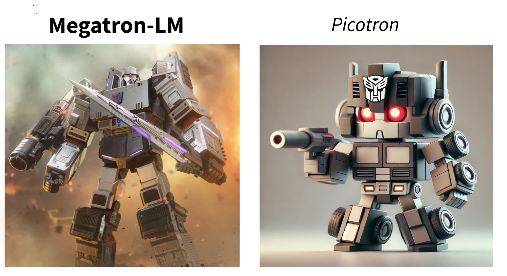

# Hugging Face Releases Picotron: A Tiny Framework that Solves LLM Training 4D Parallelization

> The rise of large language models (LLMs) has transformed natural language processing, but training these models comes with significant challenges. Training state-of-the-art models like GPT and Llama requires enormous computational resources and intricate engineering. For instance, Llama-3.1-405B needed approx. 39 million GPU hours, equivalent to 4,500 years on a single GPU. To meet these demands […]

The rise of large language models (LLMs) has transformed natural language processing, but training these models comes with significant challenges. Training state-of-the-art models like GPT and Llama requires enormous computational resources and intricate engineering. For instance, Llama-3.1-405B needed approx. 39 million GPU hours, equivalent to 4,500 years on a single GPU. To meet these demands within months, engineers employ 4D parallelization across data, tensor, context, and pipeline dimensions. However, this approach often results in sprawling, complex codebases that are difficult to maintain and adapt, posing barriers to scalability and accessibility.

### Hugging Face Releases Picotron: A New Approach to LLM Training

**_[Hugging Face has introduced Picotron,](https://github.com/huggingface/picotron)_** a lightweight framework that offers a simpler way to handle LLM training. Unlike traditional solutions that rely on extensive libraries, Picotron streamlines 4D parallelization into a concise framework, reducing the complexity typically associated with such tasks. Building on the success of its predecessor, Nanotron, Picotron simplifies the management of parallelism across multiple dimensions. This framework is designed to make LLM training more accessible and easier to implement, allowing researchers and engineers to focus on their projects without being hindered by overly complex infrastructure.

### Technical Details and Benefits of Picotron

Picotron strikes a balance between simplicity and performance. It integrates 4D parallelism across data, tensor, context, and pipeline dimensions, a task usually handled by far larger libraries. Despite its minimal footprint, Picotron performs efficiently. Testing on the SmolLM-1.7B model with eight H100 GPUs demonstrated a Model FLOPs Utilization (MFU) of approximately 50%, comparable to that achieved by larger, more complex libraries.

One of Picotron’s key advantages is its focus on reducing code complexity. By distilling 4D parallelization into a manageable and readable framework, it lowers the barriers for developers, making it easier to understand and adapt the code for specific needs. Its modular design ensures compatibility with diverse hardware setups, enhancing its flexibility for a variety of applications.

### Insights and Results

Initial benchmarks highlight Picotron’s potential. On the SmolLM-1.7B model, it demonstrated efficient GPU resource utilization, delivering results on par with much larger libraries. While further testing is ongoing to confirm these results across different configurations, early data suggests that Picotron is both effective and scalable.

Beyond performance, Picotron streamlines the development workflow by simplifying the codebase. This reduction in complexity minimizes debugging efforts and accelerates iteration cycles, enabling teams to explore new architectures and training paradigms with greater ease. Additionally, Picotron has proven its scalability, supporting deployments across thousands of GPUs during the training of Llama-3.1-405B, and bridging the gap between academic research and industrial-scale applications.

### Conclusion

Picotron represents a step forward in LLM training frameworks, addressing long-standing challenges associated with 4D parallelization. By offering a lightweight and accessible solution, Hugging Face has made it easier for researchers and developers to implement efficient training processes. With its simplicity, adaptability, and strong performance, Picotron is poised to play a pivotal role in the future of AI development. As further benchmarks and use cases emerge, it stands to become an essential tool for those working on large-scale model training. For organizations looking to streamline their LLM development efforts, Picotron provides a practical and effective alternative to traditional frameworks.

---

Check out **the _[GitHub Page](https://github.com/huggingface/picotron)_**. All credit for this research goes to the researchers of this project. Also, don’t forget to follow us on **[Twitter](https://twitter.com/Marktechpost)** and join our **[Telegram Channel](https://github.com/XGenerationLab/XiYan-SQL)** and [**LinkedIn Gr**](https://www.linkedin.com/groups/13668564/)[**oup**](https://www.linkedin.com/groups/13668564/). Don’t Forget to join our **[60k+ ML SubReddit](https://www.reddit.com/r/machinelearningnews/)**.

**[🚨 Trending: LG AI Research Releases EXAONE 3.5: Three Open-Source Bilingual Frontier AI-level Models Delivering Unmatched Instruction Following and Long Context Understanding for Global Leadership in Generative AI Excellence….](https://www.marktechpost.com/2024/12/11/lg-ai-research-releases-exaone-3-5-three-open-source-bilingual-frontier-ai-level-models-delivering-unmatched-instruction-following-and-long-context-understanding-for-global-leadership-in-generative-a/)**
