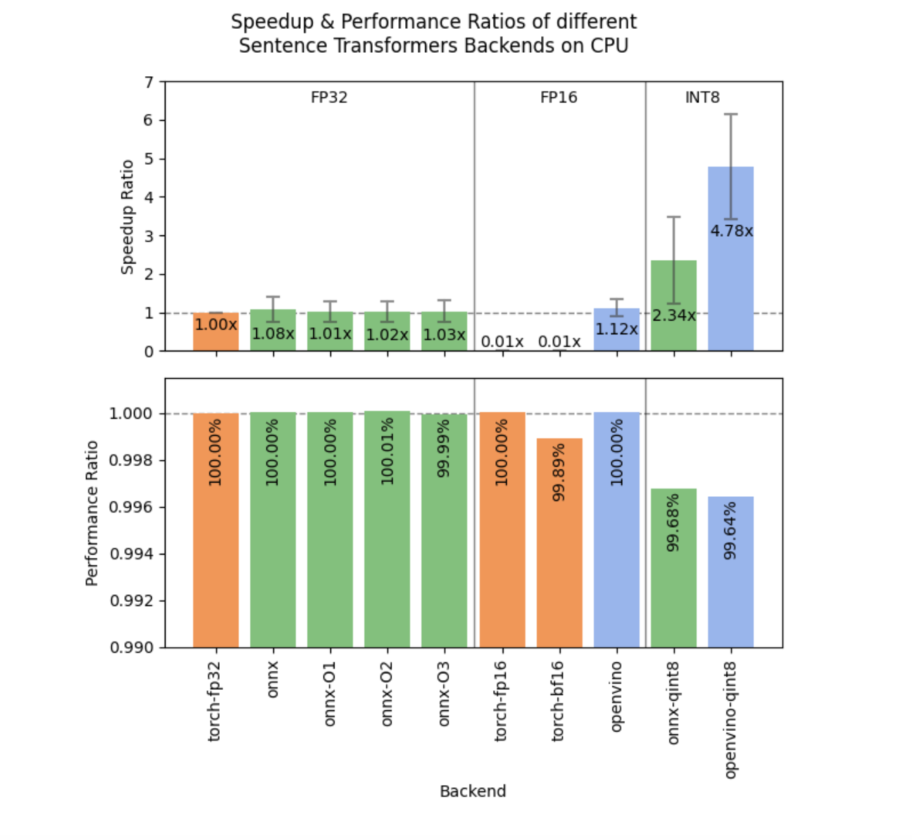

# Hugging Face Releases Sentence Transformers v3.3.0: A Major Leap for NLP Efficiency

> Natural Language Processing (NLP) has rapidly evolved in the last few years, with transformers emerging as a game-changing innovation. Yet, there are still notable challenges when using NLP tools to develop applications for tasks like semantic search, question answering, or document embedding. One key issue has been the need for models that not only perform […]

Natural Language Processing (NLP) has rapidly evolved in the last few years, with transformers emerging as a game-changing innovation. Yet, there are still notable challenges when using NLP tools to develop applications for tasks like semantic search, question answering, or document embedding. One key issue has been the need for models that not only perform well but also work efficiently on a range of devices, especially those with limited computational resources, such as CPUs. Models tend to require substantial processing power to yield high accuracy, and this trade-off often leaves developers choosing between performance and practicality. Additionally, deploying large models with specialized functionalities can be cumbersome due to storage constraints and expensive hosting requirements. In response, continual innovations are essential to keep pushing NLP tools towards greater efficiency, cost-effectiveness, and usability for a broader audience.

### Hugging Face Just Released Sentence Transformers v3.3.0

Hugging Face just released **[Sentence Transformers v3.3.0](https://github.com/UKPLab/sentence-transformers/releases/tag/v3.3.0)**, and it’s a major update with significant advancements! This latest version is packed with features that address performance bottlenecks, enhance usability, and offer new training paradigms. Notably, the v3.3.0 update brings a groundbreaking 4.5x speedup for CPU inference by integrating OpenVINO’s int8 static quantization. There are also additions to facilitate training using prompts for a performance boost, integration of Parameter-Efficient Fine-Tuning (PEFT) techniques, and seamless evaluation capabilities through NanoBEIR. The release shows Hugging Face’s commitment to not just improving accuracy but also enhancing computational efficiency, making these models more accessible across a wide range of use cases.

### Technical Details and Benefits

The technical enhancements in Sentence Transformers v3.3.0 revolve around making the models more practical for deployment while retaining high levels of accuracy. The integration of OpenVINO Post-Training Static Quantization allows models to run 4.78 times faster on CPUs with an average performance drop of only 0.36%. This is a game-changer for developers deploying on CPU-based environments, such as edge devices or standard servers, where GPU resources are limited or unavailable. A new method, `export_static_quantized_openvino_model`, has been introduced to make quantization straightforward.

Another major feature is the introduction of training with prompts. By simply adding strings like “query: ” or “document: ” as prompts during training, the performance in retrieval tasks improves significantly. For instance, experiments show a 0.66% to 0.90% improvement in NDCG@10, a metric for evaluating ranking quality, without any additional computational overhead. The addition of PEFT support means that training adapters on top of base models is now more flexible. PEFT allows for efficient training of specialized components, reducing memory requirements and enabling cheap deployment of multiple configurations from a single base model. Seven new methods have been introduced to add or load adapters, making it easy to manage different adapters and switch between them seamlessly.

### Why This Release is Important

The v3.3.0 release addresses the pressing needs of NLP practitioners aiming to balance efficiency, performance, and usability. The introduction of OpenVINO quantization is crucial for deploying transformer models in production environments with limited hardware capabilities. For instance, the reported 4.78x speed improvement on CPU-based inference makes it possible to use high-quality embeddings in real-time applications where previously the computational cost would have been prohibitive. The prompt-based training also illustrates how relatively minor adjustments can yield significant performance gains. A 0.66% to 0.90% improvement in retrieval tasks is a remarkable enhancement, especially when it comes at no extra cost.

PEFT integration allows for more scalability in training and deploying models. It is particularly beneficial in environments where resources are shared, or there is a need to train specialized models with minimal computational load. The new ability to evaluate on NanoBEIR, a collection of 13 datasets focused on retrieval tasks, adds an extra layer of assurance that the models trained using v3.3.0 can generalize well across diverse tasks. This evaluation framework allows developers to validate their models on real-world retrieval scenarios, offering a benchmarked understanding of their performance and making it easy to track improvements over time.

### Conclusion

The Sentence Transformers v3.3.0 release from Hugging Face is a significant step forward in making state-of-the-art NLP more accessible and usable across diverse environments. With substantial CPU speed improvements through OpenVINO quantization, prompt-based training to enhance performance without extra cost, and the introduction of PEFT for more scalable model management, this update ticks all the right boxes for developers. It ensures that models are not just powerful but also efficient, versatile, and easier to integrate into various deployment scenarios. Hugging Face continues to push the envelope, making complex NLP tasks more feasible for real-world applications while fostering innovation that benefits both researchers and industry professionals alike.

---

Check out the **[GitHub Page](https://github.com/UKPLab/sentence-transformers/releases/tag/v3.3.0)**. All credit for this research goes to the researchers of this project. Also, don’t forget to follow us on **[Twitter](https://twitter.com/Marktechpost)** and join our **[Telegram Channel](https://pxl.to/at72b5j)** and [**LinkedIn Gr**](https://www.linkedin.com/groups/13668564/)[**oup**](https://www.linkedin.com/groups/13668564/). **If you like our work, you will love our**[** newsletter..**](https://marktechpost-newsletter.beehiiv.com/subscribe) Don’t Forget to join our **[55k+ ML SubReddit](https://www.reddit.com/r/machinelearningnews/)**.

**[[Upcoming Live LinkedIn event](https://pxl.to/7ax55o)] [‘One Platform, Multimodal Possibilities,’ where Encord CEO Eric Landau and Head of Product Engineering, Justin Sharps will talk how they are reinventing data development process to help teams build game-changing multimodal AI models, fast‘](https://pxl.to/7ax55o)**
