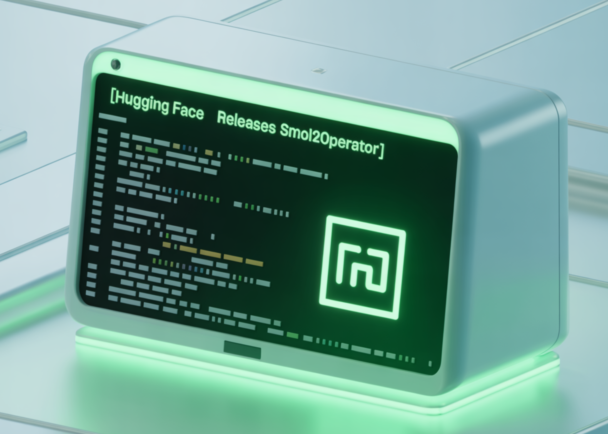

# Hugging Face Releases Smol2Operator: A Fully Open-Source Pipeline to Train a 2.2B VLM into an Agentic GUI Coder

> Hugging Face (HF) has released Smol2Operator, a reproducible, end-to-end recipe that turns a small vision-language model (VLM) with no prior UI grounding into a GUI-operating, tool-using agent. The release covers data transformation utilities, training scripts, transformed datasets, and the resulting 2.2B-parameter model checkpoint—positioned as a complete blueprint for building GUI agents from scratch rather than […]

Hugging Face (HF) has released _Smol2Operator_, a reproducible, end-to-end recipe that turns a small vision-language model (VLM) with no prior UI grounding into a GUI-operating, tool-using agent. The release covers data transformation utilities, training scripts, transformed datasets, and the resulting 2.2B-parameter model checkpoint—positioned as a complete blueprint for building GUI agents from scratch rather than a single benchmark result.

### But what’s new?

- **Two-phase post-training over a small VLM:** Starting from **SmolVLM2-2.2B-Instruct**—a model that “initially has no grounding capabilities for GUI tasks”—Smol2Operator first instills perception/grounding, then layers agentic reasoning with supervised fine-tuning (SFT).

- **Unified action space across heterogeneous sources:** A conversion pipeline normalizes disparate GUI action taxonomies (mobile, desktop, web) into a single, consistent function API (e.g., `click`, `type`, `drag`, normalized [0,1] coordinates), enabling coherent training across datasets. An _Action Space Converter_ supports remapping to custom vocabularies.

### But why Smol2Operator?

Most GUI-agent pipelines are blocked by fragmented action schemas and non-portable coordinates. Smol2Operator’s **action-space unification** and **normalized coordinate** strategy make datasets interoperable and training stable under image resizing, which is common in VLM preprocessing. This reduces the engineering overhead of assembling multi-source GUI data and lowers the barrier to reproducing agent behavior with small models.

### How it works? training stack and data path

- **Data standardization:**

Parse and normalize function calls from source datasets (e.g., AGUVIS stages) into a unified signature set; remove redundant actions; standardize parameter names; convert pixel to normalized coordinates.

- **Phase 1 (Perception/Grounding):**

SFT on the unified action dataset to learn element localization and basic UI affordances, measured on **ScreenSpot-v2** (element localization on screenshots).

- **Phase 2 (Cognition/Agentic reasoning):**

Additional SFT to convert grounded perception into step-wise action planning aligned with the unified action API.

The HF Team reports a clean performance trajectory on ScreenSpot-v2 (benchmark) as grounding is learned, and shows similar training strategy scaling down to a ~460M “nanoVLM,” indicating the method’s portability across capacities (numbers are presented in the post’s tables).

### Scope, limits, and next steps

- **Not a “SOTA at all costs” push:** The HF team frame the work as a **process blueprint**—owning data conversion → grounding → reasoning—rather than chasing leaderboard peaks.

- **Evaluation focus:** Demonstrations center on **ScreenSpot-v2** perception and qualitative end-to-end task videos; broader cross-environment, cross-OS, or long-horizon task benchmarks are future work. The HF team notes potential gains from RL/DPO beyond SFT for on-policy adaptation.

- **Ecosystem trajectory:** ScreenEnv’s roadmap includes wider OS coverage (Android/macOS/Windows), which would increase external validity of trained policies.

### Summary

Smol2Operator is a fully open-source, reproducible pipeline that upgrades **SmolVLM2-2.2B-Instruct**—a VLM with zero GUI grounding—into an agentic GUI coder via a two-phase SFT process. The release standardizes heterogeneous GUI action schemas into a unified API with normalized coordinates, provides transformed AGUVIS-based datasets, publishes training notebooks and preprocessing code, and ships a final checkpoint plus a demo Space. It targets process transparency and portability over leaderboard chasing, and slots into the **smolagents** runtime with **ScreenEnv** for evaluation, offering a practical blueprint for teams building small, operator-grade GUI agents.

---

Check out the **[Technical details](https://huggingface.co/blog/smol2operator)**, and **[Full Collection on HF](https://huggingface.co/collections/smolagents/smol2operator-release-68d288e87d3fa8f551d2ce2e)**. Feel free to check out our **[GitHub Page for Tutorials, Codes and Notebooks](https://github.com/Marktechpost/AI-Tutorial-Codes-Included)**. Also, feel free to follow us on **[Twitter](https://x.com/intent/follow?screen_name=marktechpost)** and don’t forget to join our **[100k+ ML SubReddit](https://www.reddit.com/r/machinelearningnews/)** and Subscribe to **[our Newsletter](https://www.aidevsignals.com/)**.
