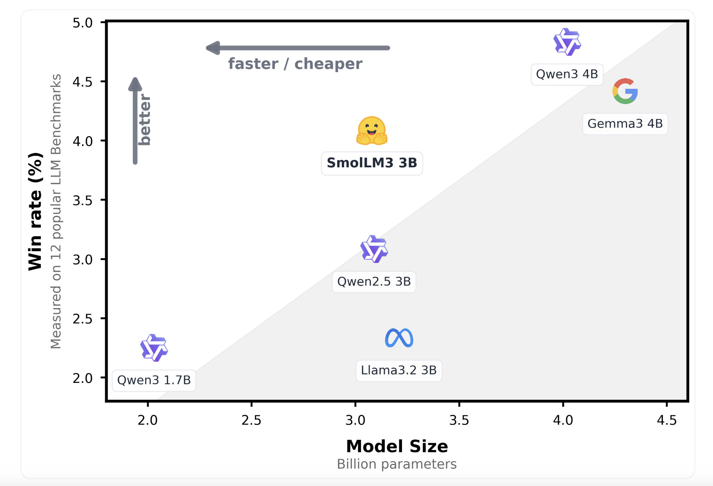

# Hugging Face Releases SmolLM3: A 3B Long-Context, Multilingual Reasoning Model

> Hugging Face just released SmolLM3, the latest version of its “Smol” language models, designed to deliver strong multilingual reasoning over long contexts using a compact 3B-parameter architecture. While most high-context capable models typically push beyond 7B parameters, SmolLM3 manages to offer state-of-the-art (SoTA) performance with significantly fewer parameters—making it more cost-efficient and deployable on constrained […]

Hugging Face just released **SmolLM3**, the latest version of its “Smol” language models, designed to deliver strong multilingual reasoning over long contexts using a compact 3B-parameter architecture. While most high-context capable models typically push beyond 7B parameters, SmolLM3 manages to offer state-of-the-art (SoTA) performance with significantly fewer parameters—making it more cost-efficient and deployable on constrained hardware, without compromising on capabilities like tool usage, multi-step reasoning, and language diversity.

### Overview of SmolLM3

SmolLM3 stands out as a **compact, multilingual, and dual-mode long-context language model** capable of handling sequences up to **128k tokens**. It was trained on **11 trillion tokens**, positioning it competitively against models like Mistral, LLaMA 2, and Falcon. Despite its size, SmolLM3 achieves surprisingly strong tool usage performance and few-shot reasoning ability—traits more commonly associated with models double or triple its size.

**SmolLM3 was released in two variants:**

- **[SmolLM3-3B-Base](https://huggingface.co/HuggingFaceTB/SmolLM3-3B-Base)**: The base language model trained on the 11T-token corpus.

- **[SmolLM3-3B-Instruct](https://huggingface.co/HuggingFaceTB/SmolLM3-3B):** An instruction-tuned variant optimized for reasoning and tool use.

Both models are publicly available under the Apache 2.0 license on Hugging Face’s Model Hub.

### Key Features

**1. Long Context Reasoning (up to 128k tokens)**
SmolLM3 utilizes a modified attention mechanism to efficiently process extremely long contexts—up to **128,000 tokens**. This capability is crucial for tasks involving extended documents, logs, or structured records where context length directly affects comprehension and accuracy.

**2. Dual Mode Reasoning**
The instruction-tuned SmolLM3-3B supports **dual-mode reasoning**:

- **Instruction-following** for chat-style and tool-augmented tasks.

- **Multilingual QA and generation** for tasks in multiple languages.

This bifurcation allows the model to excel in both open-ended generation and structured reasoning, making it suitable for applications ranging from [RAG](https://www.marktechpost.com/2024/11/25/retrieval-augmented-generation-rag-deep-dive-into-25-different-types-of-rag/) pipelines to agent workflows.

**3. Multilingual Capabilities**
Trained on a multilingual corpus, SmolLM3 supports six languages: **English, French, Spanish, German, Italian, and Portuguese**. It performs well on benchmarks like XQuAD and MGSM, demonstrating its ability to generalize across linguistic boundaries with minimal performance drop.

**4. Compact Size with SoTA Performance**
At just **3 billion parameters**, SmolLM3 achieves performance close to or on par with larger models such as Mistral-7B on multiple downstream tasks. This is made possible by the scale and quality of its training data (11T tokens) and careful architectural tuning.

**5. Tool Use and Structured Outputs**
The model demonstrates impressive performance on tool-calling tasks—both in prompt-based workflows and with structured outputs. It correctly follows schema-driven input-output constraints and interfaces well with systems requiring deterministic behavior, such as autonomous agents and API-driven environments.

### Technical Training Details

SmolLM3 was trained on an internal mixture curated by Hugging Face, consisting of high-quality web content, code, academic papers, and multilingual sources. The 11T-token training run was done using multi-node distributed training strategies on GPU clusters, employing optimizations like Flash Attention v2 for efficient long-sequence training. The tokenizer is a 128k-token SentencePiece model, shared across all supported languages.

For long context support, Hugging Face employed **linear and grouped attention mechanisms** that minimize quadratic complexity while retaining performance. This enabled the model to handle context lengths up to 128k during both training and inference—without memory bottlenecks that plague dense transformers at this scale.

The **SmolLM3-3B** instruction-tuned variant was further trained using Hugging Face’s [trlx](https://github.com/huggingface/trlx) library for alignment with chat instructions, reasoning tasks, and tool usage demonstrations.

### Performance Benchmarks

SmolLM3 performs strongly on multiple multilingual and reasoning benchmarks:

- **XQuAD (Multilingual QA)**: Competitive scores in all six supported languages.

- **MGSM (Multilingual Grade School Math)**: Outperforms several larger models in zero-shot settings.

- **ToolQA and MultiHopQA**: Shows strong multi-step reasoning and context grounding.

- **ARC and MMLU**: High accuracy in commonsense and professional knowledge domains.

While it does not surpass the latest 7B and 13B models on every benchmark, SmolLM3’s performance-to-parameter ratio remains one of the highest in its class.

### Use Cases and Applications

SmolLM3 is particularly suited for:

- **Low-cost, multilingual AI deployments** in chatbots, helpdesk systems, and document summarizers.

- **Lightweight RAG and retrieval-based systems** that benefit from long-context understanding.

- **Tool-augmented agents** requiring schema adherence and deterministic tool invocation.

- **Edge deployments and private environments** where smaller models are necessary due to hardware or data privacy constraints.

### Conclusion

SmolLM3 exemplifies a new generation of small-yet-capable language models. Its combination of multilingual support, long-context handling, and strong reasoning—all within a 3B parameter footprint—marks a significant step forward in model efficiency and accessibility. Hugging Face’s release demonstrates that with the right training recipe and architectural design, smaller models can still deliver robust performance in complex tasks traditionally reserved for much larger LLMs.

---

Check out the **[SmolLM3-3B-Base](https://huggingface.co/HuggingFaceTB/SmolLM3-3B-Base)** and **[SmolLM3-3B-Instruct](https://huggingface.co/HuggingFaceTB/SmolLM3-3B)**. All credit for this research goes to the researchers of this project. Also, feel free to follow us on **[Twitter](https://x.com/intent/follow?screen_name=marktechpost)**, and **[Youtube](https://www.youtube.com/@Marktechpost)** and don’t forget to join our **[100k+ ML SubReddit](https://www.reddit.com/r/machinelearningnews/)** and Subscribe to **[our Newsletter](https://www.airesearchinsights.com/subscribe)**.
