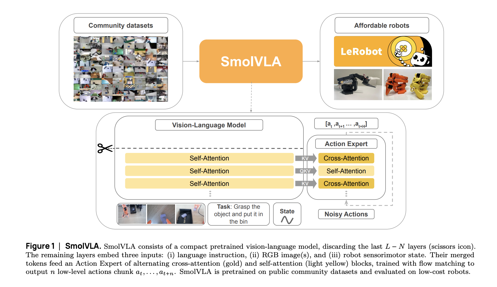

# Hugging Face Releases SmolVLA: A Compact Vision-Language-Action Model for Affordable and Efficient Robotics

> Despite recent progress in robotic control via large-scale vision-language-action (VLA) models, real-world deployment remains constrained by hardware and data requirements. Most VLA models depend on transformer-based backbones with billions of parameters, resulting in significant memory and compute costs. This limits experimentation to well-resourced labs and clouds, excluding practitioners working with lower-cost hardware. Additionally, much of […]

Despite recent progress in robotic control via large-scale vision-language-action (VLA) models, real-world deployment remains constrained by hardware and data requirements. Most VLA models depend on transformer-based backbones with billions of parameters, resulting in significant memory and compute costs. This limits experimentation to well-resourced labs and clouds, excluding practitioners working with lower-cost hardware. Additionally, much of the current progress in VLA research remains either proprietary or based on non-reproducible methodologies, impeding open research. Finally, data heterogeneity across robotic platforms—differences in morphology, sensors, and control modes—poses a further challenge to generalizability and cross-platform learning.

### Hugging Face Introduces SmolVLA: A Lightweight, Open VLA Framework

Hugging Face presents **SmolVLA**, a compact vision-language-action model developed for affordability and deployment efficiency. Unlike conventional VLAs, SmolVLA is trained entirely on community-collected datasets and is optimized to run on single-GPU or CPU environments. The model architecture integrates a trimmed version of a pretrained vision-language model (SmolVLM-2) and a transformer-based action expert. This structure enables efficient low-level control from natural language instructions and RGB camera inputs.

A distinguishing feature of SmolVLA is its asynchronous inference stack, which decouples action prediction from execution. This design enables low-latency control suitable for real-time applications, even in resource-constrained settings. SmolVLA is released under an open license with accompanying code, training data, and deployment tools.

### Architectural Overview and Design Trade-Offs

The SmolVLA model is structured into two primary components:

- **Perception Module (SmolVLM-2)**: A pretrained compact vision-language encoder processes sequences of RGB images, sensorimotor states, and language instructions. For efficiency, the model limits visual tokens through downsampling and only uses the lower half of transformer layers, based on empirical findings that earlier layers often yield more transferable features.

- **Action Expert**: A lightweight transformer, trained with flow matching, predicts sequences of continuous control actions. The action expert alternates between self-attention and cross-attention layers, balancing internal action coherence and conditioning on perception inputs. Causal masking is applied to enforce temporal consistency.

To reduce computational overhead, linear projections are used to align the modalities’ token dimensions. Action chunks are generated instead of single-step predictions, reducing the frequency of inference calls. The model is trained using bfloat16 precision and Torch’s JIT compilation for runtime optimization.

### Empirical Evaluation: Simulation and Real-World Performance

SmolVLA is evaluated across both simulation benchmarks (LIBERO and Meta-World) and real-world robotic tasks using low-cost SO100 and SO101 platforms. The model is trained from scratch on ~23K episodes across 481 community datasets, with task labels auto-generated using a VLM. Evaluation metrics include task-level success rates under both in-distribution and out-of-distribution conditions.

In the **LIBERO** benchmark, SmolVLA (0.45B) achieves an average success rate of 87.3%, closely matching or surpassing larger models such as π₀ (3.3B). In **Meta-World**, the model outperforms diffusion policies and smaller-scale VLAs across task difficulty levels. These results are notable considering SmolVLA’s smaller training footprint and absence of robotics-specific pretraining.

In real-world settings, SmolVLA achieves average success rates of 78.3% across pick-place, stacking, and sorting tasks—outperforming both ACT (trained from scratch) and π₀ (finetuned). Moreover, SmolVLA generalizes across robotic embodiments, maintaining performance on SO101 despite training exclusively on SO100 data.

### Performance Implications of Asynchronous Inference

SmolVLA’s asynchronous inference stack improves control efficiency by overlapping prediction and execution. Compared to traditional synchronous inference, this approach reduces average task time by ~30% and doubles the number of completed actions in fixed-time scenarios. This is particularly beneficial for edge deployments where inference delays degrade real-time performance.

### Conclusion

SmolVLA demonstrates that compact, reproducible, and open-source VLA models can support competent robotic control on low-cost hardware. Through careful architectural choices—layer pruning, chunked action prediction, and asynchronous execution—SmolVLA maintains performance while significantly reducing computational demands.

The model’s open training and deployment stack, paired with real-world evaluations, offers a practical foundation for further research in efficient and accessible robot learning. Future directions include expanding cross-embodiment datasets, scaling model capacity without sacrificing latency, and exploring joint training on multimodal corpora beyond robotics data.

---

**Check out the [Paper](https://arxiv.org/abs/2506.01844) and [Model on Hugging Face](https://huggingface.co/lerobot/smolvla_base) _._** All credit for this research goes to the researchers of this project. Also, feel free to follow us on **[Twitter](https://x.com/intent/follow?screen_name=marktechpost)** and don’t forget to join our **[95k+ ML SubReddit](https://www.reddit.com/r/machinelearningnews/)** and Subscribe to **[our Newsletter](https://www.airesearchinsights.com/subscribe)**.
