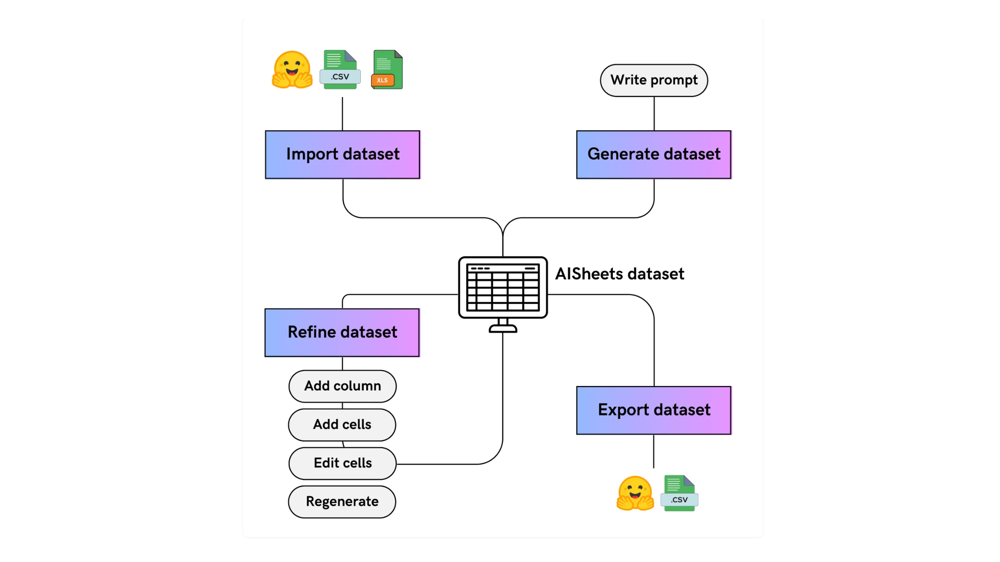

# Hugging Face Unveils AI Sheets: A Free, Open-Source No-Code Toolkit for LLM-Powered Datasets

> Hugging Face has just released AI Sheets, a free, open-source, and local-first no-code tool designed to radically simplify dataset creation and enrichment with AI. AI Sheets aims to democratize access to AI-powered data handling by merging the intuitive spreadsheet interface with direct access to leading open-source Large Language Models (LLMs) like Qwen, Kimi, Llama 3, […]

Hugging Face has just released **AI Sheets**, a free, open-source, and local-first no-code tool designed to radically simplify dataset creation and enrichment with AI. AI Sheets aims to democratize access to AI-powered data handling by merging the intuitive spreadsheet interface with direct access to leading open-source Large Language Models (LLMs) like Qwen, Kimi, Llama 3, and many others, including custom models, all without writing a line of code.

### What’s AI Sheets?

AI Sheets is a spreadsheet-style data tool purpose-built for working with datasets and leveraging AI models. Unlike traditional spreadsheets, each cell or column in AI Sheets can be powered and enriched by natural language prompts using integrated AI models. Users can:[dev+3](https://dev.to/ytosko/hugging-face-launches-ai-sheets-a-new-tool-for-working-with-datasets-using-open-ai-models-13ko)

- Build, clean, transform, and enrich datasets directly in the browser or via local deployment.

- Apply open-source models from Hugging Face Hub, or run their own local custom models (as long as they support OpenAI API spec).

- Collaboratively experiment with rapid data prototyping, fine-tune AI outputs by editing and validating cells, and run large-scale data generation pipelines.

### Key Features

- **No-Code Workflow:** Users interact with an intuitive spreadsheet UI, applying AI transformations using prompts—no Python or coding required.

- **Model Integration:** Instantly access thousands of models, including popular LLMs (Qwen, Kimi, Llama 3, etc.). Supports local deployment via servers like Ollama, empowering you to use fine-tuned or domain-specific models with zero cloud dependency.

- **Data Privacy:** When run locally, all data stays on your machine, meeting security and compliance needs.

- **Open-Source & Free:** Both hosted and local versions are available with zero cost, supporting the open AI community and customization.

- **Flexible Deployment:** Runs entirely in-browser (via Hugging Face Spaces), or locally for maximum privacy, performance, and infrastructure control.

### How It Works

- **Prompt-Driven Columns:** Create new columns by entering plain text prompts, allowing the model to generate or enrich data.

- **Local Model Support:** Set environment variables (`MODEL_ENDPOINT_URL` and `MODEL_ENDPOINT_NAME`) to seamlessly connect AI Sheets with your local inference server (e.g., Ollama with Llama 3 loaded)—fully OpenAI API compatible.

- **Use Cases:** AI Sheets supports tasks like sentiment analysis, data classification, text generation, quick dataset enrichment, even batch processing across massive datasets—all in a collaborative, visual environment.

*https://huggingface.co/blog/aisheets*

### Impact

AI Sheets dramatically lowers the technical barrier for advanced dataset preparation and enrichment. Data scientists can experiment faster, analysts get powerful automation, and non-technical users can leverage AI without any coding. By combining the Hugging Face open-source model ecosystem with a no-code interface, AI Sheets is positioned to become an essential tool for practitioners, researchers, and teams seeking flexible, private, and scalable AI data solutions.

### Supported LLMs

- Qwen

- Kimi

- Llama 3

- OpenAI’s gpt-oss (via Inference Providers)

- Any custom model supporting the OpenAI API spec

### Getting Started

- **Try in-browser:** Hugging Face Spaces hosts AI Sheets for instant use.

- **Deploy locally:** Clone from GitHub (`huggingface/aisheets`), set up your inference endpoint, and run in your infrastructure for privacy and speed.

- **Documentation:** The GitHub README and Hugging Face blog provide step-by-step setup instructions and example workflows for both cloud and local deployments.

### In Summary

Hugging Face AI Sheets is a free, open-source, and local-first no-code solution that empowers anyone to build, enrich, and transform datasets using leading open-source AI models, with seamless support for custom local deployments, making advanced AI accessible and collaborative for all.

---

Check out the **[GitHub Repo](https://github.com/huggingface/aisheets?tab=readme-ov-file), [Try it here](https://huggingface.co/spaces/aisheets/sheets) and [Technical details](https://huggingface.co/blog/aisheets)**. Feel free to check out our **[GitHub Page for Tutorials, Codes and Notebooks](https://github.com/Marktechpost/AI-Tutorial-Codes-Included)**. Also, feel free to follow us on **[Twitter](https://x.com/intent/follow?screen_name=marktechpost)** and don’t forget to join our **[100k+ ML SubReddit](https://www.reddit.com/r/machinelearningnews/)** and Subscribe to **[our Newsletter](https://www.aidevsignals.com/)**.
