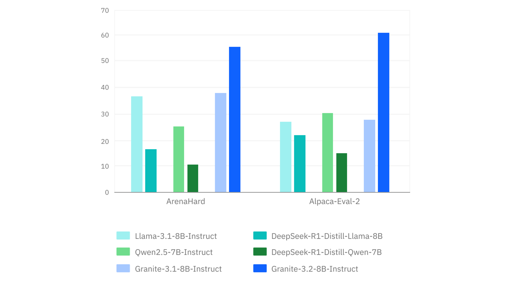

# IBM AI Releases Granite 3.2 8B Instruct and Granite 3.2 2B Instruct Models: Offering Experimental Chain-of-Thought Reasoning Capabilities

> Large language models (LLMs) leverage deep learning techniques to understand and generate human-like text, making them invaluable for various applications such as text generation, question answering, summarization, and retrieval. While early LLMs demonstrated remarkable capabilities, their high computational demands and inefficiencies made them impractical for enterprise-scale deployment. Researchers have developed more optimized and scalable models […]

Large language models (LLMs) leverage deep learning techniques to understand and generate human-like text, making them invaluable for various applications such as text generation, question answering, summarization, and retrieval. While early LLMs demonstrated remarkable capabilities, their high computational demands and inefficiencies made them impractical for enterprise-scale deployment. Researchers have developed more optimized and scalable models that balance performance, efficiency, and enterprise applicability to address these challenges.

Despite the success of existing LLMs, enterprise users require highly efficient, scalable, and tailored solutions for specific business needs. Many publicly available models are too large to deploy efficiently or lack the fine-tuning necessary for enterprise applications. Organizations also need models that support instruction-following capabilities while maintaining robustness across various domains. The need to balance model size, inference efficiency, and instruction-tuning optimization has driven researchers to develop smarter and more enterprise-ready language models.

Existing LLMs are typically designed for general-purpose text generation and reasoning tasks. Leading models like GPT-style architectures rely on large-scale pretraining and fine-tuning to enhance their capabilities. However, most of these models face limitations in efficiency, licensing constraints, and enterprise adaptability. While smaller fine-tuned models provide efficiency, they often lack robustness, and larger models require extensive computational resources, making them impractical for many enterprise applications. Companies have experimented with instruction-tuned models, which improve usability in business contexts, but a gap remains in delivering an optimal balance of size, speed, and capability.

IBM Research AI has introduced the [**Granite 3.2 Language Models**](https://huggingface.co/collections/ibm-granite/granite-32-language-models-67b3bc8c13508f6d064cff9a), a family of instruction-tuned LLMs designed for enterprise applications. The newly released models include Granite 3.2-2B Instruct, a compact yet highly efficient model optimized for fast inference, and Granite 3.2-8B Instruct, a more powerful variant capable of handling complex enterprise tasks. Also, IBM has provided an early-access preview model, Granite 3.2-8B Instruct Preview, including the latest instruction tuning advancements. Unlike many existing models, the Granite 3.2 series has been developed focusing on instruction-following capabilities, allowing for structured responses tailored to business needs. These models extend IBM’s AI ecosystem beyond the Granite Embedding Models, enabling efficient text retrieval and high-quality text generation for real-world applications.

The Granite 3.2 models leverage a transformer-based architecture, employing layer-wise optimization techniques to reduce latency while preserving model accuracy. Unlike traditional generative models that rely solely on standard pretraining datasets, these models incorporate a custom instruction-tuning process, enhancing their ability to generate structured responses. The models have been trained using a mixture of curated enterprise datasets and diverse instruction-based corpora, ensuring they perform well across various industries. The 2-billion parameter variant provides a lightweight alternative for businesses needing fast and efficient AI solutions, whereas the 8-billion parameter model offers deeper contextual understanding and improved response generation. IBM has also introduced self-distillation techniques, allowing the smaller models to benefit from the knowledge of their larger counterparts without increasing computational overhead.

Extensive benchmarking results demonstrate that Granite 3.2 models outperform comparable instruction-tuned LLMs in key enterprise use cases. The 8B model shows higher accuracy in structured instruction tasks than similarly sized models, while the 2B model achieves 35% lower inference latency than leading alternatives. Evaluations on question-answering benchmarks, summarization tasks, and text generation datasets indicate that the models maintain high fluency and coherence while improving efficiency. The Granite 3.2-8B model delivers an 82.6% accuracy rate on domain-specific retrieval tasks, 7% higher than previous iterations. Also, the model outperforms competitors by an 11% margin in structured prompt-following tasks. Performance testing across multi-turn conversations indicates that responses generated by the Granite 3.2 models retain contextual awareness for 97% of test cases, making them highly reliable for enterprise chatbots and virtual assistants.

Several Key Takeaways from the Research on Granite :

- The Granite 3.2-8B model delivers 82.6% accuracy in domain-specific retrieval tasks, with 11% better structured instruction execution than competing models.

- The 2B variant reduces inference latency by 35%, making it suitable for fast-response enterprise applications.

- The models are fine-tuned with curated datasets and self-distillation techniques, improving structured response generation.

- The Granite 3.2 models outperform existing instruction-tuned LLMs on QA, summarization, and text-generation tasks by a notable margin.

- These models are designed for real-world use and offer a 97% success rate in multi-turn conversational tasks.

- Released under Apache 2.0, allowing unrestricted research and commercial deployment.

- IBM plans to enhance the models further, with potential expansions in multilingual retrieval and optimized memory efficiency.

- 

---

Check out **_the [Technical Details](https://www.ibm.com/new/announcements/ibm-granite-3-2-open-source-reasoning-and-vision)_ and _[Model on Hugging Face](https://huggingface.co/collections/ibm-granite/granite-32-language-models-67b3bc8c13508f6d064cff9a)_.** All credit for this research goes to the researchers of this project. Also, feel free to follow us on **[Twitter](https://x.com/intent/follow?screen_name=marktechpost)** and don’t forget to join our **[80k+ ML SubReddit](https://www.reddit.com/r/machinelearningnews/)**.

**🚨 [Recommended Read- LG AI Research Releases NEXUS: An Advanced System Integrating Agent AI System and Data Compliance Standards to Address Legal Concerns in AI Datasets](https://www.marktechpost.com/2025/02/16/lg-ai-research-releases-nexus-an-advanced-system-integrating-agent-ai-system-and-data-compliance-standards-to-address-legal-concerns-in-ai-datasets/)**
