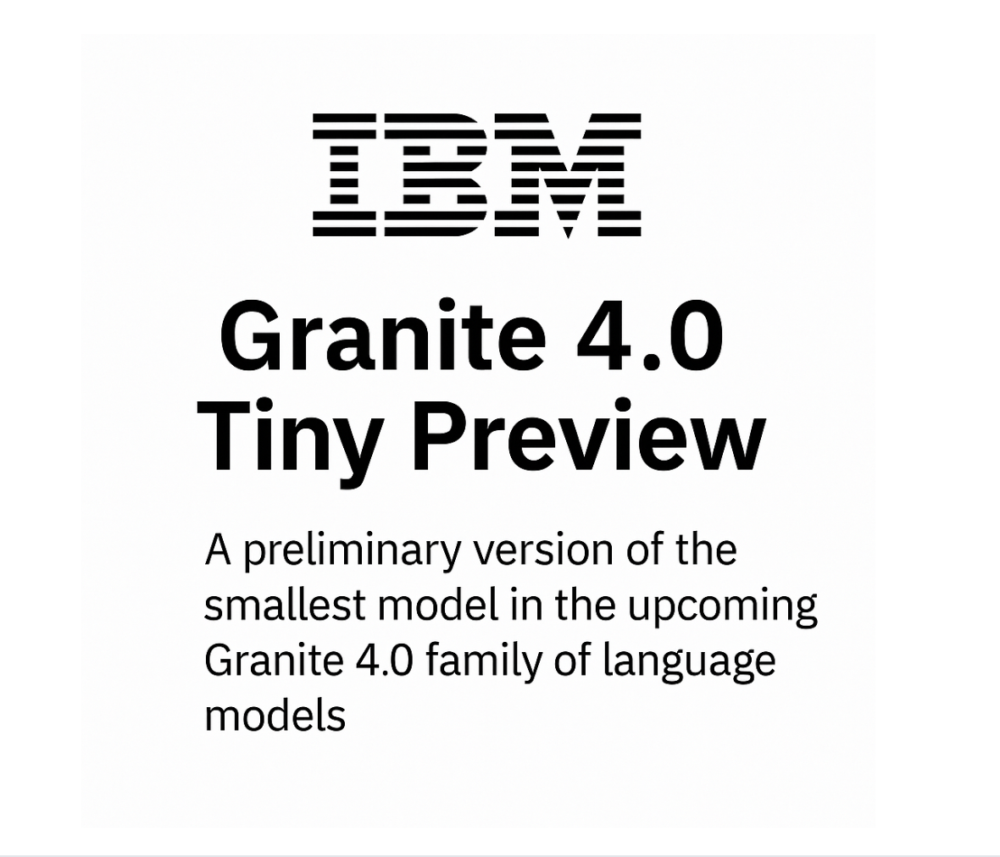

# IBM AI Releases Granite 4.0 Tiny Preview: A Compact Open-Language Model Optimized for Long-Context and Instruction Tasks

> IBM has introduced a preview of Granite 4.0 Tiny, the smallest member of its upcoming Granite 4.0 family of language models. Released under the Apache 2.0 license, this compact model is designed for long-context tasks and instruction-following scenarios, striking a balance between efficiency, transparency, and performance. The release reflects IBM’s continued focus on delivering open, […]

IBM has introduced a preview of **Granite 4.0 Tiny**, the smallest member of its upcoming Granite 4.0 family of language models. Released under the **Apache 2.0 license**, this compact model is designed for long-context tasks and instruction-following scenarios, striking a balance between efficiency, transparency, and performance. The release reflects IBM’s continued focus on delivering open, auditable, and enterprise-ready foundation models.

Granite 4.0 Tiny Preview includes two key variants: the **Base-Preview**, which showcases a novel decoder-only architecture, and the **Tiny-Preview (Instruct)**, which is fine-tuned for dialog and multilingual applications. Despite its reduced parameter footprint, Granite 4.0 Tiny demonstrates competitive results on reasoning and generation benchmarks—underscoring the benefits of its hybrid design.

### Architecture Overview: A Hybrid MoE with Mamba-2-Style Dynamics

At the core of Granite 4.0 Tiny lies a **hybrid Mixture-of-Experts (MoE)** structure, with **7 billion total parameters** and **only 1 billion active parameters** per forward pass. This sparsity allows the model to deliver scalable performance while significantly reducing computational overhead—making it well-suited for resource-constrained environments and edge inference.

The **Base-Preview** variant employs a **decoder-only architecture** augmented with **Mamba-2-style layers**—a linear recurrent alternative to traditional attention mechanisms. This architectural shift enables the model to scale more efficiently with input length, enhancing its suitability for long-context tasks such as document understanding, dialogue summarization, and knowledge-intensive QA.

Another notable design decision is the use of **NoPE (No Positional Encodings)**. Instead of fixed or learned positional embeddings, the model integrates position handling directly into its layer dynamics. This approach improves generalization across varying input lengths and helps maintain consistency in long-sequence generation.

### Benchmark Performance: Efficiency Without Compromise

Despite being a preview release, Granite 4.0 Tiny already exhibits meaningful performance gains over prior models in IBM’s Granite series. On benchmark evaluations, the **Base-Preview** demonstrates:

- **+5.6 improvement on DROP** (Discrete Reasoning Over Paragraphs), a benchmark for multi-hop QA

- **+3.8 on AGIEval**, which assesses general language understanding and reasoning

These improvements are attributed to both the model’s architecture and its extensive pretraining—reportedly on **2.5 trillion tokens**, spanning diverse domains and linguistic structures.

### Instruction-Tuned Variant: Designed for Dialogue, Clarity, and Multilingual Reach

The **Granite-4.0-Tiny-Preview (Instruct)** variant extends the base model through **Supervised Fine-Tuning (SFT)** and **Reinforcement Learning (RL)**, using a Tülu-style dataset consisting of both open and synthetic dialogues. This variant is tailored for instruction-following and interactive use cases.

Supporting **8,192 token input windows** and **8,192 token generation lengths**, the model maintains coherence and fidelity across extended interactions. Unlike encoder–decoder hybrids that often trade off interpretability for performance, the decoder-only setup here yields **clearer and more traceable outputs**—a valuable feature for enterprise and safety-critical applications.

#### Evaluation Scores:

- **86.1 on IFEval**, indicating strong performance in instruction-following benchmarks

- **70.05 on GSM8K**, for grade-school math problem solving

- **82.41 on HumanEval**, measuring Python code generation accuracy

Moreover, the instruct model supports **multilingual interaction across 12 languages**, making it viable for global deployments in customer service, enterprise automation, and educational tools.

### Open-Source Availability and Ecosystem Integration

IBM has made both models publicly available on Hugging Face:

- [Granite 4.0 Tiny Base Preview](https://huggingface.co/ibm-granite/granite-4.0-tiny-base-preview)

- [Granite 4.0 Tiny Instruct Preview](https://huggingface.co/ibm-granite/granite-4.0-tiny-preview)

The models are accompanied by full model weights, configuration files, and sample usage scripts under the **Apache 2.0 license**, encouraging transparent experimentation, fine-tuning, and integration across downstream NLP workflows.

### Outlook: Laying the Groundwork for Granite 4.0

Granite 4.0 Tiny Preview serves as an early glimpse into IBM’s broader strategy for its next-generation language model suite. By combining **efficient MoE architectures**, **long-context support**, and **instruction-focused tuning**, the model family aims to deliver state-of-the-art capabilities in a controllable and resource-efficient package.

As more variants of Granite 4.0 are released, we can expect IBM to deepen its investment in responsible, open AI—positioning itself as a key player in shaping the future of transparent, high-performance language models for enterprise and research.

---

Check out the **[Technical details](https://www.ibm.com/new/announcements/ibm-granite-4-0-tiny-preview-sneak-peek), [Granite 4.0 Tiny Base Preview ](https://huggingface.co/ibm-granite/granite-4.0-tiny-base-preview)and [Granite 4.0 Tiny Instruct Preview](https://huggingface.co/ibm-granite/granite-4.0-tiny-preview)**. Also, don’t forget to follow us on **[Twitter](https://x.com/intent/follow?screen_name=marktechpost)** and join our **[Telegram Channel](https://arxiv.org/abs/2406.09406)** and [**LinkedIn Gr**](https://www.linkedin.com/groups/13668564/)[**oup**](https://www.linkedin.com/groups/13668564/). Don’t Forget to join our **[90k+ ML SubReddit](https://www.reddit.com/r/machinelearningnews/)**. For Promotion and Partnerships, **[please talk us](https://calendly.com/marktechpost/marktechpost-sponsorship-call).**

[**🔥 [Register Now] miniCON Virtual Conference on AGENTIC AI: FREE REGISTRATION + Certificate of Attendance + 4 Hour Short Event (May 21, 9 am- 1 pm PST) + Hands on Workshop**](https://minicon.marktechpost.com/)
