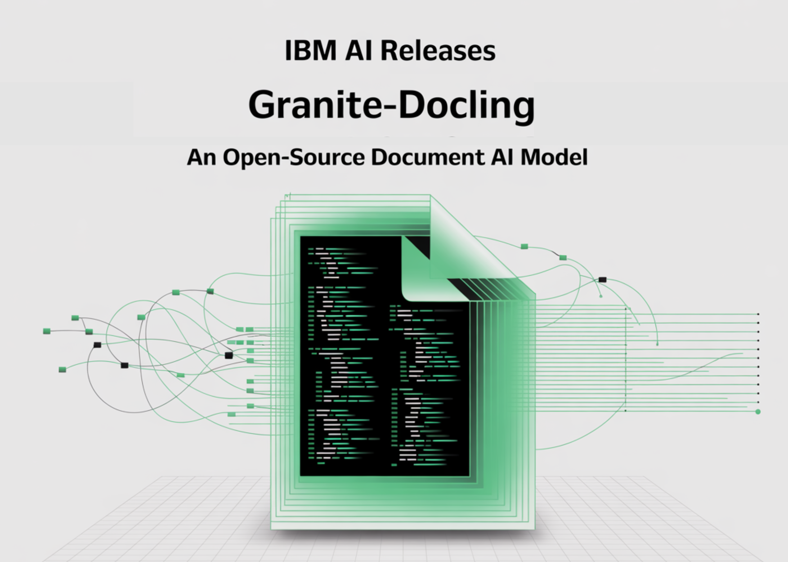

# IBM AI Releases Granite-Docling-258M: An Open-Source, Enterprise-Ready Document AI Model

> IBM has released Granite-Docling-258M, an open-source (Apache-2.0) vision-language model designed specifically for end-to-end document conversion. The model targets layout-faithful extraction—tables, code, equations, lists, captions, and reading order—emitting a structured, machine-readable representation rather than lossy Markdown. It is available on Hugging Face with a live demo and MLX build for Apple Silicon. What’s new compared to […]

IBM has released **Granite-Docling-258M**, an open-source (Apache-2.0) vision-language model designed specifically for end-to-end document conversion. The model targets layout-faithful extraction—tables, code, equations, lists, captions, and reading order—emitting a structured, machine-readable representation rather than lossy Markdown. It is available on Hugging Face with a live demo and MLX build for Apple Silicon.

### What’s new compared to SmolDocling?

Granite-Docling is the product-ready successor to SmolDocling-256M. IBM replaced the earlier backbone with a **Granite 165M** language model and upgraded the vision encoder to **SigLIP2 (base, patch16-512)** while retaining the Idefics3-style connector (pixel-shuffle projector). The resulting model has 258M parameters and shows consistent accuracy gains across layout analysis, full-page OCR, code, equations, and tables (see metrics below). IBM also addressed instability failure modes observed in the preview model (e.g., repetitive token loops).

### Architecture and training pipeline

- **Backbone:** Idefics3-derived stack with SigLIP2 vision encoder → pixel-shuffle connector → Granite 165M LLM.

- **Training framework:** **nanoVLM** (lightweight, pure-PyTorch VLM training toolkit).

- **Representation:** Outputs **DocTags**, an IBM-authored markup designed for unambiguous document structure (elements + coordinates + relationships), which downstream tools convert to Markdown/HTML/JSON.

- **Compute:** Trained on IBM’s **Blue Vela** H100 cluster.

### Quantified improvements (Granite-Docling-258M vs. SmolDocling-256M preview)

Evaluated with `docling-eval`, LMMS-Eval, and task-specific datasets:

- **Layout:** MAP 0.27 vs. 0.23; F1 0.86 vs. 0.85.

- **Full-page OCR:** F1 0.84 vs. 0.80; lower edit distance.

- **Code recognition:** F1 **0.988** vs. 0.915; edit distance **0.013** vs. 0.114.

- **Equation recognition:** F1 **0.968** vs. 0.947.

- **Table recognition (FinTabNet @150dpi):** TEDS-structure **0.97** vs. 0.82; TEDS with content **0.96** vs. 0.76.

- **Other benchmarks:** MMStar **0.30** vs. 0.17; OCRBench **500** vs. 338.

- **Stability:** “Avoids infinite loops more effectively” (production-oriented fix).

### Multilingual support

Granite-Docling adds **experimental** support for **Japanese, Arabic, and Chinese**. IBM marks this as early-stage; English remains the primary target.

### How the DocTags pathway changes Document AI

Conventional OCR-to-Markdown pipelines lose structural information and complicate downstream retrieval-augmented generation (RAG). Granite-Docling emits **DocTags**—a compact, LLM-friendly structural grammar—which Docling converts into Markdown/HTML/JSON. This preserves table topology, inline/floating math, code blocks, captions, and reading order with explicit coordinates, improving index quality and grounding for RAG and analytics.

### Inference and integration

- **Docling Integration (recommended):** The `docling` CLI/SDK automatically pulls Granite-Docling and converts PDFs/office docs/images to multiple formats. IBM positions the model as a component inside Docling pipelines rather than a general VLM.

- **Runtimes:** Works with **Transformers**, **vLLM**, **ONNX**, and **MLX**; a dedicated **MLX** build is optimized for Apple Silicon. A Hugging Face Space provides an interactive demo (ZeroGPU).

- **License:** **Apache-2.0**.

### Why Granite-Docling?

For enterprise document AI, small VLMs that **preserve structure** reduce inference cost and pipeline complexity. Granite-Docling replaces multiple single-purpose models (layout, OCR, table, code, equations) with a single component that emits a richer intermediate representation, improving downstream retrieval and conversion fidelity. The measured gains—in TEDS for tables, F1 for code/equations, and reduced instability—make it a practical upgrade from SmolDocling for production workflows.

### Demo

### Summary

Granite-Docling-258M marks a significant advancement in compact, structure-preserving document AI. By combining IBM’s Granite backbone, SigLIP2 vision encoder, and the nanoVLM training framework, it delivers enterprise-ready performance across tables, equations, code, and multilingual text—all while remaining lightweight and open-source under Apache 2.0. With measurable gains over its SmolDocling predecessor and seamless integration into Docling pipelines, Granite-Docling provides a practical foundation for document conversion and RAG workflows where precision and reliability are critical.

---

Check out the **[Models on Hugging Face](https://huggingface.co/collections/ibm-granite/granite-docling-682b8c766a565487bcb3ca00)_ _**and** [Demo here](https://huggingface.co/spaces/ibm-granite/granite-docling-258m-demo)_._** Feel free to check out our **[GitHub Page for Tutorials, Codes and Notebooks](https://github.com/Marktechpost/AI-Tutorial-Codes-Included)**. Also, feel free to follow us on **[Twitter](https://x.com/intent/follow?screen_name=marktechpost)** and don’t forget to join our **[100k+ ML SubReddit](https://www.reddit.com/r/machinelearningnews/)** and Subscribe to **[our Newsletter](https://www.aidevsignals.com/)**.
