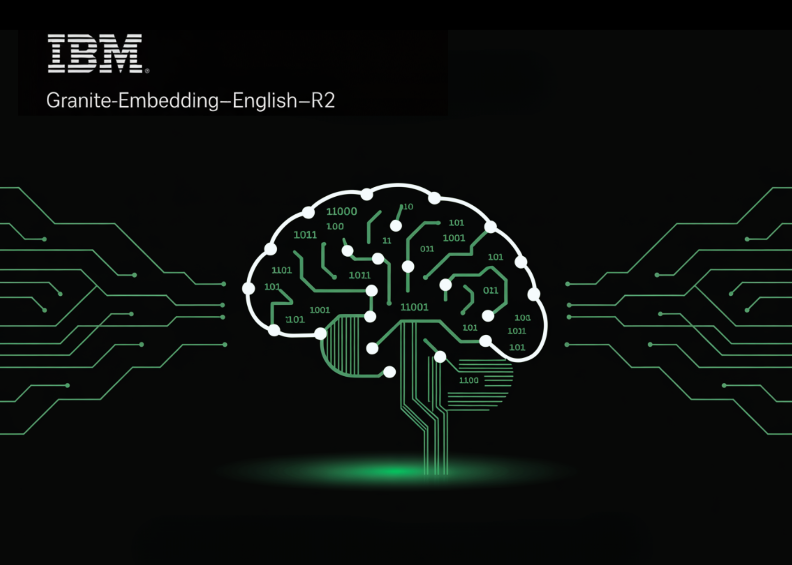

# IBM AI Research Releases Two English Granite Embedding Models, Both Based on the ModernBERT Architecture

> IBM has quietly built a strong presence in the open-source AI ecosystem, and its latest release shows why it shouldn’t be overlooked. The company has introduced two new embedding models—granite-embedding-english-r2 and granite-embedding-small-english-r2—designed specifically for high-performance retrieval and RAG (retrieval-augmented generation) systems. These models are not only compact and efficient but also licensed under Apache 2.0, […]

IBM has quietly built a strong presence in the open-source AI ecosystem, and its latest release shows why it shouldn’t be overlooked. The company has introduced two new embedding models—**granite-embedding-english-r2** and **granite-embedding-small-english-r2**—designed specifically for high-performance retrieval and RAG (retrieval-augmented generation) systems. These models are not only compact and efficient but also licensed under **Apache 2.0**, making them ready for commercial deployment.

### What Models Did IBM Release?

The two models target different compute budgets. The larger **granite-embedding-english-r2** has 149 million parameters with an embedding size of 768, built on a 22-layer ModernBERT encoder. Its smaller counterpart, **granite-embedding-small-english-r2**, comes in at just 47 million parameters with an embedding size of 384, using a 12-layer ModernBERT encoder.

Despite their differences in size, both support a maximum context length of **8192 tokens**, a major upgrade from the first-generation Granite embeddings. This long-context capability makes them highly suitable for enterprise workloads involving long documents and complex retrieval tasks.

*https://arxiv.org/abs/2508.21085*

### What’s Inside the Architecture?

Both models are built on the **ModernBERT** backbone, which introduces several optimizations:

- **Alternating global and local attention** to balance efficiency with long-range dependencies.

- **Rotary positional embeddings (RoPE)** tuned for positional interpolation, enabling longer context windows.

- **FlashAttention 2** to improve memory usage and throughput at inference time.

IBM also trained these models with a **multi-stage pipeline**. The process started with masked language pretraining on a two-trillion-token dataset sourced from web, Wikipedia, PubMed, BookCorpus, and internal IBM technical documents. This was followed by **context extension from 1k to 8k tokens**, **contrastive learning with distillation from Mistral-7B**, and **domain-specific tuning** for conversational, tabular, and code retrieval tasks.

### How Do They Perform on Benchmarks?

The Granite R2 models deliver strong results across widely used retrieval benchmarks. On **MTEB-v2** and **BEIR**, the larger granite-embedding-english-r2 outperforms similarly sized models like BGE Base, E5, and Arctic Embed. The smaller model, granite-embedding-small-english-r2, achieves accuracy close to models two to three times larger, making it particularly attractive for latency-sensitive workloads.

*https://arxiv.org/abs/2508.21085*

Both models also perform well in specialized domains:

- **Long-document retrieval (MLDR, LongEmbed)** where 8k context support is critical.

- **Table retrieval tasks (OTT-QA, FinQA, OpenWikiTables)** where structured reasoning is required.

- **Code retrieval (CoIR)**, handling both text-to-code and code-to-text queries.

### Are They Fast Enough for Large-Scale Use?

Efficiency is one of the standout aspects of these models. On an Nvidia H100 GPU, the **granite-embedding-small-english-r2** encodes nearly **200 documents per second**, which is significantly faster than BGE Small and E5 Small. The larger granite-embedding-english-r2 also reaches **144 documents per second**, outperforming many ModernBERT-based alternatives.

Crucially, these models remain practical even on CPUs, allowing enterprises to run them in less GPU-intensive environments. This balance of **speed, compact size, and retrieval accuracy** makes them highly adaptable for real-world deployment.

### What Does This Mean for Retrieval in Practice?

IBM’s Granite Embedding R2 models demonstrate that embedding systems don’t need massive parameter counts to be effective. They combine **long-context support, benchmark-leading accuracy, and high throughput** in compact architectures. For companies building retrieval pipelines, knowledge management systems, or RAG workflows, Granite R2 provides a **production-ready, commercially viable alternative** to existing open-source options.

*https://arxiv.org/abs/2508.21085*

### Summary

In short, IBM’s Granite Embedding R2 models strike an effective balance between compact design, long-context capability, and strong retrieval performance. With throughput optimized for both GPU and CPU environments, and an Apache 2.0 license that enables unrestricted commercial use, they present a practical alternative to bulkier open-source embeddings. For enterprises deploying RAG, search, or large-scale knowledge systems, Granite R2 stands out as an efficient and production-ready option.

---

Check out the **[Paper](https://arxiv.org/abs/2508.21085), [granite-embedding-small-english-r2](https://huggingface.co/ibm-granite/granite-embedding-small-english-r2)** and **[granite-embedding-english-r2](https://huggingface.co/ibm-granite/granite-embedding-english-r2)_._** Feel free to check out our **[GitHub Page for Tutorials, Codes and Notebooks](https://github.com/Marktechpost/AI-Tutorial-Codes-Included)**. Also, feel free to follow us on **[Twitter](https://x.com/intent/follow?screen_name=marktechpost)** and don’t forget to join our **[100k+ ML SubReddit](https://www.reddit.com/r/machinelearningnews/)** and Subscribe to **[our Newsletter](https://www.aidevsignals.com/)**.
