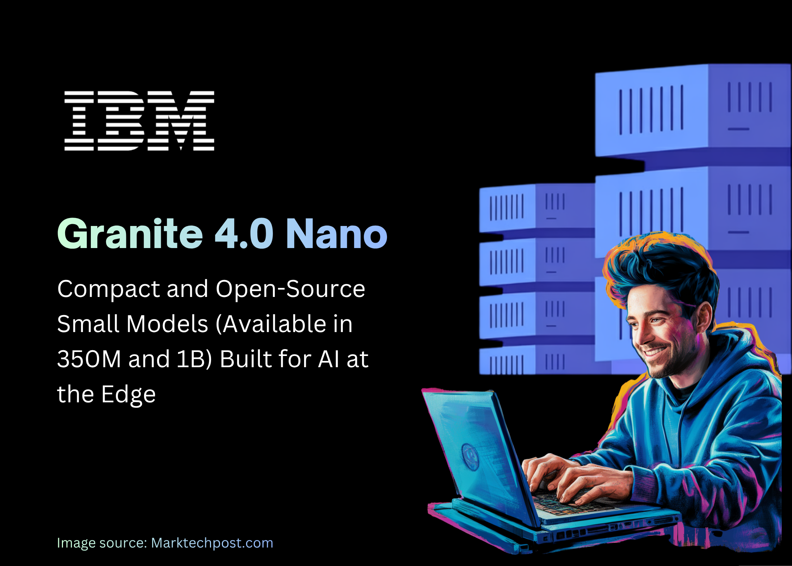

# IBM AI Team Releases Granite 4.0 Nano Series: Compact and Open-Source Small Models Built for AI at the Edge

> Small models are often blocked by poor instruction tuning, weak tool use formats, and missing governance. IBM AI team released Granite 4.0 Nano, a small model family that targets local and edge inference with enterprise controls and open licensing. The family includes 8 models in two sizes, 350M and about 1B, with both hybrid SSM […]

Small models are often blocked by poor instruction tuning, weak tool use formats, and missing governance. **IBM AI team** released **Granite 4.0 Nano**, a small model family that targets local and edge inference with enterprise controls and open licensing. The family includes 8 models in two sizes, 350M and about 1B, with both hybrid SSM and transformer variants, each in base and instruct. **Granite 4.0 Nano** series models are released under an Apache 2.0 license with native architecture support on popular runtimes like vLLM, llama.cpp, and MLX

*https://huggingface.co/blog/ibm-granite/granite-4-nano*

### What is new in Granite 4.0 Nano series?

**Granite 4.0 Nano **consists of four model lines and their base counterparts. Granite 4.0 H 1B uses a hybrid SSM based architecture and is about 1.5B parameters. Granite 4.0 H 350M uses the same hybrid approach at 350M. For maximum runtime portability IBM also provides Granite 4.0 1B and Granite 4.0 350M as transformer versions.

Granite releaseSizes in releaseArchitectureLicense and governanceKey notesGranite 13B, first watsonx Granite models13B base, 13B instruct, later 13B chatDecoder only transformer, 8K contextIBM enterprise terms, client protectionsFirst public Granite models for watsonx, curated enterprise data, English focusGranite Code Models (open)3B, 8B, 20B, 34B code, base and instructDecoder only transformer, 2 stage code training on 116 languagesApache 2.0First fully open Granite line, for code intelligence, paper 2405.04324, available on HF and GitHubGranite 3.0 Language Models 2B and 8B, base and instructTransformer, 128K context for instructApache 2.0Business LLMs for RAG, tool use, summarization, shipped on watsonx and HFGranite 3.1 Language Models (HF) 1B A400M, 3B A800M, 2B, 8BTransformer, 128K contextApache 2.0Size ladder for enterprise tasks, both base and instruct, same Granite data recipeGranite 3.2 Language Models (HF) 2B instruct, 8B instructTransformer, 128K, better long promptApache 2.0Iterative quality bump on 3.x, keeps business alignmentGranite 3.3 Language Models (HF) 2B base, 2B instruct, 8B base, 8B instruct, all 128KDecoder only transformerApache 2.0Latest 3.x line on HF before 4.0, adds FIM and better instruction followingGranite 4.0 Language Models 3B micro, 3B H micro, 7B H tiny, 32B H small, plus transformer variantsHybrid Mamba 2 plus transformer for H, pure transformer for compatibilityApache 2.0, ISO 42001, cryptographically signedStart of hybrid generation, lower memory, agent friendly, same governance across sizesGranite 4.0 Nano Language Models 1B H, 1B H instruct, 350M H, 350M H instruct, 2B transformer, 2B transformer instruct, 0.4B transformer, 0.4B transformer instruct, total 8H models are hybrid SSM plus transformer, non H are pure transformerApache 2.0, ISO 42001, signed, same 4.0 pipelineSmallest Granite models, made for edge, local and browser, run on vLLM, llama.cpp, MLX, watsonx*_**Table Created by Marktechpost.com**_*

### Architecture and training

The H variants interleave SSM layers with transformer layers. This hybrid design reduces memory growth versus pure attention, while preserving the generality of transformer blocks. The Nano models did not use a reduced data pipeline. They were trained with the same Granite 4.0 methodology and more than 15T tokens, then instruction tuned to deliver solid tool use and instruction following. This carries over strengths from the larger Granite 4.0 models to sub 2B scales.

### Benchmarks and competitive context

IBM compares Granite 4.0 Nano with other under 2B models, including Qwen, Gemma, and LiquidAI LFM. Reported aggregates show a significant increase in capabilities across general knowledge, math, code, and safety at similar parameter budgets. On agent tasks, the models outperform several peers on IFEval and on the Berkeley Function Calling Leaderboard v3.

*https://huggingface.co/blog/ibm-granite/granite-4-nano*

### Key Takeaways

- IBM released 8 Granite 4.0 Nano models, 350M and about 1B each, in hybrid SSM and transformer variants, in base and instruct, all under Apache 2.0.

- The hybrid H models, Granite 4.0 H 1B at about 1.5B parameters and Granite 4.0 H 350M at about 350M, reuse the Granite 4.0 training recipe on more than 15T tokens, so capability is inherited from the larger family and not a reduced data branch.

- IBM team reports that Granite 4.0 Nano is competitive with other sub 2B models such as Qwen, Gemma and LiquidAI LFM on general, math, code and safety, and that it outperforms on IFEval and BFCLv3 which matter for tool using agents.

- All Granite 4.0 models, including Nano, are cryptographically signed, ISO 42001 certified and released for enterprise use, which gives provenance and governance that typical small community models do not provide.

- The models are available on Hugging Face and IBM watsonx.ai with runtime support for vLLM, llama.cpp and MLX, which makes local, edge and browser level deployments realistic for early AI engineers and software teams.

### Editorial Comments

IBM is doing the right thing here, it is taking the same Granite 4.0 training pipeline, the same 15T token scale, the same hybrid Mamba 2 plus transformer architecture, and pushing it down to 350M and about 1B so that edge and on device workloads can use the exact governance and provenance story that the larger Granite models already have. The models are Apache 2.0, ISO 42001 aligned, cryptographically signed, and already runnable on vLLM, llama.cpp and MLX. Overall, this is a clean and auditable way to run small LLMs.

---

Check out the **[Model Weights on HF](https://huggingface.co/collections/ibm-granite/granite-40-nano-language-models) **and **[Technical details](https://huggingface.co/blog/ibm-granite/granite-4-nano)**. Feel free to check out our **[GitHub Page for Tutorials, Codes and Notebooks](https://github.com/Marktechpost/AI-Tutorial-Codes-Included)**. Also, feel free to follow us on **[Twitter](https://x.com/intent/follow?screen_name=marktechpost)** and don’t forget to join our **[100k+ ML SubReddit](https://www.reddit.com/r/machinelearningnews/)** and Subscribe to **[our Newsletter](https://www.aidevsignals.com/)**. Wait! are you on telegram? **[now you can join us on telegram as well.](https://t.me/machinelearningresearchnews)**
