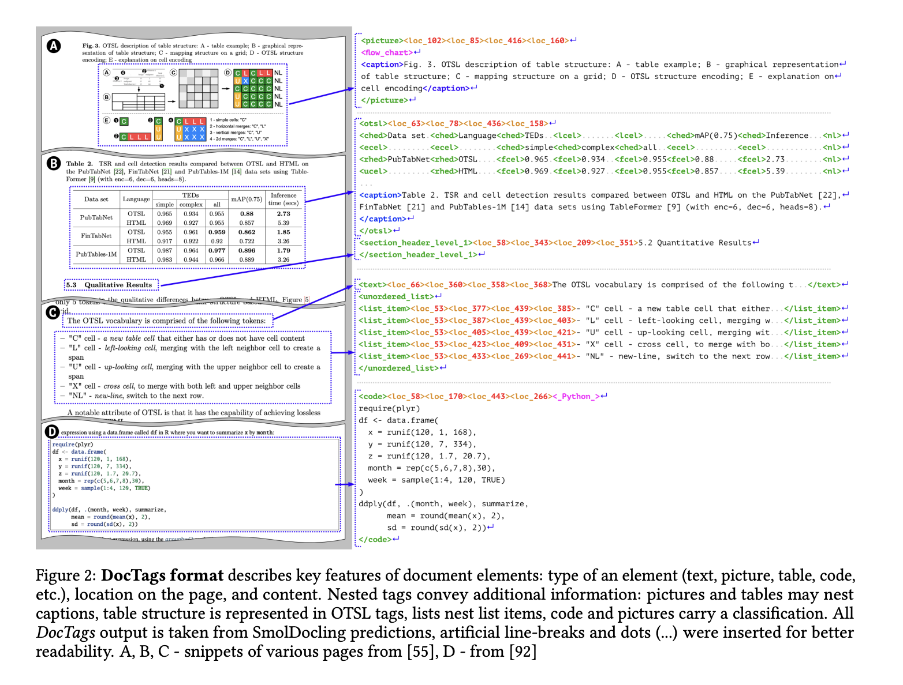

# IBM and Hugging Face Researchers Release SmolDocling: A 256M Open-Source Vision Language Model for Complete Document OCR

> Converting complex documents into structured data has long posed significant challenges in the field of computer science. Traditional approaches, involving ensemble systems or very large foundational models, often encounter substantial hurdles such as difficulty in fine-tuning, generalization issues, hallucinations, and high computational costs. Ensemble systems, though efficient for specific tasks, frequently fail to generalize due […]

Converting complex documents into structured data has long posed significant challenges in the field of computer science. Traditional approaches, involving ensemble systems or very large foundational models, often encounter substantial hurdles such as difficulty in fine-tuning, generalization issues, hallucinations, and high computational costs. Ensemble systems, though efficient for specific tasks, frequently fail to generalize due to their dependency on handcrafted pipelines for each sub-task. On the other hand, multimodal foundational models, although powerful, often suffer from high computational costs and reliability issues like hallucinations.

Researchers from IBM and Hugging Face have recently addressed these challenges by releasing SmolDocling, a 256M open-source vision-language model (VLM) designed explicitly for end-to-end multi-modal document conversion tasks. Unlike larger foundational models, SmolDocling provides a streamlined solution that processes entire pages through a single model, significantly reducing complexity and computational demands. Its ultra-compact nature, at just 256 million parameters, makes it notably lightweight and resource-efficient. The researchers also developed a universal markup format called DocTags, which precisely captures page elements, their structures, and spatial contexts in a highly compact and clear form.

SmolDocling leverages Hugging Face’s compact SmolVLM-256M as its architecture base, which features significant reductions in computational complexity through optimized tokenization and aggressive visual feature compression methods. Its main strength lies in the innovative DocTags format, providing structured markup that distinctly separates document layout, textual content, and visual information such as equations, tables, code snippets, and charts. SmolDocling utilizes curriculum learning for efficient training, which initially involves freezing its vision encoder and gradually fine-tuning it using enriched datasets that enhance visual-semantic alignment across different document elements. Additionally, the model’s efficiency allows it to process entire document pages at lightning-fast speeds, averaging just 0.35 seconds per page on a consumer GPU while consuming under 500MB of VRAM.

The performance data clearly positions SmolDocling at the forefront of current technologies. In comprehensive benchmark tests involving various document conversion tasks, SmolDocling outperformed substantially larger competing models. For example, in full-page document OCR tasks, SmolDocling achieved significantly better accuracy metrics, such as a notably lower edit distance (0.48) and higher F1-score (0.80), compared to models like Qwen2.5 VL (7B parameters) and Nougat (350M parameters). It also excelled in equation transcription, achieving a 0.95 F1-score, matching state-of-the-art models like GOT. Furthermore, SmolDocling set a new benchmark in code snippet recognition, demonstrating high precision and recall scores of 0.94 and 0.91 respectively.

What sets SmolDocling apart from other document OCR solutions is its capability to handle diverse elements within documents, including intricate items such as code, charts, equations, and varied layouts. Its capabilities extend beyond typical scientific papers to reliably handle patents, forms, and business documentation. By offering comprehensive structured metadata through DocTags, SmolDocling eliminates ambiguity inherent in formats like HTML or Markdown, enhancing the downstream usability of document conversions. Its compact size enables large-scale batch processing at remarkably low resource demands, facilitating cost-effective deployments at scale.

In conclusion, SmolDocling represents a significant breakthrough in document conversion technology, demonstrating that compact models can not only compete but substantially outperform larger foundational models in crucial tasks. The researchers have successfully demonstrated how targeted training, innovative data augmentation, and novel markup formats like DocTags can overcome traditional limitations associated with size and complexity. SmolDocling’s release not only sets a new standard in efficiency and versatility for OCR technologies but also provides an invaluable resource for the community through openly available datasets and a highly efficient, compact model architecture. This marks a substantial advancement in document understanding and opens up exciting new possibilities for enterprise-level applications and broader accessibility.

---

Check out **_the [Paper ](https://arxiv.org/abs/2503.11576)and [Model on Hugging Face](https://huggingface.co/ds4sd/SmolDocling-256M-preview)._** All credit for this research goes to the researchers of this project. Also, feel free to follow us on **[Twitter](https://x.com/intent/follow?screen_name=marktechpost)** and don’t forget to join our **[80k+ ML SubReddit](https://www.reddit.com/r/machinelearningnews/)**.
