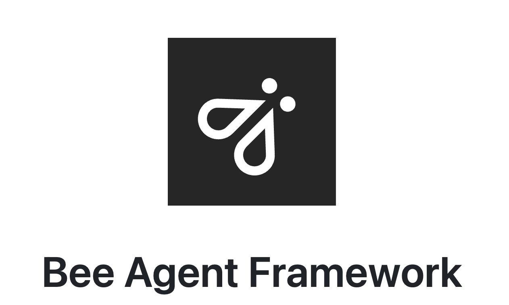

# IBM Developers Release Bee Agent Framework: An Open-Source AI Framework for Building, Deploying, and Serving Powerful Agentic Workflows at Scale

> In recent years, AI-driven workflows and automation have advanced remarkably. Yet, building complex, scalable, and efficient agentic workflows remains a significant challenge. The complexities of controlling agents, managing their states, and integrating them seamlessly with broader applications are far from straightforward. Developers need tools that not only manage the logic of agent states but also […]

In recent years, AI-driven workflows and automation have advanced remarkably. Yet, building complex, scalable, and efficient agentic workflows remains a significant challenge. The complexities of controlling agents, managing their states, and integrating them seamlessly with broader applications are far from straightforward. Developers need tools that not only manage the logic of agent states but also ensure reliable traceability, scalability, and efficient memory management. Additionally, achieving seamless integration into existing workflows while minimizing operational complexity adds to the difficulty.

IBM developers have recently released the Bee Agent Framework, an open-source toolkit designed to build, deeply integrate and serve agentic workflows at scale. The framework enables developers to create complex agentic architectures that efficiently manage workflow states while providing production-ready features for real-world deployment. It is particularly optimized for working with Llama 3.1, enabling developers to leverage the latest advancements in AI language models. Bee Agent Framework aims to address the complexities associated with large-scale, agent-driven automation by providing a streamlined yet robust toolkit.

Technically, Bee Agent Framework comes with several standout features. It provides sandboxed code execution, which is crucial for maintaining security when agents execute user-provided or dynamically generated code. Another significant aspect is its flexible memory management, which optimizes token usage to enhance efficiency, particularly with models like Llama 3.1, which have demanding token processing needs. Additionally, the framework supports advanced agentic workflow controls, allowing developers to handle complex branching, pause and resume agent states without losing context, and manage error handling seamlessly. Integration with MLFlow adds an important layer of traceability, ensuring all aspects of an agent’s performance and evolution can be monitored, logged, and evaluated in detail. Moreover, the OpenAI-compatible Assistants API and Python SDK offer flexibility in easily integrating these agents into broader AI solutions. Developers can use built-in tools or create custom ones in JavaScript or Python, allowing for a highly customizable experience.

The Bee Agent Framework also features AI agents that are refined for Llama 3.1, or developers can build their own agents tailored to specific needs. The framework offers multiple strategies to optimize memory and token spend, ensuring that agent workflows are efficient and scalable. The inclusion of serialization features allows developers to easily handle complex workflows, with the ability to pause and resume operations seamlessly. For traceability, the framework provides complete visibility into an agent’s inner workings, including detailed logging of all events and MLFlow integration to debug and optimize performance. The production-level control features such as caching, error handling, and a user-friendly Chat UI make Bee Agent Framework suitable for real-world applications, providing transparency, explainability, and user control.

The analysis tools integrated within Bee Agent Framework provide developers with deep insights into the functioning of their agentic workflows. By leveraging these tools, users can obtain a granular understanding of workflow efficiency, agent bottlenecks, and performance metrics, which ultimately helps in optimization. The inclusion of MLFlow integration not only supports detailed event logging but also aids in managing and tracking models’ lifecycles, contributing to reproducibility and transparency, both of which are critical in deploying reliable AI systems. The ability to provide traceability also supports better debugging and troubleshooting, reducing time to resolution for issues that might arise during deployment. As per initial tests, workflows built with the Bee Agent Framework showed significant efficiency improvements, especially in memory management and the ability to pause and resume complex workflows without losing context.

In conclusion, IBM’s Bee Agent Framework presents a comprehensive solution for developers looking to implement and scale agentic workflows in a reliable and efficient manner. It addresses key challenges like state management, sandboxed execution, and traceability, making it a robust choice for complex automation needs. With its strong focus on integration, flexibility, and production-grade features, it has the potential to significantly reduce the complexity involved in building sophisticated agent-based systems. For teams and developers who work with agentic models like Llama 3.1, Bee Agent Framework offers an essential toolkit to create, deploy, and optimize their AI-driven workflows effectively.

---

Check out the **[GitHub](https://github.com/i-am-bee/bee-agent-framework).** All credit for this research goes to the researchers of this project. Also, don’t forget to follow us on **[Twitter](https://twitter.com/Marktechpost)** and join our **[Telegram Channel](https://pxl.to/at72b5j)** and [**LinkedIn Gr**](https://www.linkedin.com/groups/13668564/)[**oup**](https://www.linkedin.com/groups/13668564/). **If you like our work, you will love our**[** newsletter..**](https://marktechpost-newsletter.beehiiv.com/subscribe) Don’t Forget to join our **[55k+ ML SubReddit](https://www.reddit.com/r/machinelearningnews/)**.

**[[Upcoming Live Webinar- Oct 29, 2024] ](https://go.predibase.com/predibase-inference-engine-102924-lp?utm_medium=3rdparty&utm_source=marktechpost)****[The Best Platform for Serving Fine-Tuned Models: Predibase Inference Engine (Promoted)](https://go.predibase.com/predibase-inference-engine-102924-lp?utm_medium=3rdparty&utm_source=marktechpost)**
