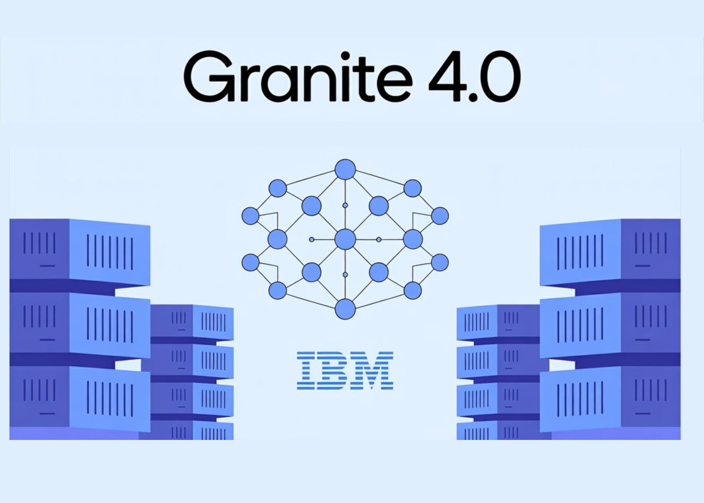

# IBM Released new Granite 4.0 Models with a Novel Hybrid Mamba-2/Transformer Architecture: Drastically Reducing Memory Use without Sacrificing Performance

> IBM just released Granite 4.0, an open-source LLM family that swaps monolithic Transformers for a hybrid Mamba-2/Transformer stack to cut serving memory while keeping quality. Sizes span a 3B dense “Micro,” a 3B hybrid “H-Micro,” a 7B hybrid MoE “H-Tiny” (~1B active), and a 32B hybrid MoE “H-Small” (~9B active). The models are Apache-2.0, cryptographically […]

IBM just released Granite 4.0, an open-source LLM family that swaps monolithic Transformers for a hybrid Mamba-2/Transformer stack to cut serving memory while keeping quality. Sizes span a 3B dense “Micro,” a 3B hybrid “H-Micro,” a 7B hybrid MoE “H-Tiny” (~1B active), and a 32B hybrid MoE “H-Small” (~9B active). The models are Apache-2.0, cryptographically signed, and—per IBM—the first open models covered by an accredited ISO/IEC 42001:2023 AI management system certification. They are available on watsonx.ai and via Docker Hub, Hugging Face, LM Studio, NVIDIA NIM, Ollama, Replicate, Dell Pro AI Studio/Enterprise Hub, Kaggle, with Azure AI Foundry…

### So, what is new?

Granite 4.0 introduces a hybrid design that interleaves a small fraction of self-attention blocks with a majority of Mamba-2 state-space layers (9:1 ratio). As per [IBM technical blog](https://www.ibm.com/new/announcements/ibm-granite-4-0-hyper-efficient-high-performance-hybrid-models), relative to conventional Transformer LLMs, Granite 4.0-H can reduce RAM by **>70%** for long-context and multi-session inference, translating into lower GPU cost at a given throughput/latency target. IBM’s internal comparisons also show the smallest Granite 4.0 models **outperforming Granite 3.3-8B** despite using fewer parameters.

### Tell me what are the released variants?

IBM is shipping both **Base** and **Instruct** variants across four initial models:

- **Granite-4.0-H-Small:** 32B total, ~9B active (hybrid MoE).

- **Granite-4.0-H-Tiny:** 7B total, ~1B active (hybrid MoE).

- **Granite-4.0-H-Micro:** 3B (hybrid dense).

- **Granite-4.0-Micro:** 3B (dense Transformer for stacks that don’t yet support hybrids).

All are **Apache-2.0** and **cryptographically signed**; IBM states Granite is the first open model family with accredited **ISO/IEC 42001** coverage for its AI management system (AIMS). Reasoning-optimized (“Thinking”) variants are planned later in 2025.

### How is it trained, context, and dtype?

Granite 4.0 was trained on samples up to **512K tokens** and evaluated up to **128K tokens**. Public checkpoints on Hugging Face are **BF16** (quantized and **GGUF** conversions are also published), while FP8 is an execution option on supported hardware—not the format of the released weights.

### Lets understand it’s performance signals (enterprise-relevant)

IBM highlights instruction following and tool-use benchmarks:

**IFEval (HELM):** Granite-4.0-H-Small leads most open-weights models (trailing only Llama 4 Maverick at far larger scale).

*https://www.ibm.com/new/announcements/ibm-granite-4-0-hyper-efficient-high-performance-hybrid-models*

**BFCLv3 (Function Calling):** H-Small is competitive with larger open/closed models at lower price points.

*https://www.ibm.com/new/announcements/ibm-granite-4-0-hyper-efficient-high-performance-hybrid-models*

**MTRAG (multi-turn RAG):** Improved reliability on complex retrieval workflows.

*https://www.ibm.com/new/announcements/ibm-granite-4-0-hyper-efficient-high-performance-hybrid-models*

### How can I get access?

Granite 4.0 is live on **IBM watsonx.ai** and distributed via **Dell Pro AI Studio/Enterprise Hub, Docker Hub, Hugging Face, Kaggle, LM Studio, NVIDIA NIM, Ollama, OPAQUE, Replicate**. IBM notes ongoing enablement for **vLLM, llama.cpp, NexaML, and MLX** for hybrid serving.

### My thoughts/comments

I see Granite 4.0’s hybrid Mamba-2/Transformer stack and active-parameter MoE as a practical path to lower TCO: >70% memory reduction and long-context throughput gains translate directly into smaller GPU fleets without sacrificing instruction-following or tool-use accuracy (IFEval, BFCLv3, MTRAG). The BF16 checkpoints with GGUF conversions simplify local evaluation pipelines, and ISO/IEC 42001 plus signed artifacts address provenance/compliance gaps that typically stall enterprise deployment. Net result: a lean, auditable base model family (1B–9B active) that’s easier to productionize than prior 8B-class Transformers.

---

Check out the **[Hugging Face Model Card](https://huggingface.co/collections/ibm-granite/granite-40-language-models-6811a18b820ef362d9e5a82c)** and **[Technical details](https://www.ibm.com/new/announcements/ibm-granite-4-0-hyper-efficient-high-performance-hybrid-models)**. Feel free to check out our **[GitHub Page for Tutorials, Codes and Notebooks](https://github.com/Marktechpost/AI-Tutorial-Codes-Included)**. Also, feel free to follow us on **[Twitter](https://x.com/intent/follow?screen_name=marktechpost)** and don’t forget to join our **[100k+ ML SubReddit](https://www.reddit.com/r/machinelearningnews/)** and Subscribe to **[our Newsletter](https://www.aidevsignals.com/)**. Wait! are you on telegram? **[now you can join us on telegram as well.](https://t.me/machinelearningresearchnews)**
