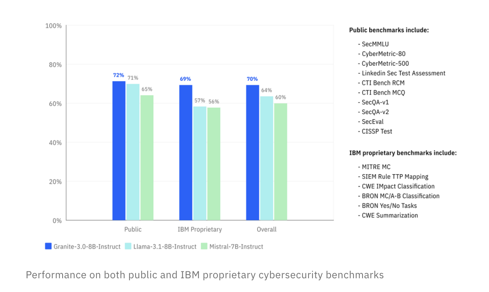

# IBM Releases Granite 3.0 2B and 8B AI Models for AI Enterprises

> Artificial intelligence is advancing rapidly, but enterprises face many obstacles when trying to leverage AI effectively. Organizations require models that are adaptable, secure, and capable of understanding domain-specific contexts while also maintaining compliance and privacy standards. Traditional AI models often struggle with delivering such tailored performance, requiring businesses to make a trade-off between customization and […]

Artificial intelligence is advancing rapidly, but enterprises face many obstacles when trying to leverage AI effectively. Organizations require models that are adaptable, secure, and capable of understanding domain-specific contexts while also maintaining compliance and privacy standards. Traditional AI models often struggle with delivering such tailored performance, requiring businesses to make a trade-off between customization and general applicability. Additionally, many AI models lack transparency, hindering trust among enterprise users.

IBM has officially released Granite 3.0 AI Models, a new line of foundation models designed to bring advanced AI capabilities to enterprises. These models represent a crucial step forward in IBM’s ongoing efforts to provide businesses with AI solutions that are not only high-performing but also secure and trustworthy. Granite 3.0 models are built to support diverse use cases in enterprise environments, ranging from natural language understanding to facilitating enhanced decision-making processes. Built on IBM’s watsonx AI and data platform, Granite 3.0 aims to allow companies to easily integrate AI in their workflows, thus improving efficiency while adhering to the specific security and privacy needs that enterprises often require.

Technically speaking, IBM’s Granite 3.0 AI models are built upon large language models (LLMs), designed specifically for enterprise AI applications. These include 8B and 2B parameter-dense decoder-only models, which outperformed similarly sized Llama-3.1 8B in Hugging Face’s OpenLLM Leaderboard (v2). The models are trained on over 12 trillion tokens across 12 languages and 116 programming languages, providing a versatile base for natural language processing (NLP) tasks and ensuring privacy and security. With capabilities that span across understanding unstructured data, generating content, summarizing information, and even facilitating complex decision-making, Granite 3.0 delivers powerful NLP features in a secure and transparent manner.

Moreover, these models are open and extensible, giving developers the freedom to adapt them as per their enterprise requirements. The models are licensed under Apache 2.0, with disclosed training data and methods and are available on the IBM Watsonx platform as well as through partners. Notably, the models were trained using 100% renewable energy, underscoring IBM’s commitment to sustainability.

One of the critical reasons why Granite 3.0 is a significant development is its focus on openness, extensibility, and transparency, which addresses one of the key barriers to AI adoption in enterprise environments—trust. Granite 3.0 provides transparency into how the models are built, with full documentation available, making it easier for enterprises to understand how the model makes decisions. Additionally, Granite 3.0’s integration with the Watsonx platform means that it benefits from Watsonx’s suite of tools, which include capabilities for data governance, model monitoring, and prompt-tuning.

According to IBM’s benchmarks, Granite 3.0 has shown improved accuracy in industry-specific tasks compared to previous models, leading to enhanced decision-making efficiency for enterprise users. The models rival Meta and Mistral AI models on academic benchmarks, lead on RAGBench for enterprise tasks, excel on cybersecurity benchmarks, and outperform peers on function calling benchmarks. The industry-leading robustness on the adversarial prompt benchmark AttaQ further demonstrates Granite 3.0’s reliability. The use of open-source elements also allows organizations to audit and refine the models to suit their specific needs, reducing the time and effort required for AI customization and deployment.

The Granite 3.0 release also includes inference-efficient offerings, such as Mixture of Experts (MoE) models—3B-A800M and 1B-A400M—designed for high efficiency in on-device, CPU servers and low-latency use cases. Additionally, a speculative decoder model accelerates inference by 220%, thanks to innovations in token conditioning and two-phase training. These advancements make Granite 3.0 particularly appealing for enterprises that require not only high performance but also efficient and cost-effective deployment options.

IBM Granite 3.0 AI Models mark an important leap in enterprise AI, focusing on the specific requirements of security, adaptability, and transparency. By providing open and extensible models that integrate with IBM’s Watsonx AI platform, Granite 3.0 helps enterprises overcome some of the traditional barriers to AI adoption, such as concerns about privacy, lack of customization, and trust in AI systems. The versatility of Granite 3.0 for natural language tasks, combined with its transparency and easy integration capabilities, positions it as a valuable tool for enterprises looking to leverage AI effectively and responsibly. As organizations continue to navigate the complexities of AI implementation, IBM’s Granite 3.0 serves as an ideal foundation for driving innovation, operational efficiency, and enhanced decision-making across industries.

---

Check out the** [Details](https://www.ibm.com/new/ibm-granite-3-0-open-state-of-the-art-enterprise-models), [Paper](https://github.com/ibm-granite/granite-3.0-language-models/blob/main/paper.pdf), and [Model on Hugging Face](https://huggingface.co/collections/ibm-granite/granite-30-models-66fdb59bbb54785c3512114f).** All credit for this research goes to the researchers of this project. Also, don’t forget to follow us on **[Twitter](https://twitter.com/Marktechpost)** and join our **[Telegram Channel](https://pxl.to/at72b5j)** and [**LinkedIn Gr**](https://www.linkedin.com/groups/13668564/)[**oup**](https://www.linkedin.com/groups/13668564/). **If you like our work, you will love our**[** newsletter..**](https://marktechpost-newsletter.beehiiv.com/subscribe) Don’t Forget to join our **[50k+ ML SubReddit](https://www.reddit.com/r/machinelearningnews/)**.

**[[Upcoming Live Webinar- Oct 29, 2024] ](https://go.predibase.com/predibase-inference-engine-102924-lp?utm_medium=3rdparty&utm_source=marktechpost)****[The Best Platform for Serving Fine-Tuned Models: Predibase Inference Engine (Promoted)](https://go.predibase.com/predibase-inference-engine-102924-lp?utm_medium=3rdparty&utm_source=marktechpost)**
