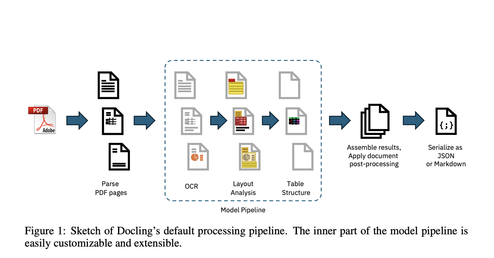

# IBM Research Open-Sources Docling: An AI Tool for High-Precision PDF Document Conversion and Structural Integrity Maintenance Across Complex Layouts

> Document conversion, particularly from PDF to machine-processable formats, has long presented significant challenges due to PDF files’ diverse and often complex nature. These documents, widely used across various industries, frequently need more standardization, resulting in a loss of structural features when optimized for printing. This structural loss complicates the recovery process, as important elements such […]

Document conversion, particularly from PDF to machine-processable formats, has long presented significant challenges due to PDF files’ diverse and often complex nature. These documents, widely used across various industries, frequently need more standardization, resulting in a loss of structural features when optimized for printing. This structural loss complicates the recovery process, as important elements such as tables, figures, and reading order can be misinterpreted or completely lost. As businesses and researchers increasingly rely on digital documents, the need for efficient and accurate conversion tools has become crucial. The advent of advanced AI-driven tools has provided a promising solution to these challenges, enabling better understanding, processing, and extracting content from complex documents.

A critical issue in document conversion is the reliable extraction of content from PDFs while preserving the document’s structural integrity. Traditional methods often falter due to the wide variability in PDF formats, leading to problems such as inaccurate table reconstruction, misplaced text, and lost metadata. This problem is technical and practical, as document conversion accuracy directly impacts downstream tasks such as data analysis, search functionality, and information retrieval. Given the growing reliance on digital documents for academic and industrial purposes, ensuring the fidelity of converted content is essential. The problem lies in developing tools that can handle these tasks with the precision required by modern applications, particularly when dealing with large-scale document collections.

Current tools for PDF conversion, both commercial and open-source, often need to meet the necessary standards of performance and accuracy. Many existing solutions are limited by their dependence on proprietary algorithms and restrictive licenses, which hinder their adaptability and widespread use. Even popular methods struggle with specific tasks, such as accurate table recognition and layout analysis, critical components of high-quality document conversion. For instance, tools like PyPDFium and PyMuPDF have been noted for their shortcomings in processing complex document layouts, resulting in merged text cells or distorted table structures. The lack of an open-source, high-performance solution that can be easily extended and adapted has left a significant gap in the market, particularly for organizations that require reliable tools for large-scale document processing.

The AI4K Group at IBM Research introduced **Docling**, an open-source package designed specifically for PDF document conversion. Docling distinguishes itself by leveraging specialized AI models for layout analysis and table structure recognition. These models, including DocLayNet and TableFormer, have been trained on extensive datasets and can handle many document types and formats. Docling is efficient, running on commodity hardware, and versatile, offering configurations for batch processing and interactive use. The tool’s ability to operate with minimal resources while delivering high-quality results makes it an attractive option for academic researchers and commercial enterprises. By bridging the gap between commercial software and open-source tools, Docling provides a robust and adaptable solution for document conversion.

The core of Docling’s functionality lies in its processing pipeline, which operates through a series of linear steps to ensure accurate document conversion. Initially, the tool parses the PDF document, extracting text tokens and their geometric coordinates. This is followed by applying AI models that analyze the document’s layout, identify elements such as tables and figures, and reconstruct the original structure with high fidelity. For instance, Docling’s TableFormer model recognizes complex table structures, including those with partial or no borderlines, spanning multiple rows or columns, or containing empty cells. The results of these analyses are then aggregated and post-processed to enhance metadata, determine the document’s language, and correct reading order. This comprehensive approach ensures that the converted document retains its original integrity, whether it is output in JSON or Markdown format.

Docling has demonstrated impressive capabilities across various hardware configurations. Tests conducted on a dataset of 225 pages revealed that Docling could process documents with sub-second latency per page on a single CPU. Specifically, on a MacBook Pro M3 Max with 16 cores, Docling processed 92 pages in just 103 seconds using 16 threads, achieving a throughput of 2.45 pages per second. Even on older hardware, such as an Intel Xeon E5-2690, Docling maintained respectable performance, processing 143 pages in 239 seconds with 16 threads. These results highlight Docling’s ability to deliver fast and accurate document conversion, making it a practical choice for environments with varying resource constraints.

In conclusion, Docling provides a reliable method for converting complex PDF documents into machine-processable formats by combining advanced AI models with a flexible, open-source platform. Its ability to maintain high performance on standard hardware while ensuring the integrity of converted content makes it an invaluable tool for researchers and commercial users.

---

Check out the **[Paper](https://arxiv.org/abs/2408.09869) and [GitHub](https://github.com/DS4SD/docling).** All credit for this research goes to the researchers of this project. Also, don’t forget to follow us on **[Twitter](https://twitter.com/Marktechpost)** and [**LinkedIn**](https://www.linkedin.com/company/marktechpost/?viewAsMember=true). Join our **[Telegram Channel](https://www.zyphra.com/post/zamba2-mini)**.

**If you like our work, you will love our**[** newsletter..**](https://marktechpost-newsletter.beehiiv.com/subscribe)

Don’t Forget to join our **[50k+ ML SubReddit](https://www.reddit.com/r/machinelearningnews/)**
