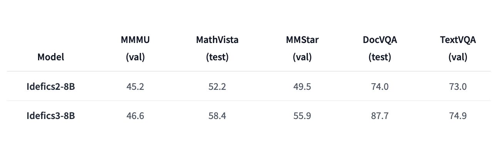

# Idefics3-8B-Llama3 Released: An Open Multimodal Model that Accepts Arbitrary Sequences of Image and Text Inputs and Produces Text Outputs

> Machine learning models integrating text and images have become pivotal in advancing capabilities across various applications. These multimodal models are designed to process and understand combined textual and visual data, which enhances tasks such as answering questions about images, generating descriptions, or creating content based on multiple images. They are crucial for improving document comprehension […]

Machine learning models integrating text and images have become pivotal in advancing capabilities across various applications. These multimodal models are designed to process and understand combined textual and visual data, which enhances tasks such as answering questions about images, generating descriptions, or creating content based on multiple images. They are crucial for improving document comprehension and visual reasoning, especially in complex scenarios involving diverse data formats.

The core challenge in multimodal document processing involves handling and integrating large volumes of text and image data to deliver accurate and efficient results. Traditional models often need help with latency and accuracy when managing these complex data types simultaneously. This can lead to suboptimal performance in real-time applications where quick and precise responses are essential.

Existing techniques for processing multimodal inputs generally involve separate analyses of text and images, followed by a fusion of the results. These methods can be resource-intensive and may only sometimes yield the best outcomes due to the intricate nature of combining different data forms. Models such as Apache Kafka and Apache Flink are used for managing data streams, but they often require extensive resources and can become unwieldy for large-scale applications.

To overcome these limitations, HuggingFace Researchers have developed Idefics3-8B-Llama3, a cutting-edge multimodal model designed for enhanced document question answering. This model integrates the SigLip vision backbone with the Llama 3.1 text backbone, supporting text and image inputs with up to 10,000 context tokens. The model, licensed under Apache 2.0, represents a significant advancement over previous versions by combining improved document QA capabilities with a robust multimodal approach.

Idefics3-8B-Llama3 utilizes a novel architecture that effectively merges textual and visual information to generate accurate text outputs. The model’s 8.5 billion parameters enable it to handle diverse inputs, including complex documents that feature text and images. The enhancements include better handling of visual tokens by encoding images into 169 visual tokens and incorporating extended fine-tuning datasets like Docmatix. This approach aims to refine document understanding and improve overall performance in multimodal tasks.

Performance evaluations show that Idefics3-8B-Llama3 marks a substantial improvement over its predecessors. The model achieves a remarkable 87.7% accuracy in DocVQA and a 55.9% score in MMStar, compared to Idefics2’s 49.5% in DocVQA and 45.2% in MMMU. These results indicate significant enhancements in handling document-based queries and visual reasoning. The new model’s ability to manage up to 10,000 tokens of context and its integration with advanced technologies contribute to these performance gains.

In conclusion, Idefics3-8B-Llama3 represents a major advancement in multimodal document processing. By addressing previous limitations and delivering improved accuracy and efficiency, this model provides a valuable tool for applications requiring sophisticated text and image data integration. The document QA and visual reasoning improvements underscore its potential for many use cases, making it a significant step forward in the field.

---

Check out the [**Model**.](https://huggingface.co/HuggingFaceM4/Idefics3-8B-Llama3) All credit for this research goes to the researchers of this project. Also, don’t forget to follow us on **[Twitter](https://twitter.com/Marktechpost)** and join our **[Telegram Channel](https://pxl.to/at72b5j)** and [**LinkedIn Gr**](https://www.linkedin.com/groups/13668564/)[**oup**](https://www.linkedin.com/groups/13668564/). **If you like our work, you will love our**[** newsletter..**](https://marktechpost-newsletter.beehiiv.com/subscribe)

Don’t Forget to join our **[48k+ ML SubReddit](https://www.reddit.com/r/machinelearningnews/)**

**Find Upcoming [AI Webinars here](https://www.marktechpost.com/ai-webinars-list-llms-rag-generative-ai-ml-vector-database/)**

---

> [Arcee AI Released DistillKit: An Open Source, Easy-to-Use Tool Transforming Model Distillation for Creating Efficient, High-Performance Small Language Models](https://www.marktechpost.com/2024/08/01/arcee-ai-released-distillkit-an-open-source-easy-to-use-tool-transforming-model-distillation-for-creating-efficient-high-performance-small-language-models/)
