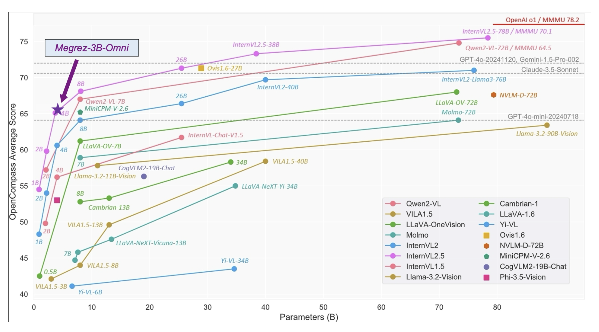

# Infinigence AI Releases Megrez-3B-Omni: A 3B On-Device Open-Source Multimodal Large Language Model MLLM

> The integration of artificial intelligence into everyday life faces notable hurdles, particularly in multimodal understanding—the ability to process and analyze inputs across text, audio, and visual modalities. Many models require significant computational resources, often relying on cloud-based infrastructures. This reliance creates challenges in terms of latency, energy efficiency, and data privacy, which can limit their […]

The integration of artificial intelligence into everyday life faces notable hurdles, particularly in multimodal understanding—the ability to process and analyze inputs across text, audio, and visual modalities. Many models require significant computational resources, often relying on cloud-based infrastructures. This reliance creates challenges in terms of latency, energy efficiency, and data privacy, which can limit their deployment on devices like smartphones or IoT systems. Furthermore, maintaining consistent performance across multiple modalities is often accompanied by compromises in either accuracy or efficiency. These challenges have motivated efforts to develop solutions that are both lightweight and effective.

### Megrez-3B-Omni: A 3B On-Device Multimodal LLM

Infinigence AI has introduced **Megrez-3B-Omni**, a 3-billion-parameter on-device multimodal large language model (LLM). This model builds on their earlier Megrez-3B-Instruct framework and is designed to analyze text, audio, and image inputs simultaneously. Unlike cloud-dependent models, Megrez-3B-Omni emphasizes on-device functionality, making it better suited for applications requiring low latency, robust privacy, and efficient resource use. By offering a solution tailored for deployment on resource-constrained devices, the model aims to make advanced AI capabilities more accessible and practical.

### Technical Details

Megrez-3B-Omni incorporates several key technical features that enhance its performance across modalities. At its core, it employs **SigLip-400M** to construct image tokens, enabling advanced image understanding capabilities. This allows the model to excel in tasks such as scene comprehension and optical character recognition (OCR), outperforming models with much larger parameter counts, such as LLaVA-NeXT-Yi-34B, on benchmarks like MME, MMMU, and OCRBench.

In terms of language processing, Megrez-3B-Omni achieves a high level of accuracy with minimal trade-offs compared to its unimodal predecessor, Megrez-3B-Instruct. Tests on benchmarks such as C-EVAL, MMLU/MMLU Pro, and AlignBench confirm its strong performance.

For speech understanding, the model integrates the **encoder head of Qwen2-Audio/whisper-large-v3**, making it capable of processing both Chinese and English speech inputs. It supports multi-turn conversations and voice-based queries, offering new possibilities for interactive applications like voice-activated visual searches and real-time transcription. This integration of modalities enhances its utility in practical scenarios where voice, text, and images converge.

### Results and Performance Insights

Megrez-3B-Omni demonstrates strong results across standard benchmarks, highlighting its capabilities in multimodal tasks. In image understanding, it consistently outperforms larger models in tasks such as scene recognition and OCR. In text analysis, the model retains high accuracy across English and Chinese benchmarks, maintaining performance levels comparable to its unimodal counterpart.

In speech processing, it performs well in bilingual contexts, excelling in tasks involving voice input and text response. Its ability to handle natural multi-turn dialogues enhances its appeal for conversational AI applications. Comparisons with older models featuring significantly more parameters underscore its efficiency and effectiveness.

The model’s on-device functionality further distinguishes it. Eliminating the need for cloud-based processing reduces latency, enhances privacy, and minimizes operational costs. These qualities make it particularly valuable in fields like healthcare and education, where secure and efficient multimodal analysis is critical.

### Conclusion

The release of Megrez-3B-Omni represents a thoughtful advancement in the development of multimodal AI. By combining robust performance across text, audio, and image modalities with an efficient, on-device architecture, the model addresses key challenges in scalability, privacy, and accessibility. Megrez-3B-Omni’s results on various benchmarks demonstrate that high performance need not come at the expense of efficiency or usability. As multimodal AI continues to evolve, this model sets a practical example of how advanced capabilities can be integrated into everyday devices, paving the way for broader and more seamless adoption of AI technologies.

---

Check out **the _[Model on Hugging Face](https://huggingface.co/Infinigence/Megrez-3B-Omni/blob/main/README_EN.md) and [GitHub Page](https://github.com/infinigence/Infini-Megrez-Omni)_**. All credit for this research goes to the researchers of this project. Also, don’t forget to follow us on **[Twitter](https://twitter.com/Marktechpost)** and join our **[Telegram Channel](https://github.com/XGenerationLab/XiYan-SQL)** and [**LinkedIn Gr**](https://www.linkedin.com/groups/13668564/)[**oup**](https://www.linkedin.com/groups/13668564/). Don’t Forget to join our **[60k+ ML SubReddit](https://www.reddit.com/r/machinelearningnews/)**.

**[🚨 Trending: LG AI Research Releases EXAONE 3.5: Three Open-Source Bilingual Frontier AI-level Models Delivering Unmatched Instruction Following and Long Context Understanding for Global Leadership in Generative AI Excellence….](https://www.marktechpost.com/2024/12/11/lg-ai-research-releases-exaone-3-5-three-open-source-bilingual-frontier-ai-level-models-delivering-unmatched-instruction-following-and-long-context-understanding-for-global-leadership-in-generative-a/)**
