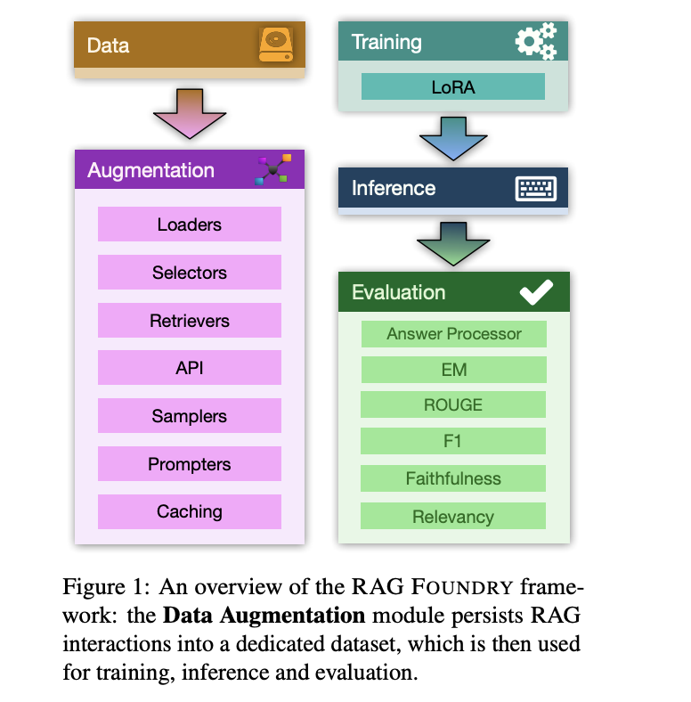

# Intel Labs Introduce RAG Foundry: An Open-Source Python Framework for Augmenting Large Language Models LLMs for RAG Use Cases

> Open-source libraries facilitated RAG pipeline creation but lacked comprehensive training and evaluation capabilities. Proposed frameworks for RAG-based large language models (LLMs) omitted crucial training components. Novel approaches, such as treating LLM prompting as a programming language, emerged but introduced complexity. Evaluation methodologies using synthetic data and LLM critics were developed to assess RAG performance. Studies […]

Open-source libraries facilitated RAG pipeline creation but lacked comprehensive training and evaluation capabilities. Proposed frameworks for RAG-based large language models ([LLMs](https://www.marktechpost.com/2025/01/11/what-are-large-language-model-llms/)) omitted crucial training components. Novel approaches, such as treating LLM prompting as a programming language, emerged but introduced complexity. Evaluation methodologies using synthetic data and LLM critics were developed to assess RAG performance. Studies investigated the impact of retrieval mechanisms on RAG systems. Concurrent frameworks offered RAG implementations and datasets but often imposed rigid workflows. Intel Labs introduces RAG Foundry built upon these contributions, providing a flexible, extensible framework for comprehensive RAG system development and experimentation.

RAG Foundry emerges as a comprehensive solution to the challenges inherent in Retrieval-Augmented Generation (RAG) systems. This open-source framework integrates data creation, training, inference, and evaluation into a unified workflow. It enables rapid prototyping, dataset generation, and model training using specialized knowledge sources. The modular structure, controlled by configuration files, ensures inter-module compatibility and supports isolated experimentation. RAG Foundry’s customizable nature facilitates thorough experimentation across various RAG aspects, including data selection, retrieval, and prompt design.

Researchers identify several critical challenges in the implementation and evaluation of Retrieval-Augmented Generation (RAG) systems. These include the inherent complexity of RAG systems, which demand deep understanding of data and intricate design decisions. Evaluation difficulties arise from the need to assess both retrieval accuracy and generative quality. Reproducibility issues stem from variations in training data and configurations. Existing frameworks often lack support for diverse use cases and customization options. The need for a flexible framework allowing comprehensive experimentation across all RAG aspects is evident. RAG Foundry emerges as a solution to these challenges, offering a customizable and integrated approach.

The methodology for RAG Foundry employs a modular approach with four distinct components: data creation, training, inference, and evaluation. Data creation involves selecting and preparing relevant datasets for RAG tasks. Training focuses on fine-tuning LLMs using various RAG techniques. Inference generates predictions based on processed datasets. The evaluation assesses model performance using local and global metrics, including an Answer Processor for custom logic. Experiments were conducted on knowledge-intensive tasks like TriviaQA, ASQA, and PubmedQA to test RAG improvements. Results analysis compared outcomes across datasets, emphasizing main metrics, faithfulness, and relevancy scores.

These datasets offer diverse question-answering scenarios, including general knowledge and biomedical domains. Chosen for their complexity and relevance to knowledge-intensive tasks, they enable comprehensive assessment of RAG techniques. This approach highlights the importance of multi-aspect metrics in evaluation and demonstrates the RAG Foundry framework’s effectiveness in enhancing LLMs for various RAG applications.

The RAG Foundry experiment evaluated Retrieval-Augmented Generation techniques across TriviaQA, ASQA, and PubmedQA datasets, revealing diverse performance outcomes. In TriviaQA, retrieved context integration and RAG fine-tuning improved results, while Chain-of-Thought (CoT) reasoning decreased performance. ASQA saw improvements with all methods, particularly fine-tuned CoT. For PubmedQA, most methods outperformed the baseline, with fine-tuned RAG showing best results. Notably, only CoT configurations produced evaluable reasoning for PubmedQA’s binary answers. These findings underscore the dataset-dependent efficacy of RAG techniques, highlighting the need for tailored approaches in enhancing model performance across varied contexts.

In conclusion, the researchers introduced an open-source library designed to enhance large language models for Retrieval-Augmented Generation tasks. The framework demonstrates its effectiveness through experiments on two models across three datasets, utilizing comprehensive evaluation metrics. RAG Foundry’s modular design facilitates customization and rapid experimentation in data creation, training, inference, and evaluation. The robust evaluation process incorporates both local and global metrics, including an Answer Processor for custom logic. While showcasing the potential of RAG techniques in improving model performance, the study also highlights the need for careful evaluation and ongoing research to refine these methods, positioning RAG Foundry as a valuable tool for researchers in this evolving field.

---

Check out the [**Paper** ](https://arxiv.org/abs/2408.02545)and **[GitHub](https://github.com/IntelLabs/RAGFoundry)**. All credit for this research goes to the researchers of this project. Also, don’t forget to follow us on **[Twitter](https://twitter.com/Marktechpost)** and join our **[Telegram Channel](https://pxl.to/at72b5j)** and [**LinkedIn Gr**](https://www.linkedin.com/groups/13668564/)[**oup**](https://www.linkedin.com/groups/13668564/). **If you like our work, you will love our**[** newsletter..**](https://marktechpost-newsletter.beehiiv.com/subscribe)

Don’t Forget to join our **[47k+ ML SubReddit](https://www.reddit.com/r/machinelearningnews/)**

**Find Upcoming [AI Webinars here](https://www.marktechpost.com/ai-webinars-list-llms-rag-generative-ai-ml-vector-database/)**

---

> [Arcee AI Released DistillKit: An Open Source, Easy-to-Use Tool Transforming Model Distillation for Creating Efficient, High-Performance Small Language Models](https://www.marktechpost.com/2024/08/01/arcee-ai-released-distillkit-an-open-source-easy-to-use-tool-transforming-model-distillation-for-creating-efficient-high-performance-small-language-models/)
