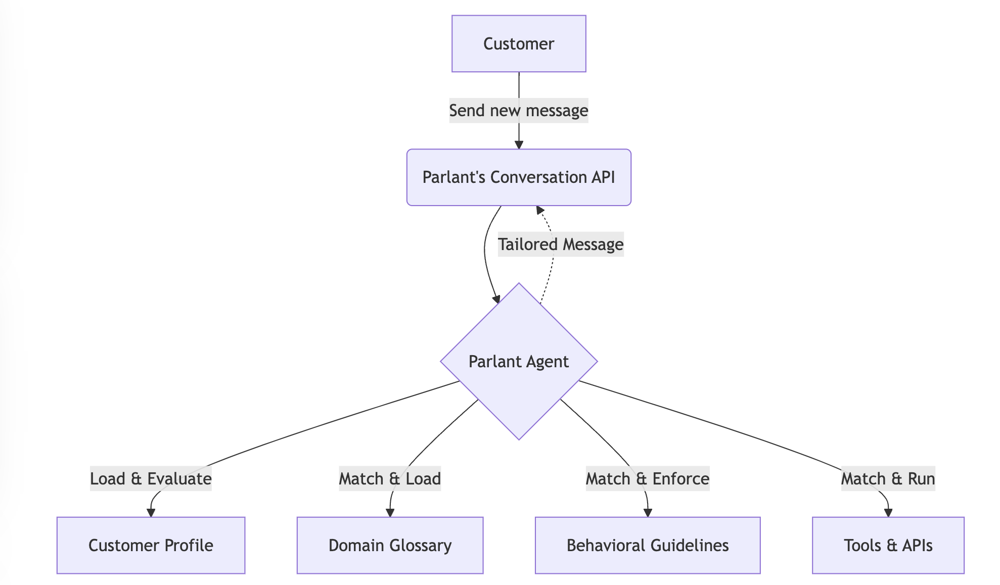

# Introducing Parlant: The Open-Source Framework for Reliable AI Agents

> The Problem: Why Current AI Agent Approaches Fail If you have ever designed and implemented an LLM Model-based chatbot in production, you have encountered the frustration of agents failing to execute tasks reliably. These systems often lack repeatability and struggle to complete tasks as intended, frequently straying off-topic and delivering a poor experience for the […]

## The Problem: Why Current AI Agent Approaches Fail

If you have ever designed and implemented an LLM Model-based chatbot in production, you have encountered the frustration of agents failing to execute tasks reliably. These systems often lack repeatability and struggle to complete tasks as intended, frequently straying off-topic and delivering a poor experience for the customers.

The typical strategies to address these challenges carry their own limitations.

One common approach is to use longer and more intricate prompts. Although this can reduce unwanted behavior, it never fully prevents the agent from going off-topic, even slightly, which can have a significant impact and may introduce considerable latency.. Whenever new corner cases arise, modifying a lengthy prompt can inadvertently create additional edge cases, leading to a fragile system.

Another widely used method is to implement guardrails. Although this can be effective, it is often a drastic measure because it forces the chatbot to shut down as soon as any violation or deviation from the task is detected, which harms the overall user experience.

The Impact is significant :

- **Eroded trust**: Users quickly lose confidence in the bot—and your brand—when responses are clearly incorrect or incomplete.

- **Compliance risks**: A chatbot that makes unauthorized or erroneous statements can pose legal and financial risks.

- **Lost sales**: When the agent diverges from the intended script, conversions and sales suffer.

- **Lost customers**: An unprofessional or misleading chatbot can drive customers away for good.

Some Real-World Examples where these issues matter:

- A **customer service agent** at a bank or financial service firm providing inconsistent advice.

- A **sales agent** on an e-commerce site that incorrectly describes or prices products.

- A **healthcare services agent** offering unverified medical suggestions.

## A New Open-Source Approach: Parlant

[**Parlant **](https://pxl.to/kgqelf6)introduces a **dynamic control system** that ensures agents follow your specific business rules. It does this by matching and activating the appropriate combination of guidelines for each situation. Here’s a quick look at how it works:

- **Contextual Evaluation**:

When a chatbot needs to respond, [Parlant](https://pxl.to/kgqelf6) evaluates the conversation context and loads relevant guidelines (rules you define for your specific use cases).

- **Behavioral Guidelines**:

These guidelines shape the chatbot’s tone, style, and allowed content. Parlant re-checks them continuously as new information emerges.

- **Self-Critique Mechanisms**:

Before generating a final response, [Parlant](https://pxl.to/kgqelf6) runs a self-critique process, ensuring the answer aligns precisely with the matched guidelines.

## How Parlant Works

[Parlant](https://pxl.to/kgqelf6)’s core components include **Guidelines**, a **Glossary**, a **Coherence Checker**, and a **Tool Service**.

**Let’s explore them:**

#### 1. Guidelines

Guidelines are the **most powerful customization feature** in [Parlant](https://pxl.to/kgqelf6). They determine how your chatbot should respond in specific scenarios. Parlant automatically injects only the relevant guidelines into the LLM’s context in real time, keeping interactions clean and efficient.

**What Are Guidelines?**

Guidelines let you shape an agent’s behavior in three primary ways.

 First, they help address undesired out-of-the-box responses when they are lackluster or incomplete. 

Second, they ensure consistent behavior across all interactions.

Third, they guide the agent to stay focused on the guided optimized behavior ( no punt intended!)

For example, an original response to a room-booking request might be, “Sure, I can help you book a room. When will you be staying?” Although this response is functional, guidelines can be applied to make it more enthusiastic. A reworked answer could become, “I’m so happy you chose our hotel! Let’s get you the best room for your needs. When will you be staying?”

**Structure of Guidelines****
**Each guideline has two parts:

**Condition**: A trigger or situation (e.g., “It is a holiday”).

**Action**: An instruction (e.g., “Offer a discount”).

In Parlant’s shorthand:

**When** it is a holiday, **Then** offer a discount.

#### 2. Ensuring Coherence

[Parlant](https://pxl.to/kgqelf6) validates guidelines for internal consistency and provides visibility into the agent’s decision-making. This eliminates confusion or contradictions when multiple guidelines could apply simultaneously.

#### 3. Glossary

A glossary defines any specialized terms or domain-specific language the chatbot needs to recognize. This helps maintain consistent terminology across conversations.

#### 4. Tool Service

The Tool Service lets the chatbot call external APIs or third-party tools, such as looking up e-commerce product categories or retrieving a user’s order history. This ensures your agent can act on real data rather than rely solely on the model’s internal training.

---

## Bonus Features: Guardrails and Content Moderation

Even with robust guidelines, it can be necessary to add another layer of protection. [Parlant](https://pxl.to/kgqelf6) integrates with services such as OpenAI’s Omni Moderation to pre-filter harmful or sensitive content, ensuring safer interactions. In domains like mental health or legal advice, it is best to hand off users to a professional. Parlant’s guidelines can automatically redirect users to human agents when these topics arise, preserving compliance and user well-being.

Customers may also attempt to harass or manipulate the agent. [Parlant](https://pxl.to/kgqelf6)’s content filtering helps keep conversations respectful and ensures the chatbot remains composed in contentious situations. Finally, some users try to “jailbreak” the agent or expose its internal rules. Parlant offers a “paranoid” mode, which integrates with Lakera Guard, to maintain the chatbot’s intended boundaries and prevent unauthorized behavior.

## The Agent Development Journey evolved!

Parlant allows you to **build and refine** your chatbot step by step. You start with basic guidelines, then evolve your agent as you learn more about your customers’ needs and behaviors. Because it is open source, you can also leverage community contributions and best practices 😉

It enables you to also evolve the guardrail in a dynamic guide…very powerful!

Give it a try and experience a **new level of control** in LLM-based chatbot development.

## How to Try Parlant?

The **entire source code**, licensed under Apache 2.0, is available on [GitHub](https://pxl.to/kgqelf6). We encourage you to check it out…this is will a be growing trends of 2025. We always love open-source project, so a friendly reminder that simple “Star” on the repository goes a long way in showing your support!

### Here are the links :

- **[GitHub Repo](https://pxl.to/kgqelf6)** – Dive into the code, tutorials, and documentation.

- [**Tutorials & Guides**](https://www.parlant.io/docs/quickstart/introduction) – Learn how to set up your first Parlant-powered agent.

---

_Thanks to the [Parlan](https://pxl.to/kgqelf6) team for the thought leadership/ Resources for this article. [Parlan](https://pxl.to/kgqelf6) team has supported us in this content/article._
