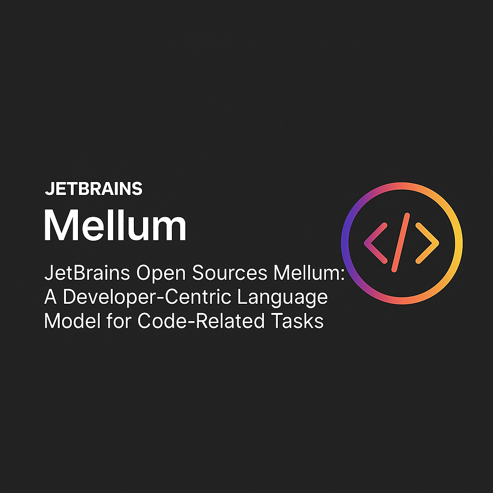

# JetBrains Open Sources Mellum: A Developer-Centric Language Model for Code-Related Tasks

> JetBrains has officially open-sourced Mellum, a purpose-built 4-billion-parameter language model tailored for software development tasks. Developed from the ground up, Mellum reflects JetBrains’ engineering-first approach, offering a domain-specialized model trained for practical usage across codebases and programming environments. With its release on Hugging Face under the Apache 2.0 license, JetBrains extends an invitation to the […]

JetBrains has officially open-sourced **Mellum**, a purpose-built 4-billion-parameter language model tailored for software development tasks. Developed from the ground up, Mellum reflects JetBrains’ engineering-first approach, offering a domain-specialized model trained for practical usage across codebases and programming environments. With its release on Hugging Face under the Apache 2.0 license, JetBrains extends an invitation to the broader research and developer community to experiment, adapt, and advance Mellum’s capabilities.

### A Focal Model for Code Understanding

Unlike general-purpose LLMs, Mellum is classified by JetBrains as a “focal model”—a term they use to describe models with a narrow yet deep specialization. Mellum is optimized specifically for programming-related tasks such as autocompletion, infilling, and structural understanding of source code. This focused design avoids the overhead of broader linguistic modeling and enables the model to perform efficiently in IDE-like environments.

The model supports a wide array of languages including Java, Kotlin, Python, Go, PHP, C, C++, C#, JavaScript, TypeScript, CSS, HTML, Rust, and Ruby—reflecting the polyglot nature of modern development teams.

### Model Architecture and Training Pipeline

Mellum follows a LLaMA-style architecture and was trained from scratch using over **4.2 trillion tokens** drawn from code-rich sources such as The Stack, StarCoder, CommitPack, and English Wikipedia. It features an 8K token context window and was trained using **bf16 mixed precision** across a high-throughput cluster of 256 NVIDIA H200 GPUs connected via Infiniband.

The training process spanned approximately 20 days and leveraged modern infrastructure for scalable model development. The architecture and training procedure were designed with reproducibility and deployment flexibility in mind, making Mellum usable in both cloud inference setups (e.g., vLLM) and on local environments (e.g., llama.cpp, Ollama).

### Benchmarking and Evaluation

JetBrains evaluated Mellum across a range of benchmarks that reflect its primary use cases—code infilling and completion. The model’s performance indicates strong alignment with the design goals:

- **RepoBench v1.1 (8K context)**:

Python EM: 27.97%

- Java EM: 31.08%

- **SAFIM (Syntax-Aware Fill-in-the-Middle)**:

pass@1: 38.11%

- **HumanEval Infilling**:

Single-line: 66.21%

- Multi-line: 38.52%

- Random-span: 29.70%

These results reflect Mellum’s specialization for structured code understanding, especially in scenarios involving partial or interrupted code, which are common in real-world development workflows.

### Rationale for Open Sourcing

JetBrains’ decision to release Mellum as open-source is grounded in several practical motivations:

- **Transparency**: Enables scrutiny of both training data and architectural decisions.

- **Reusability**: Supports integration in custom development environments and research experiments.

- **Community Collaboration**: Facilitates contribution from external developers to refine model behavior.

- **Pedagogical Value**: Provides educators and students with a hands-on artifact for understanding how domain-specific LLMs are constructed and applied.

The release includes both the **base model** ([Mellum-4b-base](https://huggingface.co/JetBrains/Mellum-4b-base)) and a **fine-tuned variant** for Python ([Mellum-4b-sft-python](https://huggingface.co/JetBrains/Mellum-4b-sft-python)).

### Implications for Developer Tooling

The availability of a compact, performant model optimized for source code opens new opportunities in the IDE space and beyond. JetBrains envisions Mellum as part of a broader strategy involving multiple focal models, each optimized for specific programming tasks such as diff generation or code review assistance. This approach aligns with the growing need for deployable, cost-effective, and context-aware AI tooling that can augment developer productivity without introducing opaque or oversized general-purpose models.

### Conclusion

Mellum represents a deliberate shift toward smaller, specialized language models that prioritize utility, transparency, and efficiency. By making the model openly available, JetBrains offers a high-quality foundation for building the next generation of AI-assisted developer tools. Its architecture, training methodology, and benchmark performance signal a practical step forward in the evolving space of LLMs tailored for software engineering.

---

The release includes both the **base model** ([Mellum-4b-base](https://huggingface.co/JetBrains/Mellum-4b-base)) and a **fine-tuned variant** for Python ([Mellum-4b-sft-python](https://huggingface.co/JetBrains/Mellum-4b-sft-python)). Also, don’t forget to follow us on **[Twitter](https://x.com/intent/follow?screen_name=marktechpost)** and join our **[Telegram Channel](https://arxiv.org/abs/2406.09406)** and [**LinkedIn Gr**](https://www.linkedin.com/groups/13668564/)[**oup**](https://www.linkedin.com/groups/13668564/). Don’t Forget to join our **[90k+ ML SubReddit](https://www.reddit.com/r/machinelearningnews/)**.

[**🔥 [Register Now] miniCON Virtual Conference on AGENTIC AI: FREE REGISTRATION + Certificate of Attendance + 4 Hour Short Event (May 21, 9 am- 1 pm PST) + Hands on Workshop**](https://minicon.marktechpost.com/)
